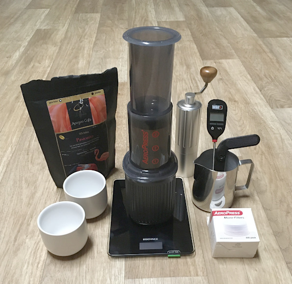

# Cooking

## Overview

- [Coffee](#coffee)


## Coffee

### Hardware on a Budget:



| Purpose              | Product                        | Notes
|----------------------|--------------------------------|---------------------------------
| Brewer               | AeroPress Go                   | don't expect more than 0.5 bar without Joepresso addon (real Espresso demands 9 bars), rather "Espresso-style", "Aeropress-style coffee" and Americano, much cleaner than French Press
| Thermometer          | Weber 6740 Digital Pocket T.   | checks brewing water and drink temperatures
| Grinder              | OSSAT Manual Coffee G. 25-28 g | all metal inside and out except wooden knob, the chinese "Comandante" but 1/4 price; <br>full charge with beans fills ~15g or well-nigh 1 leveled scoop of AeroPress Go (11.5 g), <br> so you can dump it straight into AP<br>Grind size in clicks: 1 (finest) - 26 (mid-coarse) - 40 (coarse)
| Timer                | PC or Smartphone Clock         | `$ sleep 40` on the Linux command line, or counting up: ```function timer() { for i in `seq 1 $1` ; do echo -ne "\r$i " ; sleep 1 ; done }``` in your alias-file
| Kettle               | no-name, could be anything     | the expensive ones (e.g. Fellow for 170 Euros) keep the set temperature and offer a gooseneck; I just pour the boiling water up into another mug (see below) and check temp.
| Weighing             | Soehnle Page Compact 100       | 'Tare' to reset to 0 after every step, 1 l water &thickapprox; 1 kg 
| Dishware             | Anpro Milk Pitcher 350 ml      | for easier (temp) measuring and pouring out water (not milk)
| Dishware             | AeroPress Go Mug               | receiving container when pressing the AeroPress, was sold with the AP Go
| Dishware             | Lambda Cappuccino cups 160ml   | smaller cups &ne; less coffee (drink 2 cups); more conscious sipping over mindless shotting with BigMac supersize cups just for coffeine


### Extraction:

| Extraction       | Taste
|------------------|------------------------------------
| under            | sour, lacking sweet, salty, quick finish
| ideal            | sweet, ripe, transparent (clarity/less distractions), complex acidity, finishhhhhhhh
| over             | bitter, dry astringent (black tea), hollow, empty


| Roast  | Alt. Name                                  | Brew-Water Temp.  | Grind                      | Taste / Mouthfeel
|--------|--------------------------------------------|-------------------|----------------------------|-----------------------------
| dark   | Vienna/French/Italian Roast, Full City R.  | 80-85&deg;C       | mid-to-coarse              | less sour (acids away), more bitter, more body (weight more milky than watery, creamy to chewy, not like tea), shocolade/nut notes ("sugar browing"), body preferred for espresso
| medium | American Roast, City Roast                 | 92&deg;C          | mid-grind                  | sweeter than light roast, good body, light sour notes
| light  | Cinnamom Roast, New England Roast          | 92&deg;-boiling   | mid-to-fine grind (lil coarser than very fine Espresso) | fruity/original or natural notes, more acids, preferred for filter coffee


Other:
- amount of coffeine depends on the brewing method (the longer the more coffeine) and roast (the darker the less)
- Aeropress inverted method avoids messing up the extraction by having a bunch of water drip through filter too early


### Test Series:

I usually:
- prefer soft water
- use 2 filters (not rinsed with hot water anymore, although said to prevent "paper taste" and help sticking in the filter cap)
- level the coffee bed in the Aeropress (shake it etc)
- serve at 60&deg;C
- drink black coffee (no milk, no suggar)


| Rating                               | Bean________________________ | Roast   | Grind | Grind_Size______ | Invert | Step_1_______________________   | Step_2________ | Step_3___________ | Step_4_____________        | Step_5_______________           | Step_6________________   | Subjective_________________________________________________________________
|--------------------------------------|------------------------------|---------|-------|------------------|--------|---------------------------------|----------------|-------------------|----------------------------|---------------------------------|--------------------------|-----------------------------------------------
| &starf;&starf;&starf;&starf;&star;   | Solino Yirgacheffe           | light   | 30g   | 26 (mid-coarse)  | yes    | water        100g,    92&deg;C  |                | stir 20x firmly   |                            | brew 40s closed, no excess air  | dilute 120g,   92&deg;C  | Wendelien van Bunnik recipe
| &starf;&starf;&starf;&starf;&star;   | "                            | "       | 20g   | 5  (espresso)    | no     | water        to #1.5, 92&deg;C  | brew 20s       | stir 10s firmly   | press firmly               |                                 | dilute to 1/2, 92&deg;C  | 
| &starf;&starf;&starf;&#x2bea;&star;  | "                            | "       | 15g   | 5                | no     | water        to #1.5, 92&deg;C  | brew 20s       | stir 10s firmly   | press firmly               |                                 | dilute to 1/2, 92&deg;C  | 
| &starf;&starf;&star;&star;&star;     | "                            | "       | 15g   | 3                | yes    | water        to #3,   85&deg;C  | brew 50s open  |                   | press                      |                                 | dilute to 2/3, 83&deg;C  | quality but too light for me
| &star;&star;&star;&star;&star;       | "                            | "       | 15g   | 3                | no     | swirly water to #4,   97&deg;C  | brew 45s       |                   | press slowly 40s           |                                 | dilute to 1/2. 92&deg;C  | sour
| &starf;&starf;&starf;&starf;&star;   | Mounthagen Aethopien Sidamo  | middle  | 30g   | 26 (mid-coarse)  | yes    | water        100g,    92&deg;C  |                | stir 20x          |                            | brew 40s closed, no excess air  | dilute 120 g,  92&deg;C  | Wendelien van Bunnik recipe
| &starf;&starf;&starf;&starf;&star;   | "                            | "       | 20g   | 5  (espresso)    | no     | water        to #1.5, 92&deg;C  | brew 20s       | stir 10s strongly | press firmly               |                                 | dilute to 1/2, 92&deg;C  | mild but ok, quick finish though
| &starf;&starf;&starf;&starf;&star;   | "                            | "       | 30g   | 7                | yes    | water        to #3,   93&deg;C  |                | stir 10s slowly   |                            | brew 40s open                   | dilute to 2/3, 83&deg;C  | 
| &starf;&starf;&starf;&starf;&star;   | "                            | "       | 30g   | 8                | yes    | water        100g,    97&deg;C  |                | stir 20s slowly   |                            | brew 20s open                   | dilute to 2/3, 83&deg;C  | 
| &starf;&starf;&starf;&#x2bea;&star;  | "                            | "       | 30g   | 11               | yes    | water        100g,    97&deg;C  |                | stir 20s slowly   |                            | brew 20s open                   | dilute to 2/3, 83&deg;C  | 
| &starf;&starf;&starf;&#x2bea;&star;  | "                            | "       | 30g   | 18 (mid-coarse)  | yes    | water        100g,    97&deg;C  |                | stir 20s slowly   |                            | brew 20s open                   | dilute to 1/2, 83&deg;C  | 
| &starf;&starf;&starf;&star;&star;    | "                            | "       | 15g   | 6                | yes    | water        to #3,   93&deg;C  |                | stir 10s slowly   |                            | brew 40s open                   | dilute to 2/3, 83&deg;C  | ok for me, too weak for mom
| &starf;&starf;&starf;&star;&star;    | "                            | "       | 30g   | 23 (mid-coarse)  | yes    | wet grind,            97&deg;C  | bloom 30s      | stir 3x           | water to top               | brew 90s closed                 | dilute to 1/2, 83&deg;C  | flowery?
| &starf;&starf;&star;&star;&star;     | "                            | "       | 15g   | 4                | yes    | water        to #3,   90&deg;C  |                | stir 10s slowly   |                            | brew 50s open                   | dilute to 2/3, 83&deg;C  | 
| &starf;&star;&star;&star;&star;      | "                            | "       | 30g   | 7                | yes    | water        to #3,   83&deg;C  |                | stir 10s slowly   |                            | brew 40s open                   | dilute to 2/3, 83&deg;C  | somehwat sour
| &starf;&starf;&starf;&starf;&star;   | Apogeo Pasionata Castillo    | dark    | 11g   | 29 (mid-coarse)  | no     | water        200g,    85&deg;C  |                |                   | brew 120s closed (plunger) | swirl gently (not stir)         | wait 30s, dump mug leftovers, press  | maybe lil thin, but does justice to the flavor notes, not really bitter, drink-ready (60&deg;C)
| &starf;&starf;&starf;&star;&star;    | "                            | "       | 18g   | 13 (fine)        | yes    | water         90g,   100&deg;C  |                | stir firmly       | brew 130s closed           |                                 | press completely         | espresso style, lil acid notes(?) but not bad at all
| &starf;&starf;&starf;&star;&star;    | "                            | "       | 20g   | mid-coarse       | no     | water        200g,    85&deg;C  |                |                   | brew 120s closed (plunger) | swirl gently (not stir)         | wait 30s, press          | dark roast notes, acids
| &starf;&starf;&starf;&star;&star;    | "                            | "       | 30g   | 40 (coarse)      | yes    | water        100g,    92&deg;C  |                | stir 20x          |                            | brew 40s closed, no excess air  | dilute 120 g,  92&deg;C  | Wendelien van Bunnik recipe, many notes, pretty strong, shocolate (texture) dominates
| &starf;&starf;&starf;&star;&star;    | "                            | "       | 16g   | mid-coarse       | no     | wet 5secs,   to #2,   82&deg;C  | bloom 20s      |                   | water to #3                | brew 55s closed (plunger)       |                          | lighter, citrus notes dominate, less shcoloate
| &starf;&starf;&starf;&star;&star;    | "                            | "       | 11g   | fine             | no     | water        200g,    85&deg;C  |                |                   | brew 120s closed (plunger) | swirl gently (not stir)         | wait 30s, press          | 
| &starf;&starf;&star;&star;&star;     | "                            | "       | 15g   | mid-coarse       | yes    | water        100g,    90&deg;C  | stir           | brew 30s          | stir again                 | water 80g                       | brew 210s closed         | nothing special, somewhat sour (acids)
| &starf;&starf;&star;&star;&star;     | "                            | "       | 15g   | mid-coarse       | no     | water        to #3,   80&deg;C  |                | stir 5s           | brew 40s closed, flipped   | stir 5s                         | dilute                   | drinkable, nothing special, just some okayish bitter notes


Recipes:
- Wendelien van Bunnik: https://www.youtube.com/watch?v=53qXj3uft_E 
- FlatberryMarket Mario: https://www.youtube.com/watch?v=R-BlXC3WhpM 


