# Fahrrad

_"Driving a car is like watching a movie, but riding a bike is like acting in one."_

_ACHTUNG: Alles work-in-progress hier, mag sich alles ändern_

## Übersicht

- [Begriffe](#begriffe)
- [Modell](#modell)
- [Schalten](#schalten)
- [Bremsen](#bremsen)
- [Diebstahlschutz](#diebstahlschutz)
- [Straßenzulassung StVoZ](#)
- [Kleidung](#kleidung)
- [Wartung](#wartung)
- [Bikepacking](#bikepacking)
- [Tourplanung](#tourplanung)
- [Reisekueche](#reisekueche)
- [Herbst/Winter](#herbst-winter)
- [Reifen](#reifen)
- [Sattel](#sattel)
- [Lenker](#lenker)
- [Shops](#shops)
- [Wahoo-Hackerei](#wahoo-hackerei)

## Begriffe

- Ritzel: Zahnräder hinten
- Kurbel
- Kettenblatt: Zahnräder vorne
- Kassette: Bündel an Zahnrädern hinten
- Kassette modular:
- Kettenradgarnitur: Bündel an Zahnrädern vorne?
- Rahmen: Rohrgestänge insgesamt
- [Rohre](https://cdn.prod.www.spiegel.de/images/5fdc5420-0001-0004-0000-000001203310_w860_r1.7551020408163265_fpx33.03_fpy50.jpg):
	- Oberrohr
	- Unterrohr
	- Sitzrohr / Sattelrohr
	- Sattelstütze (Rohr am Sattel, das dann wiederum im Sitzrohr steckt)
	- Steuerrohr
	- Gabel
	- Sitzstrebe / Druckstrebe / Hinterbau
	- Kettenstrebe             / Hinterbau
	- Tretlagergehäuse
- Umwerfer vorne/hinten
- Gang
- Lenker
	- Unterlenker
	- Oberlenker
	- Flair
	- Dropbar
	- Flatbar
- Bowdenzug (hatte immer "Bautenzug" verstanden)
- Schaltauge: 
	daran ist das hintere Schaltwerk angebracht/eingeschraubt; wenige Grad Abweichung schon ändern ganze Schaltgeometrie; fängt Seitenschläge auf;
	austauschen, wenn verbogen; gerade biegen kann dazu führen, dass es bricht und ganze Schaltkäfig in die Speichen kommt und viel kaputt macht;
	Ersatzschaltauge besorgen (kann dann z.B. auf Reisen Werkstatt einbauen)
- Sattel
	- Sattelschienen
	- Sattelklemmung: Verbindet Sattelstuetze und Sattel durch Klemmung an den Sattelschienen
- Fahrradtypen:
	Rennrad, Endurance-Rennrad, Gravelbike, Enduro-MTB, Hardtail-MTB, Fully (Full Suspension MTB), 
	Adventure-Bike, Cyclocrosser (CX), Trekking-Bike
- Kadenz
- Fred: 
	man kann auf dem Rad durch Kleidungswahl und Modifikationen/Anbauten am Rad 
	schnell wie ein Clown aussehen ohne es zu merken, verwandt mit MAMIL; 
	v.a. im Rennrad-Bereich ist Minimalismus/cleane Optik angesehen
- MAMIL: 
	Middle-aged Men in Lycra; Presswurst-Optik dank Bierbauch im Skinsuit, 
	auf dem irgendwelche Logos gedruckt wurden, 
	was vermeintlich Pro aussehen würde; verwandt mit Fred
- Laufrad: Gesamtheit von
	- Steckachse
	- Schnellspanner
	- Felge
	- Mantel
	- Reifen: s. Mantel
	- Ventil
	- Karkasse
	- Hub
	- Nabe
	- Speiche
	- Speichennippel
	- Speichenmuster
	- Schlauch
	- Clincher
	- Tubeless
	- Tubular
	- System-Laufradsatz

## Modell

GIANT Revolt 2 (2022) XL Black-Diamond Gravelbike (Ladenkauf 2023):
- 150 kg max. Systemgewicht (Fahrrad ~11 kg + Fahrer + Gepäck ~15 kg)
- Scheibenbremsen (mechanisch, nicht hydraulisch wie Revolt 1)
- Schaltung 2x9 (18 Gänge, 16 nur sinnvoll fahrbar wg. Kettenlinie)
- Bremshebel, Schalthebel, Umwerfer, Schaltwerk: Shimano Sora
- Kassette: Shimano CS-HG400, 11-34T
- Kette: KMC X9

## Schalten

### Schaltnummerierung / Wording

| Krafttreten, Geschwindigkeit        | Leichttreten für Anstiege (dafür mehr treten)
|-------------------------------------|--------------------------------------------------
| hoher Gang                          | niedriger Gang
| hinten kleinstes Ritzel             | hinten größtes Ritzel
| letzter Gang                        | erster Gang
| hohe Übersetzung                    | niedrige Übersetzung
| Kette weiter vom Fahrrad            | Kette näher am Fahrrad

### Schalt-Vorgehen (Kettenschaltung)

- Gangwechsel erfolgt nur beim Pedalieren
- im Leerlauf schalten, nicht währenddessen treten, leichtes Antreten
- nicht mit Kraft bergauf in neuen Gang treten, sonst kann Bowdenzug reißen o.a.
- Pedale beim Schalten nicht rückwärts treten
- vorausschauend schalten (Ampel, Huegel, stockender Verkehr, ...)
	- vorm Anhalten in leichteren Gang schalten, damit Antreten leichter und weniger belastend fürs Material
- Gang im Stehen korrigieren: Vorderbremse ziehen, Rad nach vorn schieben, dass das Hinterrad in der Luft haengt und dann mit dem eingeklickten Fuß die Kurbel drehen
- höhere Trittfrequenz = weniger Belastung für Knie und Gelenke
- Radler trainieren für Ausdauer nicht Kraft, Kraftreten (hohe Übersetzung) eher sinnlos
- nicht über Kreuz schalten:
	- schlecht: kleines Zahnrad hinten (Ritzel) und kleines Zahnrad vorne (Kettenblatt) = klein-klein vermeiden (Kreuz)
	- schlecht: großes Zahnrad vorne und großes Zahnrad hinten   = groß-groß vermeiden (Kreuz)
	- gut: klein-mitte hinten und großes vorne
	- gut: mitte       hinten und groß oder klein vorne
	- gut: mitte-groß  hinten und klein vorne
- beim Wiegetritt vorher bisschen schwerer schalten

### Schalthebel

Rennrad-Schalthebel / Dropbars / STI:

| L1 (Bremse)           | L2                 | R1 (Bremse)                  | R2
|-----------------------|--------------------|------------------------------|--------------------
| schaltet vorne        | vorne              | schaltet hinten              | hinten
| größeres Zahnrad      | kleineres Zahnrad  | größeres Zahnrad (leichter)  | kleineres (schneller)
| dient Kettenflucht?   | "                  | dient Geschwindigkeit        | "

- Kettenschaltung: Shimano Sora ST-R3000
- s.a. Wartung: Schaltung einstellen

## Bremsen

- immer mit beiden gleichzeitig, nie nur vorne
- Vorderbremse hat immer mehr Bremswirkung
- s.a. Wartung: Bremsen einstellen

## Diebstahlschutz

Hatte erst ein 16mm-Bügelschloss vor dem Kauf meines neuen Fahrrads, 
dann gegen Faltschloss getauscht, 
da sich paar Sekunden Sicherheitsgewinn nicht lohnen:

| Bügelschloss Trelock U6 16mm Dicke                                               | Faltschloss ABUS Bordo 6000K BIG  (120cm)                  | Kettenschloss
|----------------------------------------------------------------------------------|---------------------------------------------------|--------|--------------------------------
| Installation: in Rahmen hässlich und sperrig, behindert Trinkflasche etc         | relativ schmal im Rahmen, wird nur breiter zu den Beinen mit mehr Länge, besser als Bügel, aber schön es auch nicht und nimmt Platz für weitere Trinkflasche weg; die Klappe des billigen Plastikhalters bricht schnell und das Schloss kann rausfallen, muss man dann mit einem Klettband ersetzen   | 
| Abschließen: Passte bei mir nicht um Rahmen und Hinterrad                        | passt um alles                                             | passt um alles
| Abschließen: Kaum Länge oder Durchmesser für Geländer, Bäume, Laternen           | passt um fast alles                                        | passt um fast alles
| Sicherheit: 150-€-Akkuflex ~60s, örtl. Unflexibilität kompromittiert Sichtweite  | Flex ~20s(?), wahrscheinlicher in Sichtweite platzierbar   | bei 3 mm: Flex 3s, grosser Bolzenschneider 3s; haelt aber Gelegenheitsdiebe ab und ist dabei widerstandsfaehiger als die Minischloesser
| Gewicht: merkbar hoch mit 1-2 kg                                                 | halb so schwer, aber leicht auch nicht                     | bei 3 mm: 300g
| Preis: 75 €                                                                      | 130 € überteuert (im Fahrradladen)                         | 40 €

- wer dicke Faltschlösser knacken kann, hat Werkzeug auch für Bügelschlösser
- es heißt: Schloss sollte 10% vom Fahrradpreis kosten
- dünnere Kabelschlösser gelten als "Geschenkbänder"
- Zahlencode scheint bei einigen beliebter als Schlüssel, gerade wenn man nur kurz weg ist; bei manchen lässt der richtige Code aber ertasten

Spontane Wegfahrsperre ohne richtiges Schloss:
- Kette vom vorderen Zahnrad nehmen 
- sehr hohen oder sehr niedrigen Gang einlegen
- Radhelm um Reifen/Rahmen klicken
- Hiplock
- Klettbänder
- Steckachsen heraus- und mitnehmen
- kann man irgendwie Bremsen schnell de- und reaktivieren? wenn Dieb schnell losradelt, dann knallt es vllt

- "schmier ich aushärtende Dichtmasse in die Inbusaufnahme, Hoffnung:da muss man ne zeitlang puhlen....",
	"So ähnlich mach ich das auch. Ich nehme aber 2-Komponenten Kleber, schmiere damit den Sechskant zu"
- "Laubwäldchen, haben das Rad flachgelegt und mit abgerissenen Zweigen getarnt"

- zeitlang fuhr ich nur mit dem Hiplock herum, keine Lust/Sinn 2-kg-Schloss herumzufahren; 
	hatte das Rad bisher auch immer Auge/Armweite (Cafeterasse);
	sah mal ein Video, wo einer im Laufen mit Kraft und Schwung einfach ein Fahrrad mit sich riss und das Schloss dabei abbrach.
	Das Schloss hatte sicherlich nicht weniger Masse als so ein dünnes Hiplock.
	Dieses spontane Wegrollen-Szenario sollte mit solchen Minimalschlössern eigentlich verhindert werden, die sonst nichts anderes verhindern.
	Der Öffnungscode meines Hiplock hatte sich außerdem um 1 verstellt, ohne dass es großartig eingesetzt wurde

- verwende aktuell ein 129 cm langes, 300 Gramm schweres, 3mm dickes Stahlketten-Zahlenschloss (Kohlburg Reykjavík),
	mit dem man auch die Laufräder dazuketten kann und das nicht so leicht abreißbar sein sollte;
	die Kette kann man während der Fahrt außerdem gut um Sattelstütze/Sitzrohr gewickelt tragen
	ohne dass es dumm aussieht oder beim Pedalieren stört; sicherer als Kabelschlösser soll es auch sein

- mit Cover verhängen? Für Dieb umständlicher an Einzelteile zu kommen und unklar für Dieb, ob sich Aktion lohnt
	- Rad macht Anschein, dass Besitzer weit entfernt ist und Dieb viel Zeit damit haben könnte 
		(kann aber dazu führen, dass der zu lange wartet)
	- Cover möglichst ranzig aussehen lassen; irgendwie Hinweis "gleich wieder da!"?

## Straßenzulassung StVoZ

- 4 Reflektoren in den Pedalen (Deutschland Pflicht "2 Rückstrahler")
- 2 Reflektoren in den Speichen (180 Grad versetzte Katzenaugen oder Speichensticks rundum), 
	oder Rundum-Reflektorstreifen im Mantel
- 1 aktive Vorderlampe     (Akku erlaubt)
- 1 aktives Rücklicht rot  (Akku erlaubt), 
	darf nicht blinken (Hoheitsfahrzeuge); Kleidung darf wohl blinken;
	Bremslichtfunktion wohl erlaubt
- 1 passiver Rückstrahler rot, 1 passiver Frontstrahler weiß (können auch in den Lampen verbaut sein)
- 1 Klingel (nicht elektrisch)
- 2 voneinander unabhängige Bremsen
- Licht darf nicht von anderen Bauteilen oder Ladung verdeckt sein
- 20 Euro Bußgeld; höher falls Gefährdung oder Sachbeschädigung

Mit Reflektoren verliert man Street-Cred. beim Sportrad ("Fred").
Nicht-StVoZ-Alternativen:
- schwarze Reflektorstreifen auf schwarzer Felge

## Kleidung

Kleine Materialkunde:
| Material               | Trocknung | Waerme | Kuehlung | bleibt geruchsarm | Hautgefuehl | Preis   | Kommentar
|------------------------|-----------|--------|----------|-------------------|-------------|---------|----------------
| Baumwolle              | \*        | \*\*\* | \*\*\*   | \*                | \*\*        | \*\*\*  | 
| Merino-Wolle           | \*\*      | \*\*\* | \*\*\*   | \*\*\*            | \*\*\*      | \*      | 
| ...                    |           |        |          |                   |             |         | 

Helm:
	- sollte einfarbig weiss oder schwarz sein, damit man ihn mit allen Kleidern kombinieren kann; sonst beißen sich evtl. Farben
	- Größe gut, wenn man noch Spiel beim Einstellrädchen hat:
		- lockern bei Druckschmerzen nach längerer Zeit (Kopf schwillt auch an)
		- Platz für Unterhelmmütze
	- Polster entfern- und reinigbar; Ersatzpolster kaufbar (musste meine aum Ausland bestellen)
	- Unterscheidungen:

| Rennradhelm (Giro Synthe 2 MIPS)                      | Stadthelm                                | Aerohelm |  ...
|-------------------------------------------------------|------------------------------------------|----------|--------
| starke belüftet                                       | weniger belüftet für mehr Crash-Masse    | weniger belueftet   |
| MIPS (mglw. nur Marketing Gimmick)                    |                                          |          |
| "GIRO"- und MIPS-Logoaufkleber entfernt               |                                          |          |

Temperaturen Deutschland Ostsee (bei Kälte auch essen!):

|        | -5-4&deg;C               | 4-7&deg;C                | 7-9&deg;C                | 9-13&deg;C              | 13-18&deg;C              | 18-30&deg;C
|--------|--------------------------|--------------------------|--------------------------|-------------------------|--------------------------|----------------------------
| Kopf   | Helm                     | Helm                     | Helm                     | Helm                    | Helm                     | Helm
| "      | dünne Unterhelmmütze     | dünne Unterhelmmütze     | ggf. Unterhelmmütze      | -                       | -                        | -
| "      | Buff Hinterkopf+Gesicht  | Buff (Atmung)            | ggf. Buff (Atmung)       | -                       | -                        | -
| "      | Klarsicht-/Sonnenbrille  | Klarsicht-/Sonnenbrille  | Klarsicht-/Sonnenbrille  | Klarsicht-/Sonnenbrille | Sonnenbrille             | Sonnenbrille
| Torso  | Thermo-Softshelljacke    | Thermo-Softshelljacke    | Thermo-Softshelljacke    | dünne 80%-Windjacke     | Kurzarmtrikot            | Kurzarmtrikot
| "      | Langarm-Trikot-Midlayer  | dicker Thermo-Baselayer  | dünner Kurzarm-Basel.    | dicker Thermo-Baselayer | Windweste                | oder dünnes Merino-Langarmshirt
| "      | Kurzarm-Baselayer        | -                        | -                        | -                       | Armlinge (dünn wirklos)  | - 
| "      |                          | -                        | -                        | -                       | o. Windstopper-Unterhemd | Sonnencreme (oder UV-Armlinge)
| "      | -                        | -                        | -                        | -                       | Langarmtrikot            | -
| Hände  | Krebshandschuhe          | Langfingerhandschuhe     | Langfingerhandschuhe     | dünne Handschuhe        | Kurzfingerhandschuhe     | Kurzfingerhandschuhe
| Beine  | windblock. Thermo-Tights | lange aufgerau. Bibs     | lange aufgerauhte Bibs   | lange Bibs              | Bibshorts                | Bibshorts
| "      |                          | oder Winterbeinlinge     | oder Beinlinge           | oder Beinlinge          | -                        | -
| "      |                          | kurze windd. Überhose    | mit winddichten Bibs     | mit winddichten Bibs    | -                        | -
| "      |                          | oder Thermo-Tights       | -                        | -                       | -                        | -
| "      |                          | oder Sommerbibs mit      | oder Sommerbibs mit      | -                       | -                        | -
| "      |                          | langer Ueberhose         | langer Ueberhose         | -                       | -                        | -
| Füße   | Sommer-Radschuhe SPD     | Sommer-Radschuhe SPD     | Sommer-Radschuhe SPD     | Sommer-Radschuhe SPD    | Sommer-Radschuhe SPD     | Sommer-Radschuhe SPD
| "      | dicke Neopren-Überschuhe | Neopren-Überschuhe       | -                        | -                       | -                        | -
| "      | normaldicke Socken       | normaldicke Socken       | normaldicke Socken       | normaldicke Socken      | normaldicke Socken       | dünnere Mesh-Socken
| "      | (oder Winter-Radschuhe)  | oder winddichte Socken   | -                        | -                       | -                        | -
| Regen  | Regenjacke im Gepäck     | Regenjacke im Gepäck     | Regenjacke im Gepäck     | Regenjacke im Gepäck    | ggf. Regenjacke Gepäck   | aushalten
| "      | Regenponcho              | Regenponcho              | Regenponcho              | Regenponcho             | ggf. Regenponcho         | aushalten

- Sportbrille:
	- bruchsicher
	- großer Sichtbereich
	- gegen Zugluft, Insekten, Split, ...
	- Sonnenschutz (UV)
	- Bügel nicht gebogen sondern gerade:
		- passen in Radhelm-Lueftungsschlitze, falls man sie eine Weile nicht tragen moechte
		- leichter aufsetzbar/abnehmbar ohne sich in Helmbändern zu verheddern
	- wird _ueber_ statt unter dem Helmriemen getragen, damit kein Gefriemel im Ungluecksfall und Rüffel durch Stylepolizei
		- Nachteil: Vergessen beim Helmabsetzen = Brille fliegt auf den Boden
	- ...
	- Klarsicht fuer Abend/Herbst/Winter, oder photochromatisch
- Handschuhe:
	- schuetzt Haende beim Hinfallen, Weiterfahren sonst schmerzhaft
	- Lenkerband verschmutzt weniger schnell
	- Wind-/Kaelteschutz
	- Polsterung
	- Kurzfinger: Castelli Men's Entrata V Glove
	- Langfinger: Gripgrab Herbst (schwarz), Gripgrab Deep Winter (schwarz), Castelli Perfetto Light Glove (sehr duenn, 0 Polsterung, winddicht)
- Trikot: 
	- weites Hemd mit engen Bibs = Fred-Vibes: locker-locker oder eng-eng
	- Gravel-Style: fahre Frueh-Sommer bis Frueh-Herbst mittlerweile ein dünnes, etwas lockerer liegendes Langarm-Merino-Hemd mit Halb-Reißverschluss: 
		UV-Blocker und gutes Klima drunter gehabt; steckt in einer duennen, enger geschnittenen Ueber-Hose; 
		nicht presswurst-eng figurbetont wie Roadies und nicht zu baggy wie MTB-Fahrer; Aermel kann man bei Bedarf hoch/runterziehen 
- Radhose:
	- Polster: mMn. schwimmende besser als statische; 3d-geformte Polster vermutl. sinnvoller wenn man ungepolsterte Plastikschalen-Rennradsattel hat,
		sonst addieren sich die Polsteroptimierungen u.U. unguenstig und die Polsterhuegel wandern unterm Hintern;
		ich komme jedenfalls mit den neutralen/flachen Polstern besser klar bei meiner leichten Sattelpolsterung (Ergon SR Allroad Core).
	- siehe auch Abschnitt Sattel
	- Trägerhose (Bib) rollt nicht vom Bauch
	- zusammen mit Ueberhosen ergeben auch "Bib-Liner" Sinn; sind luftiger und Rueckentaschen des Liners ersetzen fehlende Rueckentaschen am Trikot/Hemd
	- System fuer Herbst/Winter: mehrere hochwertige Sommer-Bibs mit polsterfreier Thermo-Ueberhose = bessere/gewohnte Polster, oekonomischer: kann 1 lange Hose laenger tragen und Bibs durchwechseln/waschen
- Ueberhose:
	- Anmutung kompatibler mit laendlich wohnenden Hillbillies als enge, abzeichnende Bibshorts
	- Taschen, erspart andere Taschen am Rad oder Trikot
	- Hose "Sportful Supergiara" taugt, waere das Bundsystem nicht so dumm: reißt schnell und hält kaum Gewicht, z.B. Handy in der Tasche, kein Silikongripper;
		auf dem Rad egal, aber Hose rutscht beim Gehen, was sehr stoert
- Schuhe:
	- für Klickpedale (clipless)
	- mit SM-SH56-Cleats (erlaubt schräge Panikausstiege, taugt trotzdem sehr gut zum Pedalziehen)
	- Boa-Verschlussmechanismus evtl. besser als Schnürren?
	- Radschuhe mit Schnuerren haben oft eine flexible Lasche auf der Zunge, 
		unter die man die Schnüren fixieren kann, damit sie sich nicht aufs Kettenblatt oder Pedalgewinde wickeln
- Herbst/Winter:
	- Langaermel-Trikot in orange (wobei dann eh meist Windweste oder Jacke drueber ist, highvis-Trikot eher sekundaer; 
		hatte nur 1 oder 2x Windstopperhemd drunter, Tage schnell kaelter geworden)
	- Thermojacke
	- im Spaetsommer mal einfache Regenjacke angehabt 
		und darunter dann durch Schweiss so nass gewesen 
		als haette ich mich gleich vollregnen lassen koennen;
		probiere es seither mit Fahrrad-optimierten Poncho, der breiter belueftet wird
	- Merino schwierig: trocknet langsamer als technische Plastikkleidung (aber schneller als Baumwolle)
- HighVis (v.a. Herbst-Winter, nachts):
	- man sieht aus wie ein Idiot, statt Neongelb lieber nicht ganz so grelle Signalfarben wie orange, rot, matteres gelb
	- Autofahrer finden es gut, als Radfahrer sieht man solche auch in Entfernung gut
	- vermute, Problem ist meist weniger, dass Radler nicht genug wie Tannenbaum leuchtet, sondern Autofahrer nicht hingucken (Handy, Fahrerfensterseite) oder Radfahrer verdeckt wird
	- Farbe nachts egal, Reflektoren wichtiger
	- Debatte (inkl Reflektoren) macht Radsicherheit zum Privatproblem des Individuums und 
		ignoriert allgm. Verkehrsinfrastruktur mit Gefaehrdungsstellen fuer Radler, Autos, Fussgaenger
- Sonstiges:
	- Armlinge und Beinlinge verwende ich selten im Alltag; nur noch, wenn Packvolumen problem wird; 
	  meist stimmt dann schon die Langarm-/Langbein-Auswahl; die nervt auch weniger als das Anzuppen;
	  im letzten Sommer/Herbst gab's mal einen kalten Tag entlang des Wassers, da war ich froh ueber die Beinlinge;
	  Vorteil ist das kleine Packmaß (Rückentaschen etc)
	- habe eine duenne und dicke Unterhelmmuetze von Gripgrab; bei Temperaturen -2 bis 2 hat die dünne immer gereicht, 
		wenn man das Buff auch noch bis über den Hinterkopf gezogen hat (und daruber dann die dünne Mütze), 
		dann wurde aus beidem quasi eine dickere Unterhelmmütze,
		und die Wangen usw. wurdem auch noch geschuetzt

## Wartung

### Werkzeuge

Allgemein:

- Minitool
	- besser man kauft die Teile einzeln, da Minitool sperrig und Inbus oft zu kurz
- Schrauberbitset (BOSCH Professional 32tlg.)
- Drehmomentschlüssel, vermeidet "nach fest kommt ab"
	- "handfest" keine Einheitsvorstellung (bei mir leicht in den Widerstand reinfahren, also spannen, bei Anderen mimikverzerrt solange Kraft drauf bis sich nichts mehr regt, also "anknallen"; taugt beides nichts)
	- bis 15 Nm reicht Auslösung für nur Rechtsgewinde (Ratsche links egal); Proxxon ist gut und Preis noch ok;
	- 15-60 Nm braucht es beim Fahrrad unbedingt Auslösung für Rechts- und Linksgewinde (Pedale, ...), sonst Fehlkauf;
		- bei manchen großen guenstigeren Rechtsgewinde-Drehmos kann man den Kopf drehen, wenn man 2 Schrauben loest (Proxxon), Sache von 1 Minute
	- festes Anziehen in gleichmäßigen Viertelumdrehungen mit der Ratsche – nicht zu kleine, aber auch nicht zu große Schritte. So spürt man das Auslösen klarer und verringert die Gefahr des Überdrehens.
	- immer am Griff anfassen – der Schlüssel ist für diese Position kalibriert; falsches Greifen verändert den Hebelarm und verfälscht das Drehmoment.
	- nach dem Einstellen den Drehring arretieren – verhindert ungewolltes Verstellen während der Arbeit.
	- nach Gebrauch entspannen – Einstellmoment auf den Minimalwert zurückdrehen (nicht unter den Minimalwert), um ein Setzen der Feder zu vermeiden. Beim Proxxon MC15 also bei 3 Nm; komplett entspannt klappert er
	- geforderte Drehmomente gelten in der Regel für trockene Schrauben. Bei geölten oder gefetteten Schrauben verringert sich die Reibung, die Vorspannkraft steigt deutlich – Drehmoment entsprechend reduzieren. Bei Flächen (nicht Gewinden) können bestimmte Montagepasten (z.B. Carbonpaste) die Reibung bewusst erhöhen, so dass man materialschonender mit weniger Anzugsmoment klemmen kann.
	- Drehmomente nur bewusst anpassen – bei unkritischen Schrauben kann man zur Materialschonung leicht unter den Herstellerwert gehen, bei sicherheitsrelevanten Verbindungen jedoch immer den exakten Sollwert verwenden. Falls man unterschiedliche Materialien klemmt, z.B. bei Sattelstützklemme oder Klemmkopf für die Sattelschienen, dann natürlich nicht den Sollwert vom härteren Material nehmen.
- hochwertiges Set Inbus-Schlüssel, das genau sitzt und Schrauben nicht ausnudelt (Inbus Original)
- Pinsel fuers Auftragen von Fetten oder Loesemitteln
- Flachrundzange 
	- z.B. für Splints bei den Bremsen, oder Festhalten von Bowdenzügen; 
	- Knipex 25 01 125 ist so klein, dass sie noch in die Werkzeug-Satteltasche passt (die kleine Knipex Kobra ist m.M.n. am modernen Fahrrad eher nutzlos)
- Montagestaender (CXWXC fuer nur 70 Euro taugt richtig gut fuer Bio-Bikes und laesst sich kompakt verstauen)

Antrieb:

- Kettenverschleißlehre (Rohloff Caliber 2)
- Kettenschlosszange (Shimano TL-CN10)
- Kettennieter (Topeak All Speeds Chain)
- Kasettenabzieher (UNIOR Kassettenschluessel mit Fuehrungsstift + GEDORE 29cm-Quergriff)
- Kettenpeitsche oder besser: Kettenzange
- Kurbelabzieher (z.B. Kettenblattwechsel)
- ...

Laufrad:

- Luftpumpe:
	- unterwegs: kleine Teleskop-Pumpe für mehr Power - ideal mit Schlauch, um Ventil zu schonen
			(habe SKS Supershort + SKS Zipflinger; gibt es aber auch in Einheit)
	- Keller: Standpumpe mit Manometer (SKS Rennradkompressor)
	- Tubeless-Kompressor-Pumpe/Druckbehaelter/Booster (Airshot)
- Ausrichthilfe für Bremsscheiben
- Ventileinsatzschlüssel (Parktool VC-1)
- Reifenheber (die blauen von Schwalbe sollen stabil genug und felgenschonend sein)
- Speichenspanner
- Speichennippelwerkzeug (Speichennippeldreher von Innenseite der Felge)
- Zentrierstaender (UNIOR 1688)
	- Achsenadapter (die kleinen Magnetischen von UNIOR sind fuer das Modell ineffizient/unbrauchbar; besser mit Stange, da man Rad oefter umschlagen muss mit 1 Sensor)
	- Sensor Bremsscheibe
- Dichtstoffspritze (STANS Notubes Injector) oder direkt aus kleiner 59ml-Dichtmilch-Flasche
- Konusschlüssel falls Konuslager
- Ein- und Auspresswerkzeuge falls Cartridge-Lager
- ...

Reinigung:
- ...

Taeglich am Fahrrad:
- Werkzeugtasche (SKS Explorer Straps 800 ml):
	- Inbus 3,4,5  (3er bei mir fuer Bremsbelagnachstellung)
	- Bits PH1, PH2 mit kleinem Daumenschrauber (Shimano-Schaltgruppe)
	- Tubeless-Wuerstchen mit Pieker und Minimesser (klappbar)
	- Reifenheber Schwalbe 2x
	- TPU-Schlauch
	- TPU-Schlauch-Reperatur-Kit
	- Reifen-Reperaturkit (Boots)
	- Minizange Knipex Kobra
	- Mini-Kettennieter mit Griff = Ventileinsatzschluessel
	- Speichennippel-Spanner
	- Nitril-Handschuhe
	- RIAS Trockentuecher in Tablettenform (Schmutz am Rad oder Oel-Haende abwischen, Frischmachen im Schwitz-Sommer, Notfall-Klopapier)
	- ...
- Minipumpe (SKS Supershort) am Sitzrohr mit paar Metern Panzertape aufgewickelt

### Kleine Schmierstoffkunde

| Eigenschaft      | Öl                               | Fett
|------------------|----------------------------------|------------------------
| Konsistenz       | flüssig bei Raumtemperatur       | halbfest bis fest
| Zusammensetzung  | reine Grundöle + Additive        | Mischung aus Öl und Verdicker wie Lithiumseife oder PTFE
| Anwendung        | schnell-bewegl. Teile            | stark belastete, langsam bewegl. oder dauerhaft geschuetzte Teile, Lager, Tretlager, Gewinde, Steuersatz
| Haftung          | dringt in enge Zwischenräume, bildet dünnen Schutzfilm | haftet länger an 
| Haltbarkeit      | wäscht sich schnell aus          | besserer Schutz gegen Wasser

- Teile vor dem Auftragen von Fett gruendlich saubern, sonst erzeugt man eine Schleifpaste.
- meisten Fette sind lithiumverseift und nicht so wasserfest wie calciumbasierte Fette wie Motorex 2000
- Allgemein:
	- Auf alles was klemmen soll, kommt Carbon-Montagepaste mit Schleifpartikeln
	- Auf alles, was sich im Betrieb drehen/bewegen soll, kommt Fett
	- Auf alles, was im Betrieb fest sein soll, aber rein/raus geschraubt werden muss, kommt Montagepaste.
		Wenn man keine Montagepaste hat, kann man auch einfach Fett nehmen.
		Fett zu nehmen ist besser, als das Gewinde trocken zu schrauben.
- Motorex 2000: "Steckachse und im Steuersatz nicht optimal finde. 
	Durch die Rotationsbewegungen scheint es sich mit der Zeit etwas zu verklumpen."
- Silikonfett wird als synthetisches Fett betrachtet, 
		weil es auf synthetischen Silikonölen basiert, 
		anstatt auf natürlichen Ölen oder Fetten;
		greift Kunsstoffe (Carbon) nicht an
- auf Grund der elektrochemischen Spannungsreihe erzeugt Kupferpaste bei Alu und Stahl unter Feuchtigkeit Korrosion
- Calcium-verseiftes Fett nennt sich auch Staufferfett

| Produkt                           | Typ                | Hauptzweck         | Do                           | Don't               | Kommentar
|-----------------------------------|--------------------|--------------------|------------------------------|---------------------|-----------------------
| Shimano Anti-Seize Motorex Anti-Seize | Montagepaste| Trennmittel        | Gewinde zw. Kurbel und Pedal,  Bolzen Sattelklemmung,  Sattelstuetze-Sitzrohr-Klemmung,  Gewinde Kurbelarme,   Vorbauschrauben | alles mit Carbon (macht Oberflaeche zu glatt),  Sattelstreben-Klemmflaeche | Montagepaste mit niedrigem Reibungswert; verhindert Korrosion und Kaltverschweissung von Alu und Stahl; trennt Kontaktflaechen/Festbacken von Metallen = leichtere Enfernbarkeit; nur geringe Schmierung fuer bewegl. Teile (anders als Fett), Partikel koennten sogar Lager/Gewinde beschaedigen; zuvorderst Trennmittel; daempfende Schicht reduziert Knarzgeraeusche von Mikrobewegungen zw Stuetze und Rahmen / Fugen zwischen den Bauteilen aufgefüllt und ein flächiger Kontakt hergestellt also die Haftung verbessert- keine Bewegungen und kein Knacken mehr
| ??? Alu-Montagepaste              | Montagepaste, Reibungspaste | Reibung erhoehen   | Klemmflaeche Alu-Alu (z.B. TT-Aerobars/Auflieger)  || Montagepaste mit hohem Reibungswert; erlaubt Anzug mit weniger Drehmoment/Schraubenvorspannkraft = materialschonender;  alternativ Silikonpaste mit hohem Reibungswert 
| Muc-off Carbon Gripper Muc-Off Carbon Assembly Paste Finish Line Carbon Fiber Paste Park Tool CSG-2            | Montagepaste, Reibungspaste | Reibung erhoehen   | Klemmflaeche Carbon-\* | Klemmfläche Alu-Alu (knarzt)  | Montagepaste mit hohem Reibungswert; erlaubt Anzug mit weniger Drehmoment/Schraubenvorspannkraft = materialschonender; MucOff Gripper fuer hoeher belastete Sachen wie Vorbau/Lenker/Sattelstuetze
| Muc-off Bio Degreaser             | Entfetter          | Entfetten          |                              |                     | weniger aggressive zu Gummi-/Kunststoffteilen (Dichtungen) als Bremsenreiniger
| WD40 Silikonspray                 |                    |                    |                              |                     |
| WD40 Rostentferner                |                    |                    |                              |                     | 
| WD40 Kontaktspray                 |                    |                    |                              |                     |
| WD40 klassisch                    |                    |                    |                              | alles               |
| Finishline Premium-Grease         | Fett               |                    |                              |                     | alte PTFE-Version mit "Trilinium" (Eigenbezeichnung) ersetzt
| Shimano Premium-Fett              | Fett               |                    |                              |                     |
| Inbus Schraubensicherung Loctite | Klebstoff        | Loslösen hindern   | Bremsscheiben-Bolzen, Cleats-Schrauben (Schuh), Bremsgriff-Schrauben, Lenker-Schrauben  |  | sicherheitsrelevante Teile; gg. Lockerung durch Vibration; bietet auch Korrossionsschutz; Loctite blau ist niedrigfest bis mittelfest, rot ist hochfest
| Liquimoly LM47 Langzeitfett       | Fett (Lagerfett)   | Reibung reduzieren |                              | Carbon (Fett blaeht Carbon-bindendes Epoxidharz )  | 
| Liquimoly Silikonfett             | Fett (synthetisch) |                    | Carbon                       |                     | 
| Liquimoly Dry oder Wet Lube       | Öl                 | Reibung reduzieren | Kette im Sommer/Herbstwinter | Kassetten-Ritzel (verschmutzt ohne Nutzen), Bremsscheibe | punktuell auf Kettenglieder, nur dort muss Öl hin, sonst sauber; ich verwende einen kleinen, festen flachen Pinsel, Tropfen Öl drauf und streich dann eine Bahn, wdh. insg. 3 Tropfen pro Bahn: sauberste Arbeit und Ergebnis
| Liquimoly Multi-Spray Plus 7      |                    |                    |                              |                     |
| Nigrin Bike-Care Fahrradreiniger  |                    |                    |                              |                     |
| Nigrin Bike-Care Feinöl           | Öl (Kriechöl)      |                    | ?                            | Bremsscheibe        | 
| Brunox Turbo-Spray                | Öl (Kriechöl)      | Reinigen           | ?                            | Bremsscheibe        | lockert festgefressene Teile, Schmierun, Wasser fernhalten, Korrossionschutz; wohl ueberall dort falsch, wo WD40 falsch waere
| Balistol PTFE-Trockenschmierung   | PTFE+Lsgmittel     | Reibung reduzieren | Schrauben, Gewinde, Schaltwerk-Federn/-Gelenke   | | nicht fettig oder klebrig bleibt, sondern eine trockene, schmierende Schicht hinterlässt, die weniger Schmutz und Staub anzieht
| Würth Bremsenreiniger             | Entfetter          | Entfetten          | Bremsscheibe                 |                     | Bremsenreiniger oft auf Alkoholbasis (alt. reinen Alkohol nehmen)
| Würth Industrie Clean             |                    |                    | Etiketten, Kleberueckstaende |                     |
| Giant Tire Sealant                | Dichtmilch         | Löcher schließen   | Tubeless-Reifen              |                     |
| Schwalbe Easy-Fit Montage Fluid   | Reifenmontierflüss.| Reibung reduzieren | Reifen                       |                     | vereinfacht Reifenmontage auf Felge
| ??? Kettenwachs                   | Wachs              |                    |                              |                     | Alternative zum Kettenoel
| ??? Steuersatzfett                | Fett               |                    |                              |                     | s.a. Kugellager-Abschmierfett (salzwasserbestaendig), s.a. Wälzlagerfett, Siliconpaste bei Carbon (Faser ist chemiebständig, aber deren Harz-Einbettung nicht)
| Isopropyl-Alkohol, Hand-Sanitizer |                    |                    | Bremsscheiben, Hoods-Griffgummi-Inneres fuer Gleitfaehigkeit bei Montage | |
| Talkumpulver                      |                    |                    | Reifenschlauch               |                     |

Aktueller Schmierplan:

| Bauteil                            | Vor-Reinigung          | Nachbehandlung 
|------------------------------------|------------------------|-------------------------
| Schaltwerk-Roellchen (Pullies)     | nur mechanisch         | ?
| Schaltwerk-Federn/-Gelenke         | ?                      | Balistol PTFE-Trockenschmierung (Spray); Öl wuerde mehr Dreck anziehen und kann verharzen = schwergaengiger; Alternative Brunox nur bei viel Regen
| Pedal-Cleat-Federn                 | ?                      | Balistol PTFE-Trockenschmierung (Spray); Alternative Brunox nur bei viel Regen
| Pedal-Kurbel-Gewinde               | IPA                    | Shimano Anti-Seize
| Cleat-Schrauben im Schuh           | ?                      | Shimano Anti-Seize über 90% der Laenge und 10% Schraubensicherung am Ende
| Sattelstuetze-Sitzrohr             | IPA                    | Shimano Anti-Seize, auch alle Teile des Schraubmechanismus = verhindert Knarzgeraeusche
| Steuersatz                         | IPA, Muc-off Bio Degreaser + Pinsel zum Saeubern ausgebauter Lager, weniger aggressiv gegen Gummidichtung als Bremsenreiniger | Finishline Premium-Fett auf den Lager-Sitzen, _duenner_ Film um Cartridge Bearings und Gabelkonus, und dick unter der oberen Abdeckkappe (Gummiring) für Wasserdichtigkeit; unten wenig Fett (Dreck), oben mehr (kein Wassereintrag)
| Griffgummis                        | ?                      | Hand-Sanitizer falls neu aufzuziehen
| Kette                              | ?                      | Liquimoly Dry bzw. Wet Lube
| Kettenblatt                        | ?                      | ?
| Kassette                           | ?                      | ?
| Radwaesche allgemein               | ?                      | Nigrin Bike-Care Fahrradreiniger; auch fuer Kassette (obwohl besser, wenn man die separiert und mit Bremsenreiniger bearbeitet)
| Reifen-Dichtmilch                  | ?                      | Giant Tire Sealant (da Giant-Reifen/Felgenband/Felge) oder Stans (Giant angeblich nur rebranded; offiziell bei Giant auch nur Empfehlung fuer Giant oder Stans)
| Bremsscheibe                       | IPA oder Wuerth Bremsenreiniger | ?
| Radlager Vorderrad Konuslager      | Bio Degreaser, IPA, WD40 Rostentferner | Finishline Premium-Grease

### Inspektionen

- nach 200 km sollte man bei Neurädern den Erst-Service machen
	- neue Bowden-Züge längen sich 
	- Speichen müssen nachgespannt werden
	- tats. hatte ich nach 500 km Klimpergeräusche im Hinterrad, der Klang, wenn man Speichen an den Speichenkreuzpunkten zusammendrückt.;
		Werkstatt meines Händlers hat 2x nachgespannt und danach war wieder alles ok. War auch erst nach 500 km dort.
- falls kein Serviceheft, Inspektionen im Handbuch eintragen lassen, sieht gut aus bei
	- Gewährleistung
	- Weiterverkauf

### Verschleissteile (bevorraten)

Auf Verschleissteile gibt es idR. keine Gewaehrleistung vom Fahrrad-Haendler.
Immer in bestimmter Menge vorhalten, weil nicht immer in der gesuchten Ausfuehrung in Shops verfuegbar (Corona), 
manchmal auch laenger nicht oder gar nicht mehr. Mit Vorrat hat man Zeit fuer Suche/Nachschub.

- Antrieb:
	- 3x Kette (laengt sich mit der Zeit, Schaltung wird ungenauer, Ritzel nutzen sich staerker ab)
	- 2x Kassette (Ritzel) wird abgeschliffen/verformt und beeintraechtigt Schaltung, Kette rutscht durch bei Kraft)
	- 1x Kettenblatt (wird abgeschliffen/verformt, Kette rutscht durch bei Kraft; weniger Verschl. als Ritzel da groesser/mehr Auflage und weniger Kraft); evtl. 2x falls erwartbare Beschaffungsprobleme fuer verwendete Kurbel
	- 1x Schaltungsrädchen oben (Leitroellchen / Guide Pulley)
	- 1x Schaltungsrädchen unten (Spannroellchen / Tension Pulley)
- Bowdenzug (reisst):
	- 2x Schaltzug (1-3 Jahre Lebensdauer bei sportlichen Fahrern/Pendlern/...), Fein-Einstellschraube evtl. wiederverwendbar
	- 2x Bremszug
- Bremsen:
	- 4x Bremsbelag (wird duenner/abgeschliffen)
	- 2x Bremsscheibe (wird duenner/abgeschliffen:
		(Breite min 1,5 mm, oder Min-Wert steht drauf, oder Kaufbreite-(Kaufbreite\*0,35), 
		Messung nicht ueber die Raender (bleiben dick) sondern quer auf die Bremsflaeche) + ggf je 6 Schrauben
- Lenker:
	- 2x Lenkerband (loest sich auf, sitzt nicht mehr, reisst)
	- 4x Haubenabdeckungen/Griffgummi (Bracket Covers bei den Bremsschalthebeln werden ungleichmaessig abgerieben, nicht huebsch; oder Knicke durch Wartungsarbeiten)
	- 2x Steuersatzlager exakt mit Aussen- und v.a. Innendurchmesser und z.B. 45-Grad-Kanten
- Laufrad:
	- ?x Reifenmantel (Profil) wird abgerieben 
	- 2x seltener Felgenband kann reissen, z.B. bei Wartung
	- ?x Schlauch reisst ein oder Tubeless-Dichtmilch trocknet ein
	- 6x Ventileinsätze verstopfen durch Dichtmilch, verbiegen beim Aufpumpen oder brechen sogar ab, werden undicht
	- 4x Speichen brechen (ideal selten), Speichennippel mit Speichenresten nach Bruch, Korrossion
	- Konus und Konuslager-Kugeln falls Konuslager (Kerbungen/"Pitting"), je Größe z.B. 22 pro Rad-Seite, 100 also für 2 Laufräder; 200 evtl. auf Vorrat
		Konusse sind tats. als Verschleißteile konzipiert und angeblich etwas weicher als die feste Schale an der Nabe;
		manche schleifen sie wieder glatttrund (Dremel/Bohrer+Sandpapier);
		manche Schalen sind nur eingepresst, aber einzelne Ersatzschalen zu besorgen ist idR. schwierig, oft dann neue Nabe oder Laufrad;
		Lager mind. 1x Jahr inspezieren
- Kleinkram:
	- Endhuelsen fuer Schaltzug/Bremszug
	- Endkappen in versch. Ausfuehrungen fuer Schaltzug/Bremszug
	- Schrauben Flaschenhalter
	- Ventilkappen
	- ...
- Pflegeprodukte:
	- Schmierstoffe (s. Abschnitt "Kleine Schmierstoffkunde")
	- Putzmittel (s. Abschnitt "Radwaesche")
	- Werkstatt-Handschuhe
	- ...

Verschleiß feststellen:
- Ersatz-Kettenblatt gegen montiertes Blatt halten und Zaehne vergleichen: Grate, spitzrunde Haifischzaehne, ...
- Kettenlehre
- Durchrutschen neuer Ketten

Kein Verschleißteil, aber proprietär und zu bevorraten, weil Bezug schwer werden könnte:
- Schaltauge (Sollbruchstelle zw. Rahmen und Schaltkäfig, falls Rad zur Seite fällt; kann verbiegen und brechen)  
  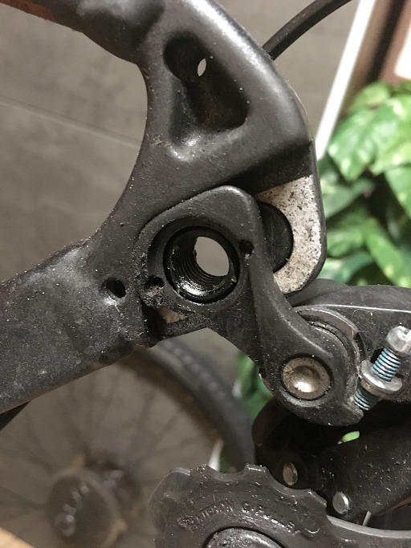
- Sitzstangenschraube (beim Revolt, Adapter auch?)

Stahl rostet,
Alu rostet nicht aber oxidiert weißlich - diese Patina sieht nicht gut aus, waere aber nicht weiter schlimm (rostet nicht durch wie Stahl),
Carbon? Titan?

### Radwäsche

"Ich benutze nie aber niemals Kettenreiniger; 
es haut die ganze schmierung zwischen den Glieder raus. 
Kette reinigt man mit der Zahnbürste und etliche saubere Lappen. 
Kassette wird abgezogen und So gereinigt. 
Dann Fahrrad mit schlauch komplett nass machen. 
Bike cleaner ordentlich drauf sprühen fertig abspülen fertig. 
Trocknen Rahmen polieren mit entsprechenden Mitteln. 
Freilauf fetten zusammen bauen. 
Kette neu schmieren paar mal auf und ab schalten. 
Kette durch ein sauberes Tuch nochmal ziehen und fertig.
So und wenn du mit Kettenreiniger die schmierung zwischen den Glieder raus waschen tust 
wirst du die schmierung zwischen den Glieder nicht mehr hinbekommen 
und deine Kette Verschleißt schneller. 
Zur Info bin Zweirad Mechaniker und im Amateur Bereich ein erfolgreicher Fahrer weiß auf was es ankommt."

Manche Mechaniker empfehlen weniger als haeufiger zu reinigen.
Wasser spuelt viel aus, Wasser bleibt irgendwo stehen und laesst korrodieren.

Motorrad-Reiniger mehr und billiger (hab ich damals vom Fahrradladen bekommen, die würden das auch so machen)

- Sprühflasche 1000 ml, z.B.
	- JMC Gel-Motorradreiniger
	- NIGRIN Bike-Care Fahrrad-Reiniger

- Bürsten, 2x Schwämme (Antrieb und Rahmen, sonst schmiert mal Kettenöl auf Rahmen),
	2x Wassereimer (Dreck und sauber zum Endabspuelen)
	- mag die Holzbuersten von Peaty's (nicht zu verwechseln mit Pedro's, sehen aber auch ok aus)

- besser: Kärcher Niedrigdruckreiniger (großes Volumen 7L reicht fuer 1 Waesche, nicht kleiner kaufen):
	Hochdruckreiniger (Tankstelle) vermeiden (bzw. mit viel Abstand nutzen), schießen Schmierung aus den Lagern 

- Handtuch (kein Wischmopptuch, das fusselt brutal) zum Trocknen von Rahmen, Lenker, Sattel und und Laufrädern

### Schaltung einstellen

- kleinster Gang = geringste Zugspannung
- Test: in kleinstes Ritzel und dann Gang für Gang nach oben und wieder zurück
- Zugspannung hinten: Rädchen an dem Zeugs hinten in die Richtung drehen, in die es besser schalten soll (rechts -> kleine Ritzel)
- Zugspannung Umwerfer: Rädchen vorne am Lenker
- Umwerfer: Anschlag
	- H-Schraube (Highspeed):  R| #|  (# Kette, | Leitblech, Z Rahmen)
			1. vorne großes Kettenblatt, hinten kleinstes Ritzel
			2. drehen, bis sichtbar an die Kette drückt
			3. dann viertel zurückdrehen, damit 1mm Abstand sichtbar wird zw. Blech und Kette
	- L-Schrauber:  R|# |
			1. vorne kleinstes Blatt, hinten größtes Ritzel
			2. 
	- nur relevant, wenn oberste oder untereste Zahnrad nicht richtig wechselt; alles dazwischen unbetroffen von den Einstellungen:w
	- Umwerferkäfig und die Kettenblätter sollten zueinander parallel stehen
- Umwerfer: Höhe
	- vorher: kleinste Gang
- Start: kleinstes Blatt vorne, größtes Ritzel hinten

### Bremsen einstellen

- TODO

### Kette schmieren

- ideal biologisch abbaubares Öl
- ideal leicht auswaschbares Öl, da man sich 100% damit immer mal wieder irgendwo einsaut (bei normalen Hosen: Hose unten nah ans Bein abbinden)
- manche nutzen Wachs statt Öl, erfordert aber Komplettreinigung
- angeblich beste: ein Tröpfchen auf jede einzelne der 57 Gliederrollen (Start-/Endpunkt Kettenschloss) - zeitintensiv
	- meine version: Tropfen auf Pinsel (flach, nicht breiter als Kette) 
	  und immer ein Kettensegment von oben einstreichen (unterer Kettenlauf), 
	  dann halbe- oder vierteldrehung weiterkurbeln - sauberer und schneller; abwischen muss man Ende bei allen Methoden
	- schlechteste: direkt auf Kette ausgiesen und drehen
- oel einwandern lassen - angeblich stunde warten, angeblich ideal ueber nacht
- am Ende immer nochmal abwischen: 
	Ol muss nur _in_ die Glieder, nicht auf der Kette bzw. an den Kettenseiten; 
	dort zieht es nur Dreck an und verschleisst den Antrieb mehr statt weniger
- korrekt geölte Kette bleibt silbern (schwarz = zu viel/zu viel Dreck); auch korrekte Ritzel sind silber und nicht schwarz;
	erkennt man den newb

### Kette wechseln

- Kette längt sich über die Zeit
	- abh. von Qualität, gefahrenen Gängen und Krafteinwirkung usw.
- gelängte Kette verschleißt auch Ritzel und Kettenblätter stärker
	- neue Ketten passen dann evtl. nicht mehr richtig drauf = Schaltprobleme, springende Kette
	- meine war schon nach etwa 1300 km gelängt, neue Kette passte gut; manche nutzen Ketten angebl. 5000-10000 km
- Kette abhängig von der Anzahl der Ritzel kaufen (9-Speed etc), je mehr Ritzel, umso dünner die Ketten
- Kettenmesslehre (z.B. Rohloff Caliber 2) 
	- Stahl vs Aluseite: Magnettest (Alu ist nicht magnetisch)
	- Kette erneuern, falls Lehrnase durch die Glieder fällt

1. Kette entspannen: kleinstes Ritzel, kleinstes Kettenblatt
2. Kettenschloss öffnen
	- spezielle Zange
	- oder Schnur in Nachbarglieder und mit Stock o.ä. zudrehen
	- oder Kettenschloss aufs Kettenblatt führen (3 oder 4 Uhr), Glieder abwinkeln und mit Minitool oä. draufschlagen
3. Kettenlänge ermitteln und einkürzen
	- Vergleich mit alter Kette: Glied mit Glied vergleichen, da alte Kette gelängt ist
	- meine KMC-Kette war out-of-the-box richtig gelängt
4. Schaltkäfig, Schalträdchen etc säubern
5. Kette richtig einfädeln (über kleinstes Ritzel)
	- korrekter Lauf über Schalträdchen und Führungen beachten
	- manche Ketten haben eine Laufrichtung (Shimano), oft Text nach außen (Richtung bei KMC egal)
6. Kettenschloss schließen
	- spezielle Zange
	- oder Kette mit Kettenschloss nach oben drehen, Bremse halten und in Pedale treten
7. neue Kette säubern, evtl. schmieren

### Pedale wechseln

- Links/Rechtsgewinde! beide Seiten jeweils Öffnen in Richtung Hinterrad und Schließen in Richtung Vorderrad [TODO nochmal gegenpruefen]
- Schmieren z.B. mit Shimano Anti-Seize fuer dichte starre Verbindung, die nicht festrosten/festfressen soll
- TODO

### Felge zentrieren / Truing

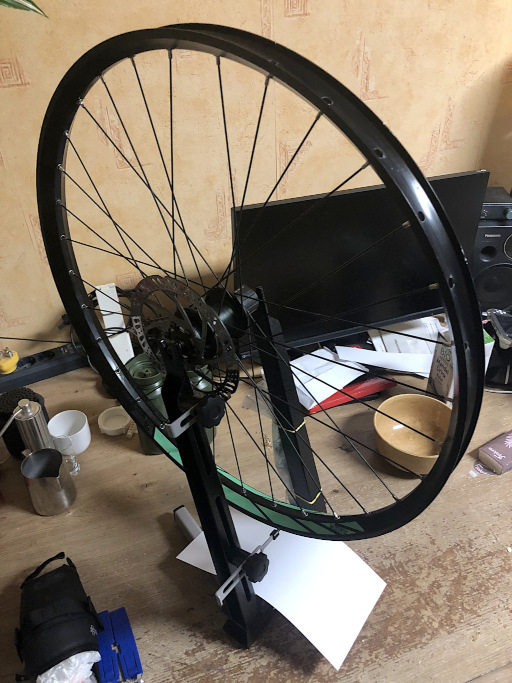

Als Hobby-Zentrierstaender habe ich den kleinen von UNIOR geholt, der ist verwindungssteif/steht wie eine 1 
und laesst sich zusammengelegt schnell wieder in den Schrank packen.
Professionellere haben Messuhren mit beweglichen Fuehlern. 
Manche bauen sich selbst welche aus Systemprofilen. 
Fuer Andere reicht ein Kabelbinder an der Sitzstrebe.

- s. Parktool YouTube

### Bowdenzuege ersetzen

- STI-Brems-Schalthebel-Kombination Shimano
- mechanische Schaltung/Bremsen
- innenverlegte Zuege

Gerissener Zug zählt wohl zum Verschleiß und Verschleißteile sind bei Gewährleistung meist ausgenommen. 
Zusätzliche (freiwillige) Garantien gibt es nur vom Hersteller Giant 
und auch dort nur auf den Rahmen und paar andere Teile
(wie z.B. damals mit meinem korrodierten Steuersatz).
Außerdem bin ich mittlerweile in der Nachweispflicht und wüsste nicht, 
wie ich nachweisen sollte, dass das Ganze bereits bei Auslieferung mangelhaft war. 
Angeblich hätten solche Züge tats. nur eine Haltbarkeit von 1-3 Jahren bei sportlicheren Fahrern.

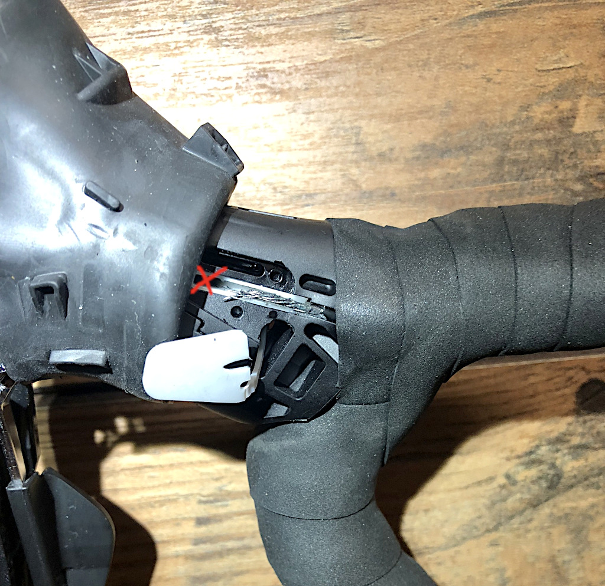

- Schaltzug 4mm, Bremszug 5mm, also das dickere, kann beim Erkennen des Kabels helfen, wenn es unterm Lenkerband irgendwo hinfuehrt...
- Radien beachten, also das alles schoen rund und nicht zu eng laueft, nichts knicken, sonst reibt der Zug 
- 

Begriffe:

- Drahtzug / Seil: Geflecht aus vielen duennen Stahldraehten
- Aussenhuelle
- Zugnippel
- (Huellen-)Endkappe, ggf. gedichtet, schliessen die Huellen, so dass nur noch der blanke Zug durchguckt, 
	sind oft auch noetig, um den Bowdenzug in Fuehrungen usw. einzustecken;
	die Endkappen gibt es in verschiedenen Ausfuehrungen, nicht nur modisch begruendete
- Zugend-Huelse verhindert Ausfranzen des Zugs am Ende, schuetzt vor allem den User vor Verletzungen
- Schaltkaefig
- Fein-Einstellschraube
- Klemmschraube / Klemmung

Nicht verkehrt "Sets" zu kaufen, da ist vieles drin, was man vielleicht vergessen haette.

Werkzeuge (teils optional):

- Bowdenzug-Cutter, evtl. mit Crimp-Funktion fuer Huelsen und (Metall-)Kappen (z.B. Gedore GEDORE Bowdenzug-Zange 170 mm 8317-160 JC)
	fuer ein sauberes Schnittbild, damit der Zug nicht ausfranzt bzw. die Huelle murks wird;
	allgemeine Kabelscheren oder Seitenschneider nur mit Vorsicht
- Feile bzw. Schleifpapier, um eine geschnittene Huelle eben/glatt zu machen, ideal bis gleichauf mit Metal innen, und nichts schief haengt
- konische Nadel / Pieker, um die Huelle wieder rund zu oeffnen, falls sie beim Cutten zusammengedrueckt wurde
- 1-2mm Schrumpfschlauch oder Stossverbinder, 
	um alten und neuen Zug zu verbinden und beim Ausfaedeln des alten Zugs den neuen Zug gleich nachzuziehen, 
	hauptsaechlich bei innenverlegten Zuegen;
	beim Schrumpfschlauch nur die Enden schrumpfen und in der Mitte nicht so sehr, sonst rutschen die Zuege aus dem Schrumpfschlauch raus oder die Verbindung wird beeintraechtigt.
	daher bisschen Zugfestigkeit testen; wenn ausreichend fest, funktioniert es auch ganz gut, damit durch kleine Loecher zu kommen
- Haken o.a., um Zuege aus Oeffnungen rauszufischen
- Lineal, um beim Ablaengen die alte Zughuellen als Referenz fuer neue zu nehmen (kann man auch direkt zusammenhalten, wenn es einfacher geht)
- evtl. was zum Schmieren der Zuege in den Huellen, aber z.B. Shimano OT-SP41 soll nicht geschmiert werden, da die von Haus aus vorgeschmiert kommen, Ol ist sogar nachteilig, zieht Dreck rein
- Inbus-Schluessel fuer Schraube am Schaltkaefig, alles Andere wird bei meinem Rad sonst nur mit der Hand rausgezeogen, gesteckt und gefaedelt
- Silikonspray zum Schmieren der Zugaufnahme im Bremsschalthebel, kein Öl; der Zug macht auch an der Stelle noch kleine Bewegungen
- Druckluft zum Ausblasen von Drahtresten (mit Vorsicht verwenden: nur bei Zugfuehrung einblasen)

Gerissenen Schaltzug im STI-Bremsschalthebel entfernen:

den Griffgummi kann man nach vorne und nach hinten (richtung Lenker) wickeln.
den Griffgummi kann man direkt unter dem Hebel greifen und etwas nach vorne Ziehen, dann loest sich der Gummi auf der Hood-Spitze beim Bremshebel.

Auf der Innenseite des Hebels ist eine helle Klappe, die kann man mit den Fingern oder etwas Spitzel heraushebeln.

Kleinen Hebel nutzen, damit die Zugnippelaufnahme Richtung Außenoeffnung kommt (von Außenseite auf den Schalter gesehen)

Von Unten auf den Hebel geschaut befindet sich ein Service-Fenster, verdeckt mit eine Klappe mit Schraube: Nach Loesen kommt man an das Schaltwerk heran
und kann abgerissene Zugteile vorsichtig herausziehen.
Um diese Klappe wieder anbringen zu koennen sollte man den Griffgummi erst nach hinten Richtung Lenker wickeln.

Drahtzug maximal 3-5 cm (inkl. Endhuelse) hinter der Klemmung überstehen lassen;
kuerzer wirkt professioneller: sauberer (kein unnoetiger Drahtueberschuss), 
weniger Risiko fuer Kontakt mit Bauteilen, Kleidung oder Gestruepp und entsprechende Geraeusche;
mind 1-2 cm aber unbedingt stehen lassen, damit man den Zug noch beim Nachjustieren greifen kann.

Schaltzug:

Shimano-Zuege sind 1,2 mm - viele andere nur 1,1mm, macht die Verwendung mit markenfremden Aussenhuellen evtl. schwieriger
Jagwire LEX Aussenhuellen waeren wohl mit Shimano bzw. max 1,2mm kompatibel. 
Mein Fahrrad kam mit Jagwire-Huellen trotz Shimano-Gruppe ausm Radladen.

TODO

Beim Einfaedeln immer schoen Radien lassen, nichts knicken;
wenn man eng um die Ecke muss, erstmal eine Schlaufe drehen und den Enden Spielraum lassen, der Zugnippel muss nicht gleich eingelegt sein;
hab das erst am Ende gemacht, wenn alles verlegt war;

Schalttest mit Finger am Zugende, nur fuers Auge nicht gleich gut erkennbar

kleinste Ritzel und den Zug dann leicht gespannt fixieren; Rest ueber Feineinstellschraube

s. Schaltung einstellen

Bremszug:

### Steuersatz (Headset), Gabel

- Knackt oder quietscht beim Einschlagen des Lenkers und 
	- Grund ist keine der Klemmungen am Vorbau 
	- Grund ist kein reibender Bowdenzug
- Gabel-Service mind. 1x im Jahr = Selbermachen
- hatte nach dem ersten Winter Knacken durch korrodierte Lager, 
		und jetzt nach dem zweiten Winter (obwohl nur Trockenfahrt) ein Quietschen wie Gummi auf Metal

- Unterscheidung 1: 
		[ ] Gewinde-Steuersatz (alt),
		[x] gewindeloser Ahead-Steuersatz (modern)
- Unterscheidung 2: 
		[ ] Aussenliegende Schalen (EC External Cups), 
		[ ] Semi-integrierte Lagerschalen (ZS Zero Stack), 
		[x] Voll-integrierte Lagerschalen (IS Integrated Standard)
- Unterscheidung 3:
		[ ] gerader Schaft
		[x] "Tapered" = konischer Schaft, nach oben verjuengt; verschieden große lager-durchmesser
- Bei einigen Modelle bilden die Lager und die Lagerschalen eine Einheit
- Reduzierhulesen und Reduzier-Steuersätze helfen beim Einpassen duennerer Gabelschaefte
- Fahrradteilhersteller 2010 auf Standard "SHIS" zur Angabe des Steuersatz-Typs: 
		z.B. EC34/30 mit 
		Bauart (EC,ZS,IS), 
		erste  Zahl = Steuerrohr-Durchmesser
		zweite Zahl = Gabelschaft-Durchmesser

#### Schmieren, Fetten

- Nachfetten von Lagern, Lagersitzen, Lagerschalen, Gabelschaft 
		und allen Kontaktflächen verhindert Korrision und erleichtert die Demontage/Montage
- zum Nachfetten reicht es, wenn man die Gabel nur ein Stück herauszieht 
- Bei offenen Lagern fetten Sie die Kugelringe mit Wälzlagerfett
- Man kann das Lager etwas zusätzlich gegen die Elemente schützen, 
	indem man Fett außen aufs Lager anbringt, optimalerweise eines, das für die Verwendung bei Carbon offiziell zugelassen ist
- Da Aluminium im Steuerrohrbereich durch Feuchtigkeit korrodieren kann, 
	ist es sinnvoll, eine dünne Schicht Fett (z. B. Montagefett oder Korrosionsschutzfett) 
	auf die Innenwände aufzutragen, besonders bei Fahrten in feuchtem Klima;
	ABER kein Fett auf die Lagersitze, da dort präziser Halt erforderlich ist.
- Gabelschaft (Carbon) vs. Spacerringe oder Vorbau:  
	Falls deine Gabel einen Carbon-Schaft hat, 
	könnte das Geräusch von einer trockenen oder unsauber montierten Verbindung zwischen Gabelschaft und Spacern oder Vorbau kommen.
	Lösung: Gabelschaft reinigen und eine dünne Schicht Carbon-Montagepaste auftragen (falls Carbon auf Metall trifft).
- Steuersatz (Lager oder Dichtung):  
	Manche Steuersätze haben eine Gummidichtung zwischen Rahmen und Lager. 
	Wenn diese trocken ist oder leicht verschoben sitzt, 
	kann sie beim Drehen des Lenkers ein quietschendes Geräusch machen.
	Lösung: Lagerdeckel und Dichtung reinigen, leicht mit Silikonfett oder PTFE-Spray schmieren (kein Öl oder dickes Fett).
- Lagerschale im Steuerrohr:  
	Falls dein Steuersatz ein integriertes oder semi-integriertes Lager hat, könnte es sein, dass die Lagerschale nicht perfekt sitzt oder leicht klemmt.
	Lösung: Lagersitz prüfen, reinigen und evtl. eine sehr dünne Schicht Fett auftragen.
- Carbon-Schmiererei:
	- NUTZE Carbon-Montagepaste für Klemmstellen, z. B. Vorbau, Sattelstütze
	- NUTZE PTFE-/Teflon-Fett für Lager, Steuersatz, Schrauben, Gewinde
	- NUTZE Silikonfett für Dichtungen, Steuersatzkappe, Spacer
	- KEIN Kupfer- oder Aluminiumfett (kann mit Carbon reagieren), 
	- KEIN normales Mehrzweckfett wie Lithiumfett oder Marinefett bzw. mineralölbasiertes Fett (kann das Harz im Carbon angreifen),
	- KEIN Lithium- oder Kalziumseifenfette (häufige Metallfette)
	- KEIN Kupfer- oder Aluminium-Anti-Seize-Pasten (enthalten oft aggressive Zusätze)
	- KEINE lösungsmittelhaltige Schmierstoffe (WD-40, Aceton, Bremsenreiniger), machen Harz spröde
	- KEIN WD-40 oder Öl als Ersatz für Fett (bietet keinen Langzeitschutz)
- Silikonfett wird nicht direkt in den Lagermechanismus 
	(also zwischen die Kugeln oder Rollen) selbst geschmiert, 
	sondern ist vielmehr für Dichtungen, 
	Gummiteile und Kunststoffkomponenten rund um das Lager gedacht. 
	Es wird verwendet, um Dichtungen zu pflegen und Reibung an Gummiteilen 
	zu reduzieren. Für die inneren Lagerteile (wie Kugeln und Rollen) sollte hingegen spezielles Lagerfett verwendet werden

Teile:
	- Ahead-Expander sitzt mit Gewinde im Gabelschaft = leicht PTFE/Teflon-Fett
	- Steuersatz-Kappe: Schraube für die Ahead-Kappe sizt in einem Gewinde = leicht PTFE/Teflon/Silikon-Fett
	- Steuersatz-Gummi-Dichtungen = Silikonfett (zur Not weniger lang haltendes Silikonspray), verhindert Austrocknung oder Quietschen
	- 

#### Vollintegrierte Lagerschalen (IS Integrated Standard)

- braucht kein Einpresswerkzeug
- Lager liegen in Buchten und koennen mir Finger oder Plastikpieker rausgeholt werden
- AHead-Kappe nur fuer Lagerspiel zustaendig, nicht zum fixieren - das macht die Klemme am Vorbau; daher auch nicht zuknallen, sondern sanft

Mein Fall: Giant-Overdrive-Steerer, konische Carbon-Gabel in Alu-Rahmen, Bremskabel in Gabel aber nicht im Rahmen integriert

Aufbau:

mehr oder weniger sichtbar:
1. [x] Spannschraube/Stellschraube durch Ahead-Kappe
2. [x] Ahead-Kappe auf Gabelschaft
3. [ ] Ahead-Kralle (Metallgabel, Spezialwerkzeug) oder [x] Ahead-Klemme/Plug/Expander (Carbon, Inbus) im Gabelschaft
		[x] CARBON: hier darf keine Aheadkralle eingeschlagen werden! 
		Diese würden den Schaft beschädigen, wodurch er an Stabilität verliert und brechen kann. 
		Bei Carbonschäften ausschließlich geschraubte Krallen!
4. [x] Vorbau um Gabelschaft ("Stem")
5. [x] "Spacer"/"Washer" um Gabelschaft
6. [x] Abschlussdeckel/Staubring ("Dust Cover") / Lagerkonus oben

innerlich oben:
7. [ ] Zentrierring ("Compression ring")
8. [x] Lenkkopf-Lager ("Bearing")

falls semi-integriert:
9. [ ] obere Lagerschale ("Upper Cup"),  nach oben geoeffnet
10. [ ] untere Lagerschale ("Lower Cup"), umgedreht/nach unten geoeffnet

innerlich unten:
11. [x] Lenkkopf-Lager ("Bearing")
12. [ ] Konusring ("Race Crown") - moeglicherweise schon integriert bei Voll-Carbon-Gabelschaft, sonst evtl. aus Alu bei Carbongabel
13. [x] Gabelbruecke und Gabelschenkel

Werkzeug:
- [x] Aufschlagwerkzeug für den Gabelkonus
- [ ] Einschlagwerkzeug für Aheadkrallen (hab ich nicht)
- [x] Inbus-Schluessel
- [ ] Fett? Eventuell Fett (in der Regel sind die Sätze jedoch vorgefettet)

Oeffnen:

1. Bei jedem Schritt Fotos machen!
2. Vorderrad ausbauen
3. Gabel am Unterrohr mit Band sichern, ggf. Kissen/Bettdecke o.a., damit eine herunter fallende Gabel weicher landet
4. AHead-Kappe abschrauben
5. Vorbauschrauben loesen - Gabel koennte jetzt schon rausfallen!
6. Lenker abziehen und vorsichtig haengen lassen oder irgendwo mit Band fixieren, ggf. auf Lappen, um Schrammen zu verhindern
7. Spacer und Abdeckung vom Gabelschaft nehmen
8. Ideal: Bremskabel lang genug und nicht im Rahmen integriert, sonst Scheibenbremse vom Rahmen loesen; 
		Gabel baumelt zwar am Kabel rum, aber genug Spielraum zum Saeubern
9. Gabel vorsichtig rausziehen

Schliessen:

### Radlager

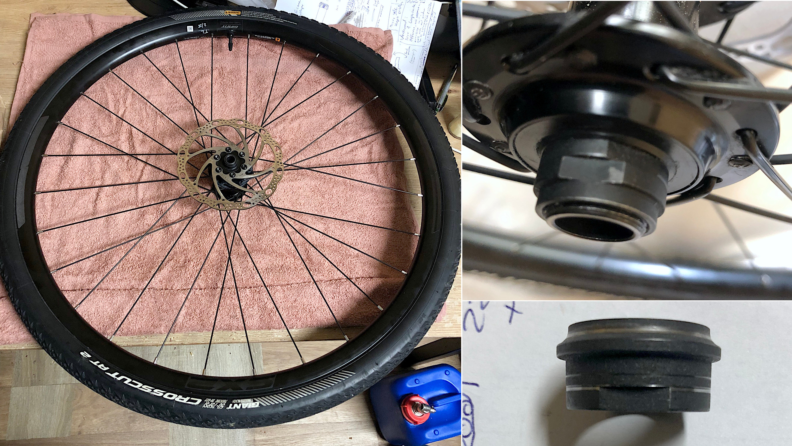

Unterscheidung:
- [ ] Cartrdige-Lager abgedichtete Industrielager
	- Ein- und Auspresswerkzeug mit korrekten Adaptern/Drifts
	- Fett
- [x] Konuslager mit Kugeln
	- Werkzeug: Konusschluessel in den richtigen Groessen: zum Kontern und schrauben
	- Lagerfett (s. Abschnitt Schmierstoffkunde)
	- Lagerkugeln: 
		- Bevorzugt Wälzlagerstahl 100Cr6 / 1.3505, 
		- gehärtet auf HRC 60–66 (HRC 40 ist Baumarktqualitaet),
		- mit Genauigkeitsklasse irgendwo zw. G5-G20 (also der Rundschliff, niedrigere Zahl = hoehere Praezision, G20 ist noch ok, darueber nicht mehr), 
		- nach DIN 5401 / ISO 3290.
		- Optional auch in Edelstahl (z.B. 440C), 
		  falls mit vergleichbarer Härte ≥58 HRC verfügbar
	- Magnet zum Entfernen der Kugeln: habe "Cat-Eye-Magnete" aus der Nagelkosmetik gekauft und den Magnet nochmal mit Superkleber in der Fassung verhaftet, 
		klein mit Griff; Teleskopmagnet wohl auch ok;
		Magnet nur zum Entfernen und wenn man sie nicht wieder einsetzen möchte (magnetische Kugeln haften sich sonst angeblich an pittings)
	- Pinzette zum Einsetzen der Kugeln
		(evtl. Trick mit eingesetzter Achse einfach die Kugeln reinfallen zu lassen); habe eine von Knipex, funktioniert ganz gut

Bei meinem Modell waere vorne Konuslager und hinten Cartridge/gedichtetes Industrielager:
- vorne wirke nur Kraft von oben und hinten (radial); Konus rolle besser als Cartridge (keine Frage von billig oder teuer; auch immer noch in teuren Raedern verbaut)
- hinten wirken noch seitliche Kraefte durch den Antrieb (axial/torsional), wo Cartridge-Lager stabiler sind

#### Vorbereitungen:

- Handtuch auf Montagetisch, Rad auf dem Handtuch: hält herausfallende Kugeln auf; alternativ ueber einem Eimer arbeiten
- Bremsscheiben entfernen (Torx 25, 4-6 Nm) kann es leichter machen - falls man an dieser Seite zumindest an der Achse was korrigieren muss, im Idealfall nicht
- Ablagen für die Einzelteile, ggf. getrennt nach Antriebs- und Nichtantriebs-/Bremsseite
- Kugeln spaeter immer mal wieder abzaehlen

#### Vorderrad-Lager oeffnen

1. ganz Aussen sitzen die Sicherungsmuttern (Mutter mit zusaetzlichem Plastikring), 
	dann eine Staubkappe, 
	dann der Konus, der Lagerkugeln auf der inneren Lagerschale mit einer definierten Spannung haelt
2. zuerst an der Antriebsseite oeffnen (also gegenueber von der Bremsscheibe)
3. Konusschluessel an Konus, dort kontern und Sicherungsmutter gegen Uhrzeigersinn aufdrehen
4. Sicherungsmutter, Staubkappe, Konus entfernen (bei Komplettwartung)
	- ueberall merken, wo oben und unten war: entweder durch entsprechendes Ablegen in einer Schale oder Skizze auf Notizzettel
5. Kugeln entfernen mit Magnet oder Pinzette
6. Rad umdrehen, dabei die Achse festhalten (sonst fliegen Kugeln raus) und Achse an der Bremsseite entfernen
7. Kugeln entfernen

#### Vorderrad-Lager reinigen

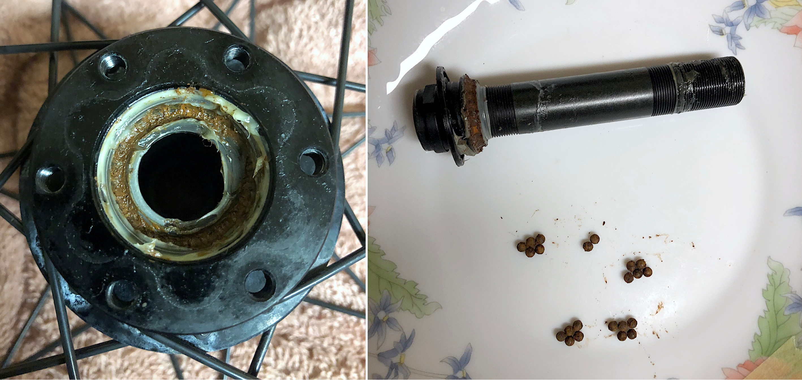
_(Abb.: Korrosion im Radlager, Fett ausgewaschen; ab Werk in 2.5 Jahren nie gewartet; Antriebsseite halbwegs ok, bremsenseitig obiges Bild)_

- alles reinigen: Achse, Konus, Schale, Kontermutter; Kugeln nur wenn neueren Datums
- Bio-Degreaser aufspruehen
- mit Wattestäbschen den Grind entfernen
- Bio-Degreaser, IPA, Rostentferner, Polieren, je nachdem - bis alles wieder glaenzt

#### Lagerteile untersuchen

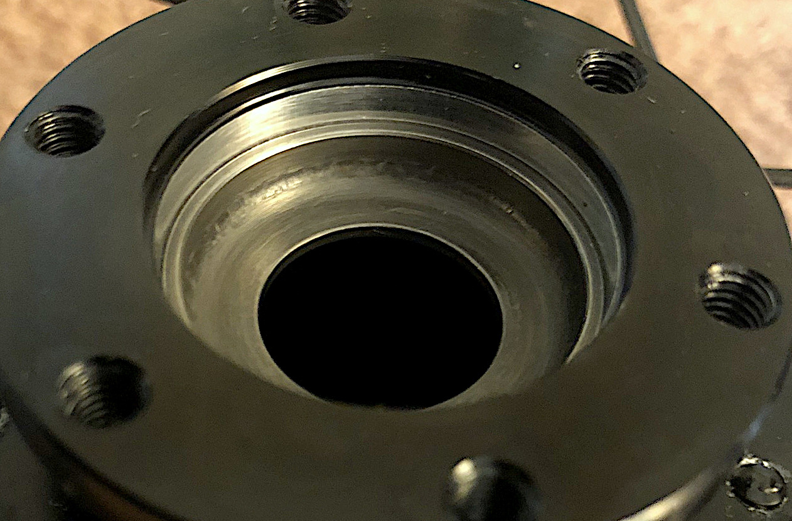
_(Abb.: Pittings in der Lagerschale)_

- minimalste Einkerbungen (Pittings) in der Lagerschale oder an der schraegen Laufflaeche des Konus sorgen schon fuer sandiges Feeling/rauen Lauf;
	sollte tats. perfekt glattrund sein für minimalsten Punktkontakt zw. Kugel und Flächen; 
	das Rad hier laeuft nach Instandsetzung wesentlich besser als vorher (handgedrehte Achse klemmt stellenweise) und auch nur leicht sandig (trotz Pittings), 
	aber nie wieder butterweich und mehr Verschleiß ist zu erwarten
- Kugeln idealerweise entsorgen und neue nehmen, kosten nicht die Welt
- manche Lagerschalen sind nur eingepresst und koennten theoretisch getauscht werden, 
	scheitert aber an Ersatzteilen, bzw. Notwendigkeit, gleich eine ganze Ersatznabe kaufen zu muessen;
	ansonsten ist die Nabe am Ende bzw. das komplette Laufrad, wenn man keine Lust aufs Einspeichen einer neuen Nabe hat

#### Vorderrad-Lager schmieren und Kugeln einsetzen

- lieber zu viel Fett als zu wenig (trotzdem nicht uebertreiben), wenn es rausquirlt ist auch nicht verkehrt (Waermeentw. und Bremswirkung wohl vernachlaessigbar)

1. bei der Nondrive-Seite (also Bremsschreiben-Seite) anfangen
2. erste Fettschicht auf der Lagerschale
3. Kugeln einsetzen, sollte Ring ausfüllen + 1 Luecke
	- manche Schalen haetten Vertiefungen fuer die Aufnahme der Kugeln, meine ist plan
4. zweite Fettschicht ueber die Kugeln
5. Achse, Konus, Staubkappe leicht einfetten
6. Achse mit dem Konus einsetzen und bisschen wackeln und drehen, damit sich die Kugeln richtig setzen
7. Rad umdrehen, Achse dabei festhalten, und auf der anderen Seite dann schmieren und Kugeln einsetzen

#### Vorderrad-Lager schließen und justieren

Unterscheidungen:
	- [ ] Schnellspanner
			- minimales Spiel der Achse erhalten, kaum fuehlbar; Schnellspanner presst/spannt zusaetzlich und kompensiere das Lagerspiel
	- [x] Steckachse
			- kein Spiel der Achse

Beachten:
	- gleiche Abstaende an den Achsenenden (wenn es dumm kommt, war das ab Werk schon ungleich und man muesste evtl. Scheibenbremse korrigieren)
	- gutes Rad laeuft butterweich, 0 Widerstand, kein leichtes sandiges Reiben, das Lager sollte man 0 spueren, als waere es gar nicht da

Trick:
1. Achse auf der gegenüberliegenden Seite richtig andrücken, damit auf der anderen Seite vollstaendiges Gewinde verfuegbar ist (sonst spaeter ungewolltest Achsenspiel)
2. Konus ranschieben bis man Kugeln kontaktiert
3. Sicherungsmutter auf den Konus mit der Hand drehen
4. Konus jetzt gegen die Mutter sichern (statt umgekehrt), so dass der Konus beim Spannen gegen die Mutter von den Kugeln minimalst zurueckgeht

### Nachbereitungen

- nach 50 km nochmal pruefen: Achsenspiel (kippelt das Laufrad in der Gabel), Rauheit, ...

### Dichtmilch erneuern

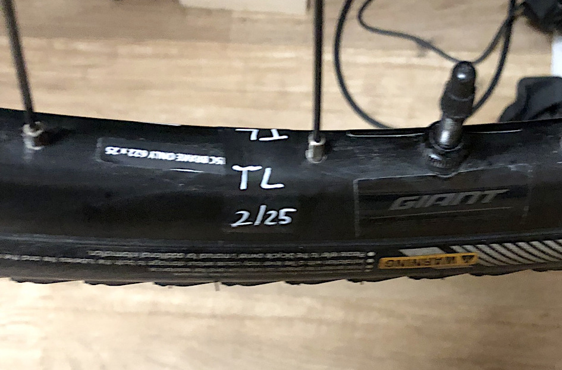

Ich notiere das Datum meiner letzten Erneuerung direkt auf den Laufraedern:
Das Etikett besteht aus einem schwarzen Stueck 3M 33+ Scotch Elektroisolierband mit 19mm Breite
und einem weissen Schriftzug aus einem Edding 780 Glanzlackmarker weiss 0,8mm Rundspitze.

Nach einigen Monaten trocknet die Milch aus.

Mit Dichtmilch sollte man regelm. fahren und nicht lange im Keler stehen lassen, 
sonst bildet sich im Reifen am Boden eine Verklumpung und damit eine Unwucht.

Nachfuellen:

- man kann haeufiger direkt nachfuellen, das Gewicht getrockneter alter Dichtmilch betraegt nur wenige Gramm und ist vernachlaessigbar.
- es gibt 59ml-Flaschen direkt mit Spitze, die man in die Ventiloeffnung druecken kann:
	1. Luft rauslassen, sonst fliegt einem der Ventileinsatz um die Ohren
	2. Ventileinsatz herausschrauben
	3. Ventil auf 12 Uhr, damit man mit der Flasche nicht rumsaut
	4. Flasche ansetzen und zusammen mit dem Ventil auf 6 Uhr drehen
	5. ausdruecken
	6. Ventiloeffnung bisschen saeubern, z.B. mit Ohrstaebchen
	7. Ventileinsatz reinschrauben
	8. aufpumpen, nicht knallvoll
	9. paar mal Rad seitlich nach vorne wenden, dann wie uhr drehen, dann zu sich drehen, wieder wie uhr drehen, wiederholen

Saeubern:

## Bikepacking

- Bikepacking vs. Radreise/Biketouring
	- Bikepacking urspr. für Offroad
- Hauptproblem: Packmaß und Gewicht; Packmaß wichtiger
- Schwere Sachen niedrig (weniger balancieren) 
	und im Zentrum des Fahrrads (frontal und seitlich)
- 0 &lt; Rad-Systemgewicht - Fahrergewicht, Fahrradgewicht, Taschengewicht, ggf. Lenkeraufsatz, ...

- je leichter das Rad, umso besser: Gewicht nervt bei Anstiegen und 
   ermuedet ueber lange Strecken schneller und geht auch staerker auf die Substanz/Gelenke etc.

- die einzige Form des Reisens: zu Fuss ist man nach Stunden noch am selben Ort, im Auto fliegt alles vorbei, Flugzeug oder Zug ist kein Reisen sondern Transport (Reisender vs Passagier),
	auf dem Fahrrad reist man langsam um alles aufzunehmen, aber schnell genug, um vorwaerts zu kommen

### Reine Lehre

- Gabeltaschen (hässlich)
- Rahmentasche (Halb- oder Vollrahmentasche)
	- Giant Halbrahmentasche H2Pro, gefaellt mir bisher
	- verhunzen aber Radästhethik
- Arschrakete (Satteltasche): 
	- Zefal Z Adventure R17: kein separater Packsack, aber trotzdem ok, wasserdicht, wackelt wenig
	- umso hässlicher je länger und höher sie absteht
- Oberrohrtasche
	- ~~Giant H2Pro~~, wackelt, Reißverschluss ausgefaedelt und nicht mehr reinbekommen, weggeworfen
	- Craft Cadence Bolt-on mit bequemerer Klappe statt Reißverschluss, 
		Schrauben fuer meine Anschraubpunkte (statt Riemen), (angebl.) wasserdicht, taugte bisher
- Lenkertasche
	- Giant H2Pro 12 Liter Harness + Drybag
	- Altura Vortex 11 Liter Rolltop Toploader (2024-Version mit orangem Strap)
	- Drybags taugen fuer leichte, ausfuellend-weiche, sperrige Items wie Zelt, Isomatte, Schlafsack;
	  sind aber nicht formstabil und gut ins Harness einklemmbar bei 
		vielen kleineren, härteren Einzelteillen z.B. Kochset, evtl Lebensmittel,
		da eignen sich Taschen besser
	- manche stützen Taschen mit Front-Racks oder kleiner "Pec Dec" bzw. "Rod Steward"
- untypisch: Rear-Rack/Gepäckträger und Paniers/Gepäckträgertaschen;
	- der Lehre nach dann zumindest nicht bulky (Micro/Mini-Paniers)
	- oder Rack-Trunk

Zeltstangen bekomme ich zw. Rahmentasche und Oberrohr 
mit verlängerten Klettbändern von der Rahmentasche, das hält sehr gut.

Für Tagesstouren komplett ausreichend, 
bei Mehrtagesstouren bei meinen "Reine-Lehre"-Kapazitäten nur mit Biwaksack 
(Doppelwand-Zelt bekomm ich nicht mehr unter/kleiner ohne aufs Koch-Set zu verzichten).
Nötigt auch viel zu Tetris.
Oder eben dann Hybridlösung.

Viele Taschen zerstören die Rad-Ästhethik (leicht und schlank).
Idealerweise in einer anderen Farbe als der Rahmen (z.B. schwarzer Rahmen, grüne Taschen).
So verschwimmt die Tasche nicht mit dem Rahmen und laesst das Rad klumpiger erscheinen.
Der Rahmen setzt sich besser ab, das schlanke Rad bleibt erkennbar.

Entscheiden: Komfort waehrend der Fahrt (wenig Gewicht/Ausruestung) oder nach der Fahrt (viel Gewicht).
Vielleicht braucht es mehr Komfort am Ende, weil man wenig waehrend der Fahrt hatte.
Andererseits ist ein Faltstuhl vor dem eigenen Zelt schon eine tolle Sache, um lesend oder mit einem Podcast Zeit tot zu schlagen.

### Hybridlösung

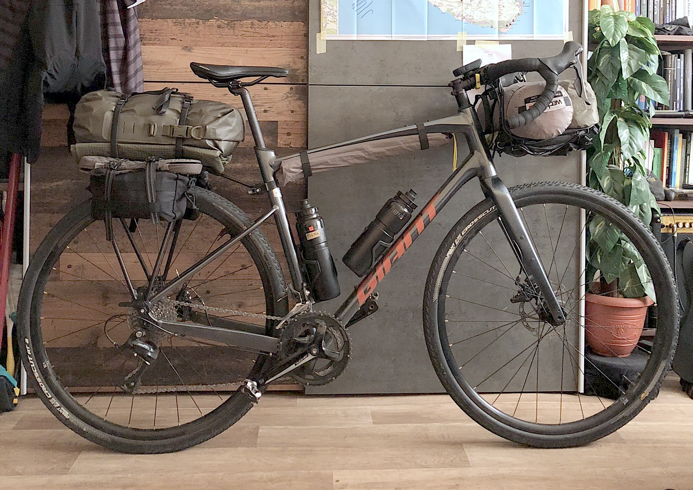

- Gepäckträger + 15-35 Liter Rucksack oder Drybag mit Trage-Gurten
	- viel mehr Platz als in der Arschrakete
	- "Hike-a-Bike" (klettern etc) viel einfacher mit Rucksack auf dem Rücken 
		statt auf dem Rad, oder 2x laufen
	- anspruchsvolleres Gelände mit Ausrüstung auf dem Rücken statt Hinterrad (?)
	- Ausrüstung leichter irgendwo hinzunehmen
	- morgens leichter/schneller zu packen
	- Ästhetik nicht hässlicher als die Arschrakete
	- siehe YouTube Tristan Ridley Perfect Setup
- Ortlieb Quick Rack: 15 Sekunden Anbau, 5 Sekunden Abbau ohne Schraubengewinde auszuleiern,
  verschandelt das Rad auch nicht zu stark; musste den Stab etwas kürzen (hab meine Flex genommen, 
  Alu macht keine Funken; kleine Metallsäge oder Drehmel ginge auch);
  Extragewicht ist noch ok (real ~650 g)
- ggf. Mini-Panniers oder Rucksack-Molle-Pouches, jedenfalls keine Maxi-Panniers (Bike-Touring)
- Front-Rack Jack The Bike Rack:
	- kein Fixierung an meiner Carbon-Gabel
	- weniger Rieb auf den Bowdenzughuellen
	- Platz auf dem gesamten Lenker fuer die Haende
	- werkzeuglos an- und abbaubar in paar Sekunden

### Basisausrüstung

TODO muss ich komplett ueberarbeiten:

- Lebensmittel
	- Kohlenhydrate (beim Strampeln verbrannt)
	- Elektrolyte (ausgeschwitzt)
- Kochset: 
	- siehe [Reiseküche](#reisekueche)
- Wasser: 
	- Adventure Hydration 3-Liter-Cranktank = 4x 750ml-Flaschen; perfekter Schwerpunkt mitte unten im Rad
		- da SPoF, habe ich noch ein Katadyn-Hydrapak-Wasserfilter-Set (2 Liter), das sich klein packen lässt
	- gute Alternative: Trinkblase in Vollrahmentasche und evtl. Extra-Flasche(n) in den Stem-Bags/Food-Pouches
	- Cargo-Cages statt Flaschenhalter und dann 2x 1,5l-Flaschen (z.B. aus Edelstahl oder Supermarkt-Plastikflasche)
- Schlafsystem Fruehling-Sommer-Herbst:
	- Hauptprobleme: 
		- Hitze/Kaelte,
		- wasserdicht/atmungsaktiv
		- Insekten, Kleintiere (Nagetiere), große Tiere (Wildschwein, Rehe, ...)
		- Lage (Wildcamping/Campingplatz/Fewo/Hotel)
	- Isomatte: 
		- Thermarest Neoair Xlite, bequem und Packmaß noch ok (XL ist schon größerer Klotz als die S-Version in der Werbung)
	- Schlafsack:
		- Sommer: Carinthia G90 (hab meinen Carinthia Tropen verkauft; würde auch nichts mil. (zu weites) mehr kaufen; zivil ist oft sinniger), 
			immer Sommer ist es hier morgens trotzdem schonmal 10-11 Grad
		- duenner Schlafsack wird gepimpt mit Daunenjacke und Thermohose, die ich auch ausserhalb tragen kann = modularer, platzsparender
	- Shelter:
		- untested: Robens Mountain Biwak (mit kleinem Insektennetz-Fenster aber ohne Hoop-Stangen, was sehr nervt; 
			Kaputze aber aufhängbar, evtl. separate Schnur quer zw. 2 Bäumen spannen und dann Kaputzenschnur dort befestigen);
			für Sommer vermutl. eher ungeeignet
		- Wechsel Pathfinder TL Zelt: etwas bulky und ~2 kg, aber noch ok, kein (bequemes) aufrechtes Sitzen, sonst sehr gut/robust, hohe Wassersäule;
			man kann aber aufrecht sitzen, wenn man dabei aus dem Fenster ragt z.B. beim Kochen
	- Liner, damit weniger Waesche = mehr Haltbarkeit; alternativ Base-Layer tragen (Multi-use)
	- Unterlage, damit nichts durchsticht und die Bodenfeuchtigkeit nicht durchdringt (auch im Sommer)
		- Bundeswehr Elefantenhaut (bulky, schwer, guenstig)
		- Wechsel Pathfinder Footprint (bulky, passgenau, teuer)
		- Six Moon Designs Footprint Large Polycro (klein, ultraleicht, guenstiger) 
		- genau unter Zelt legen, damit nichts auf den Ueberstand regnet und unters Zelt laeuft
- Nacht:
	- Stirnlampe (abends/nachts Shelter-Suche und -Aufbau (Rotlicht empfohlen), Backup-Rad-Frontlampe)
		- sinnvoll, wenn man im Zelt eine Aufhängung hätte
	- Reifenreflektoren: Habe Katzenaugen gegen schwarzen Reflektorklebestreifen ersetzt
	- Akku-Rücklicht: Ersatz in Tasche (Redundanz)
	- Akku-Frontlicht
- Müll-Management:
	- ?
- Hygiene-System:
	- "Ein Radrennfahrer muss seinen Hintern besser pflegen als sein Gesicht." (Radrennprofi Rudi Altig)
	- large Body-Wipes, einzelverpackt
	- guter Schrupp-Waschlappen und Wasser aus der Trinkflasche
	- Unterleib muss gar nicht mit Seife gewaschen werden, wird sogar abgeraten (zerstöre hauteigene Abwehr-Fettschicht); Teebaumöl desinfiziert
	- RIAS-Tuchtabletten + 100ml-Flasche mit Fluessigkeitsmix aus Wasser/Teebaumoel/Glycerin/Campseife/Vitamin-E-Oel = spart Wasser und viel Platz
- Wechselkleidung / Warm-Kit:
- Kommunikation & Informationstechnik:
	- Smartphone
	- kleine Klapptastatur fürs Smartphone (Admin/Programmierung SSH, Mails, Recherche schneller)
- Wartung:
- Sonstiges:
	- Schutzfolie gegen Abrieb durch Taschenriemen

Gutes Setup auf YT:
- TODO
- TODO

## Tourplanung

- Planung am PC:
	- Komoot
	- ungetestet: Ride with GPS (RwGPS)
	
- Mehrtagestour 
	- in mehrere Tages-Touren aufteilen (Ziel=Schlafplatz?)
	- 3+ Schlafplätze pro Tag planen: gute/normale/schlechte Tagesfitness
	- an Bahnhoefen entlang planen, damit man schnell im Zug zurueckfahren kann (Infekt etc)
	- an Trinkwasser/Resupply-Stellen entlang planen: Friedhoefe, Imbiss, Tankstellen, Supermaerkte, Trinkbrunnen, ...
	- Fewos/Hotels spontan erst am vorabend oder selben Tag buchen (wenn die Strecke und Fitness klar ist) = weniger Stress; 
			scheinbar finde sich immer was, zur Not wildcampen;
			als Soloradler mit 1P-Zelt finden Zeltplaetze nicht selten noch Luecken (ggf. vorher anfragen, wie spontan man kommen kann)
	- einfacher mit fester Zeitvorgabe zu planen (was schafft man zu sehen) als eine Planung der benoetigten Zeit (analysis paralysis)
	- ersten Tag evtl. ruhiger angehen; letzten Tag nah am Bahnhof/Faehre o.a. planen
	- rueckwaerts planen: Ende zu Anfang
	- belebte Orte an unmoeglichen Tageszeiten durchfahren, sehr frueh oder spaet
	
- Info-Basics:
	- von wo kommt der Wind
	- wann geht die Sonne auf und unter (Schlafplatzsuche)
	- wie warm wird es am Tag und wie kalt in der Nacht (Schlafsetup-Limits)
	- Regenwahrscheinlichkeit
	- Vergleiche mit Vorjahr(en)
	- https://www.meteoblue.com/
	- https://de.weatherspark.com/
	
- Navigation: Wahoo Elemnt Bolt V2
	- separat zum Handy: bessere/separate Akkuzeit, wasserdicht, kleiner etc
	- POI-Funktionalitaet schlecht v.a. mit Hinblick auf Resupply- und Schlafplaetze-Planung (siehe Abschnitt "Wahoo Hackerei")
- Navigation-Backup: Smartphone
	- Komoot
	- OsmAndMaps (Offline-Karte mit vielen POIs)
		- Komoot-GPX-Track in OsmAndMaps laden
	- Google Maps
	- ungetestet: Orux Maps, MagicEarth, PocketEarth
	
- Navigation-Backup (Radcomputer und Smartphone tot oder absent): Physische Karten
	- Kleiner Kompass schadet nicht, um Karte zu norden (z.B. mind. SUUNTO Clip-Dingsda), also wo man hinguckt und weitergeht (Kompasse auf Nord- oder Sued-Hemisphaere kalibriert)

- Wildcamping-Platzsuche TODO
	- Stealth-Camping
	- Wild-Shelter-Apps

## Reisekueche

### Kleine Materialkunde:

| Material                           | Gesundheit | Waermeleitf. | Gewicht  | Preis    | Kommentar
|------------------------------------|------------|--------------|----------|----------|---------------------
| Aluminium                          | \*         | \*\*\*       | \*\*     | \*\*\*   | Ablösung bei Abrieb und Säuren (Tomaten etc), Ablagerung im Koerper, komme durch Bluthirnschranke
| eloxiertes/anodisiertes Aluminium  | \*         | \*\*\*       | \*\*     | \*\*\*   | festere Schicht gegen Abrieb und Säuren
| hart-eloxiertes/anod. Aluminium    | \*\*       | \*\*\*       | \*\*     | \*\*     | noch festere Schicht
| Edelstahl                          | \*\*\*     | \*           | \*       | \*\*\*   | evtl. minderwertiger Alu-Topf schwerer als hochwert. duenner Edelstahl
| Duossal                            | \*\*\*     | \*\*         | \*\*     | \*\*     | Duo-StainlessSteel-ALuminium: SS innen, Alu aussen
| Titan                              | \*\*       | \*           | \*\*\*   | \*       | 
| Keramik                            |            |              |          |          | 
| Nylon                              |            |              |          |          | 
| Silikon lebensmittelecht           |            |              |          |          | 

### Mein Kochset aktuell:

#### Groessere Version:

- 1,5L-Duossal-Topf Trangia (236g) mit: 
	- 550ml-Titanbecher Toaks (73g)
	- 100g-Gaskartusche Optimus
	- Griffzange Trangia (48g), 
	- Zündstahl, Feuerzeug BIC 
	- Stove Edelrid Kiro St (80g)
	- Kartuschenfuß MSR Universal (33g); Kartuschengrößen sind nicht wirkl. standardisiert, der MSR-Fuß ist flexibel; hatte vorher einen von Edelrid mit 2 oder 3 festen Fassungen, auf dem die Colman-Kartusche nicht passte (wenige mm Abweichung)
	- Lappen, Scheuervlies-Topfschwamm (3g)
	- Topfschaber-Plektrum
	- stabiler Dosenöffner Nogent 3 Etoiles 04020H Mini-Kim
	- alles im Netzbeutel
- Schneidbrett/Nudelsieb Trangia Multidisc 18 cm
- 25-cm-Nylon-Löffel mit Topf-schonender Silikonlippe GSI Essential Spoon (26g)
	- lange Titan-Goeffel/Sporks gut fuer Trekking-Tueten, verkratzen aber Toepfe
	  und muessen bei Gabel/Messer extra verpackt werden, 
	  um nicht durch Drybag o.a. durchzustossen
- Wasserfilter-Set Katadyn Hydrapak 2l
- Kaffee-Los 125-ml-Schraubbehälter
- 1,2l Ziploc-Tueten IKEA Istad mit Lebensmitteln, Dehydriertes zusammengekippt, ...

#### Kleine Version:

- schmaler Titan-Topf:  Boundless Voyage 900 ml _oder_ Toaks 550 ml
- 100g-Gaskartusche Optimus
- Zündstahl, Feuerzeug BIC 
- Stove Edelrid Kiro St (80g)
- Kaffee-Los 125-ml-Schraubbehälter
- Kartuschenfuß MSR Universal (33g)
- stabiler Dosenöffner Nogent 3 Etoiles 04020H Mini-Kim
- Titan-Goeffel
- 1,2l Ziploc-Tueten IKEA Istad mit Nudeln, ...

#### Kalte-Kueche-Version:

- Klappbarer Goeffel

### Lebensmittel

Ziel: maximale Kohlenhydrate (primaer) und Proteine (sekundaer) auf kleinstem Stauraum bei geringem Gewicht

Kalte Kueche &gt; warme Kueche (Kochgelegenheiten, Packmaß, Dauer, Trinkwasserverbrauch, Feuerverbote, ...):
- Rossmann Fruechte-Muesli mit Milchpulver oder Haferdrinkpulver, Mandeldrinkpulver leider zu mehlig, 
	loest sich nicht gut; in 1,2l-Ziploc-Tueten, direkt aus Tuete essbar
- paar kleine flache Dosen mit Thunfisch-Couscous (363 kcal); sonst nur Zucker eklig
- Proteinriegel eher salzig als suess
- Powergels (Zucker)
- warmes Essen oft unterwegs abgreifbar

Warme Kueche:
- Pesto
- chin. Nudeln, die unter 5 Minuten kochen
- ...

### Gaskartuschen

- Entsorgung: 
	- Wertstoffhof, falls nicht entleert, da "toxisch"
	- entleert: gelbe Tonne
	- es bleibt immer etwas ueber, 
	  daher manuelle Entleerung mit Durchstecher (Jetboil CrunchIt),
	  oder irgendwie Loch bohren
	- alternativ mit Adapter nachfuellen
- Lagerung:
	- rechtl. maximal 2 Kartuschen pro Raum, egal wie gross
	- nicht in Schlafraeumen
	- nicht unter "Erdgleiche" (unter Erde wie Keller, da Blasenbildung)
	- in gut durchluefteten Raeumen

### Feuer:

- Gaskocher gilt rechtl. als "offenes Feuer" und ist im Wald idR. verboten 
	(Kerzen sind schon "offenes Feuer")

### Rezepte:

- TODO

### Inspiration aus Survival/Bushcraft/Prepping

- TODO

## Herbst/Winter

- Schutzbleche, gibt welche die kann man schraublos verbauen, z.B. bei Rädern ohne Anbaupunkte
	- SKS S-Blade / S-Board Schutzblech (aus Kunststoff)
- "Salzwasser tödlich"
	- immer gründlich säubern
	- hatte ein Lager in meinem Steuersatz korrodiert, musste ersetzt werden (Lenker knackte immer beim Einschlagen in beide Richtungen)
- siehe [Kleidung](#kleidung)

## Reifen

- Karkasse
	- TPI = Threads per inch, Fäden pro Zoll, Dichte des Gewebes (auch: EPI, ends per inch);
		Je höher der Wert, desto besser soll der Reifen walken können
- Laufleistung
- Rollwiderstand
- Geräuschentwicklung
- Nasshaftung
- Pannenschutz
- Gummimischung
	- Shore­Härte (z.B. 60a), je höher, desto weicher das Gummi
- Drahtwulst vs. Faltwulst
- wann wechseln?

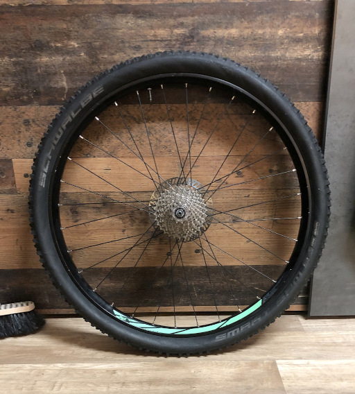

Ich hatte mir bei Kleinanzeigen.de ein Hinter-Laufrad (mit Kassette und Bremsscheibe) fuer _25 Euro_ besorgt, 
an dem ich lernen und ueben konnte (anstelle meiner teuren Räder): 
Mantel/Schlauch (de)montieren, 
Zentrieren der Felge und der Bremsscheibe, 
Einspeichen, CO2-Kartusche mal in Action erleben, 
Gefuehl fuer Lage- und Groessenverhaeltnisse entwickeln, 
die Kassette abziehen usw.

Die Felge entsprach der Groesse meiner Raedern, war allerdings breiter.

Vor Kauf vor Ort habe ich auf Felgenrisse bei den Nippeln gesucht, Freilaufgaengigkeit, Speichenspannung mit den Fingern geprueft.
Nach der Saueberung sah es fast wie neu aus, fahren wuerde ich damit aber nicht.

siehe Abschnitt zum "Zentrieren"

## Sattel

### Sitzknochenabstand ausmessen

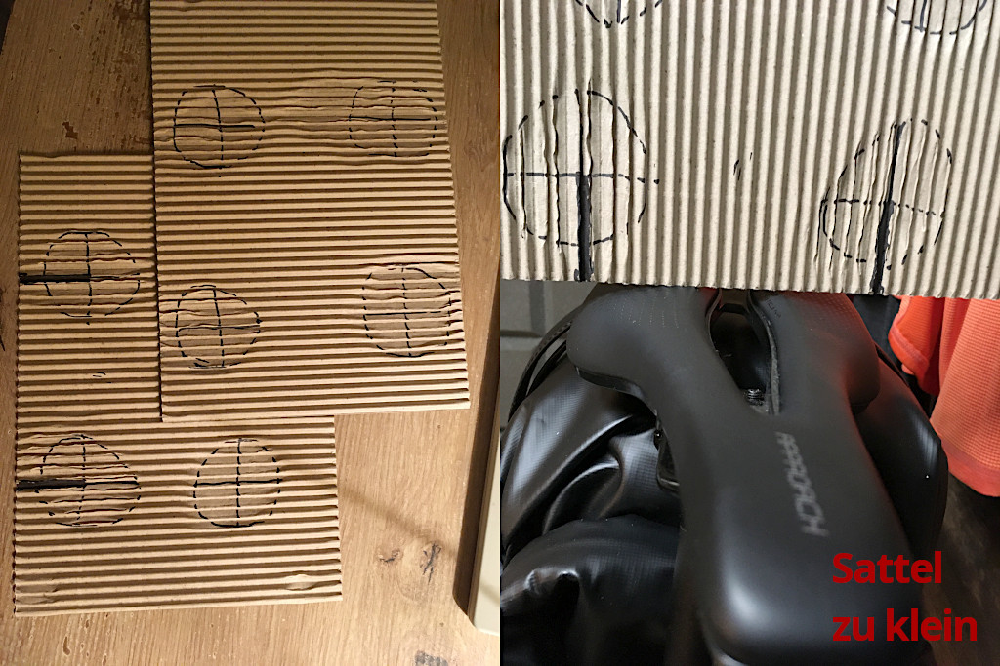

1. Wellpappe auf harten Tisch legen
	- Wellpappe kostenlos zusammen mit SQLab-Werbematerial bestellbar, gute Werbeidee, die Links bringt: 
		https://www.sq-lab.com/en/products/equipment/sqlab-family-friends-sitbone-measurement-set.html
2. draufsetzen, Knie höher als Hintern, bisschen wackeln
3. Abdrücke mit Stift als Kreis umranden, Kreuz in Kreis einzeichnen (Mittelpunkt)
	und Abstand zw. Kreuz-Schnittpunkten messen
4. 4x wiederholen und Durchschnitt/Median bilden 
	(bei mir war 3x identischer Wert, 1x 1,5 cm Abweichung)

### Optimale Breite

Bei Sitzknochenabstand _x_ (Tabelle von Fahrrad-XXL):

| Fahrradtyp                        | Sitzhaltung          | Sattel-Mindestbreite
|-----------------------------------|----------------------|---------------------
| TT/Zeitfahrrad                    | aerodynamisch        | _x_ +   0 cm
| Rennrad, CX, sportl. Gravel       | sportlich            | _x_ + 1-2 cm
| MTB, Fitnessbike, Gravel-Reiserad | entspannt-sportl.    | _x_ + 2-3 cm
| Trekkingrad, Citybike             | leicht vorgeneigt    | _x_ + 3-4 cm
| Hollandrad                        | aufrecht             | _x_ + 4-5 cm

Bei Zwischengrößen, die größere nehmen

### Polsterung, Form, Material

TODO

- Flach vs Curved = aero vs aufrechte Sitzposition (commuter, endurance), mehr Bewegung auf Sattel mgl. vs lock-in
- Kurz vs Lang = Aero-Position (Nase drückt nicht in Weichteile) vs mehr Bewegung und Offroad-Kontrolle mit Oberschenkeln
- zu breit: Oberschenkel schleifen
- Cut-Outs / Pressure reliefs:  
	- sollten nicht einschneiden, nicht zu groß
	- bei Gravel / MTB besser nicht komplett offen wg. Spritzwasser
- Leder: break-in-zeit, schlechtere wetterfestigkeit, bisschen wartungsaufwendiger (nachspannen, einschmieren, ...), dafür guter butt-fit
- Polsterung: so wenig wie möglich, vorzugsweise Hosenpolster
	1. Reibung/Chafing beim Pedalieren ist dann zw. Sattel und Hosenpolster und nicht zw. Sattelpolster und Haut
	2. That padding moves with you and stays at the anatomical locations where you will need it, regardless of how you sit on the saddle
	3. I can throw my chamios shorts in the wash when they get funky. A cushioned ass-sweat soaked seat, not so much.
	4. level and positioning of padding that you want is different according to how hard you are pressing on the pedals (and unweighting the saddle) and how upright you are sitting

- fore/aft-einstellungen:
- Satteltasche befestigbar?
- Rails kompatibel mit seat post klemme? einige carbon-rails haben einen ovalen statt runden Durchschnitt
- Fahrergewicht
- Brooks-C17-Oberfläche soll Hosen fressen

### Historie

#### Meine Sättel

| Modell                                 | Groesse     | Einsatz                     | Punkte und Befinden
|----------------------------------------|-------------|-----------------------------|-----------------
| Giant Approach (Stock)                 | 145 mm      | All-Road, Gravel            | ? von 5: bin 1 Jahr damit herumgefahren, obwohl "eigentlich" zu schmal
| Fizik Terra Argo X5                    | 160 mm      | All-Road, Gravel, sportlich | 4 von 5: straff, gut, Polsterhose zwingend
| Ergon SR Allroad Core Comp Men         | M-L         | All-Road, Langstrecke       | 5 von 5: komfortabler

#### Meine Polsterhosen

| Modell                                 | Polster         | Einsatz  | Sattel   | trocknet | Punkte und Befinden
|----------------------------------------|-----------------|----------|----------|----------|-----------------------------------------
| Gore Wear Bibs                         | Schaum          | max 3h   | G, F, E  | \*\*     | 3 von 5: Polster-Falten/Abloesung n. 1-2 Jahren = Saddle Sores (Oberstoff loest sich und bildet Rubbel-Falten); gute Standard-Hose
| Gore Wear Tights                       | Schaum          | max 3h   | F        | \*\*     | 3 von 5: Polster-Falten/Abloesung n. 1-2 Jahren = Saddle Sores (" " "); gute Hose sonst
| Gore Wear Tights Windstopper           | Schaum          | max 3h   | F        | \*\*     | 3 von 5: Polster-Falten/Abloesung n. 1-2 Jahren = Saddle Sores (" " "); Rest der Hose ist genial
| Gonso SQLab GO M Bibs (2x)             | Gel/Elast. 6mm  | max 6h   | F, E     | \*\*\*\* | 4 von 5: Polsterkomfort konstant gut genug, kein Durchsitzen; Träger beim alten Modell zu kurz; gut fuer Radreisen
| GripGrab AquaRepel Bibs                | Schaum          | max ?    | E        | \*\*     | ? von ?: Kurze Hose fuer Herbsteinsatz
| Castelli Unlimited Ultimate Bib-Liner  | Schaum          | max 2-3h | E        | \*       | 5 von 5: Progetto X2 Polster genial, guter Sitz der Hose; mein Fav fuer Standardrunden; fuer Radreisen eher ungeeignet; hat Rueckentaschen

## Lenker

### Aerolenker / TT-Bars / Auflieger

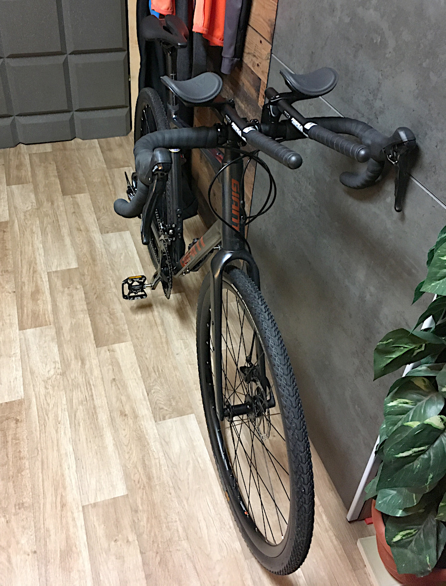

- Bequemlichkeit: zusätzl. Griffposition/Entlastung der Handgelenke
- Aeroposition: mehr Speed, unterm Wind wegtauchen
	- schmale Figur wichtiger als tiefe Sitzposition
	- kein Geschwindigkeitsvorteil, wenn man Position nicht lange fahren kann / zu unbequem ist, deswegen vllt. langsamer tritt
	- je nach Sattel drückt evtl Spitze; gibt Stubby/Short-Nose Saddles (ISM), gibt speziellen Redshift-Seat-Post
	- paar km/h Gewinn, am Ende macht aber die Fitness den Unterschied
- Armpads müssen Ellenbogen aufnehmen, nicht nur Unterarme, sonst Belastung Schultern statt Entlastung (Stütze über Skelett)
	- Abhängigkeit von der Rad-Geometrie
	- Adjustierbarkeit der Arm-Pads
	- Abstand der Stangen zueinander: beeinflusst auch Lenkverhalten, enger = empfindlicher
	- mit Spacer nach oben bringen = evtl. näher an Ellenbogen
	- alternativ mit "Fredbar" montieren 
- Lenkerband dünner als bei den Griffen, sonst Wurstoptik
	- nach innen vs. nach außen wickeln
	- untere wicklung drückt sich durch die obere und gibt rille für die nächste wicklung vor (immer mittig) = sauberes bild: gleiche abstände und winkel
	- am Ende mit Elektroband abschließen UND mitgeliefertes Abschlussband drüber; erste Wicklungen spannen, 
		letzte Wicklung von diesen Bändern nicht spannen, sondern leicht legen, sonst rupft sich das von alleine wieder ab
- Radästhetik schlechter; Sportrad eigtl. max. minimalistisch und 'Unterlenker vs TT-Bars'?; 
	- bei Gravel baut das Rad dadurch optisch nach rechts-oben auf wie Sprungschanze in Himmel, schöner wäre parallel zum Boden
	- winkel ausrichten am oberrohr falls mgl./noch sinnvoll
	- weiterer Bauchstein zur Fred-Werdung
- Klemmung mit Montagepaste, einheitliche Gaps bei den Schraubklemmen beachten
	- Schutz der Lenkerstange mit Elektroisolierbar fraglich bzgl. Haltfestigkeit
- verwende Profile Design T5+ mit dazugehörigem Profile Design Lenkerband; Stangen sehr nah beeinander aber Pads max Außen und zum Körper,
	so liegen/"fallen" meine Arme natürlicher = anstrengungsfreiere Position;
- Totgewicht in der Stadt und Offroad

Habe den Auflieger wieder abgebaut, auch wenn er Spass macht. Schlankeres Bike gefaellt mir letztlich besser.

# Shops

Ich versuche Amazon und Amazon Marketplace mittlerweile weitestgehend zu vermeiden 
	(ich kann Fakes nicht ausschliessen, Berichte von nicht wieder aufgearbeiteten Kundenruecklaeufern, ...)

| Website                                                | Teile                     | Kommentar
|--------------------------------------------------------|---------------------------|-----------------------------
| [bike24.de](https://bike24.de)                         | alles                     | Ruecksende-Etikett direkt im Paket, schneller Versand
| [bike-discount.de](https://bike-discount.de)           | alles                     | manchmal gute Preise
| [woembi.de](https://www.woembi.de)                     | Lagerkugeln (G20, HRC&ge;60)                              |
| [kugellager-shop.net](https://www.kugellager-shop.net) | gedichtete Industrielager, Lagerkugeln auf Anfrage (G10)  | Edelstahlversionen kaufen

# Wahoo-Hackerei

see [my Github Wahoo-repository](https://github.com/andre-st/wahoo)

