# Fahrrad

> Driving a car is like watching a movie, but riding a bike is like acting in one.

_ACHTUNG: Alles work-in-progress hier, mag sich alles ändern – große Müllhalde zu redigieren._  

Ich bin weder Anwalt noch ausgebildeter Zweiradmechaniker, daher alle rechtlichen oder technischen Aussagen ohne Gewähr.  

Stern-Bewertungen sind immmer von max. 3 Sternen (3 Sterne = top, 2 = zweckmäßig; 1 = vermeiden)

## Übersicht

- [Begriffe](#begriffe)
- Modell Sportrad
	- Komponentenliste
	- Montageplan
- Modell Stadtrad
- [Schalten](#schalten)
- [Fahrtechniken](#fahrtechniken)
- [Diebstahlschutz](#diebstahlschutz)
- [Straßenzulassung StVoZ](#)
- [Kleidung](#kleidung)
- Werkzeuge
- Kleine Schmierstoffkunde
- Verschleißteile bevorraten
- Radwäsche
- Bremsen einstellen
- Kettenschaltung einstellen
- Kette schmieren
- Kette wechseln
- Pedale wechseln
- Pedale schmieren
- Felge zentrieren
- Bowdenzug ersetzen
- Steuersatz/Gabel warten
- Lenker zentrieren
- Radlager warten
- Dichtmilch erneuern
- [Herbst/Winter](#herbst-winter)
- [Reifen](#reifen)
- [Sattel](#sattel)
- [Lenker](#lenker)
- [Hygiene / Medizin / Diät](#hygiene-medizin-diat)
- [Bike-Fitting](#bikefitting)
- [Bikepacking](#bikepacking)
- [Tourplanung](#tourplanung)
- [Reiseküche](#reisekueche)
- [Shops](#shops)
- [Wirtschaft](#wirtschaft)
- [Sonstiges](#Sonstiges)

## Begriffe

- Klettern: einen Anstieg hochfahren
- Antrieb:
	- Kette
	- Ritzel: Zahnräder hinten
	- Kettenblatt: Zahnräder vorne
	- Kurbel, Kurbelarm
	- Kettenradgarnitur: Bündel an Zahnrädern vorne?
- Kettenschaltung:
	- Kassette: Bündel an Zahnrädern (Ritzeln) hinten
	- Kassette modular
	- Umwerfer vorne/hinten (engl. Derailleur)
	- Schaltkäfig / Schaltwerkskäfig / Schaltschwinge
		- Schaltwerkröllchen / Pulleys: Leitrolle oben (engl. Jockey wheel/Guide pulley), Spannrolle unten (Tension pulley)
		- Kettenleitblech
	- Schaltauge
- Schaltgruppe: Gesamtheit von 
	- Schalthebeln
		- STI Shimano Total Integration: Shimano Brems-Schalthebel-Kombination, Prinzip gängig bei modernen Rennrädern; ugs. engl. "Brifters" = Brakes + Shifters
	- mechanisch: Schaltzüge
	- elektronisch: Funk oder Kabel
	- Schaltwerk
	- Umwerfer
- Gang
- Rahmen: [Rohrgestänge insgesamt](https://cdn.prod.www.spiegel.de/images/5fdc5420-0001-0004-0000-000001203310_w860_r1.7551020408163265_fpx33.03_fpy50.jpg)
	- Oberrohr
	- Unterrohr
	- Sitzrohr / Sattelrohr
	- Sattelstütze: Rohr am Sattel, das dann wiederum im Sitzrohr steckt
	- Steuerrohr
	- Gabel
	- Sitzstrebe / Druckstrebe / Hinterbau
	- Kettenstrebe             / Hinterbau
	- Tretlagergehäuse
	- Rahmengeometrie
- Bremsanlage
	- Bremssattel
	- Bremsscheibe / Rotor
	- Bremsbelag
	- Bremsleitungen (hydraulisch), Bremszüge (mechanisch)
- Lenker
	- Dropbar / Bügellenker / Rennradlenker
		- Unterlenker / Drops
		- Oberlenker / Tops
		- Hoods
		- Flare
		- Compact Dropbar
	- Flatbar
	- Backsweep
	- Reach
- Bowdenzug
- Sattel:
	- Sattelschienen
	- Sattelstütze
	- Sattelklemmung: Verbindet Sattelstütze und Sattel durch Klemmung an den Sattelschienen
- Fahrradtypen
	- Zeitfahrrad / Triathlon-Rennrad (engl. Time-Trail-Bike oder kurz TT-Bike): Handling untaugl. für Gruppen
	- Race-Roadbike / klassisches Rennrad: leicht, gute Klettereigenschaften
	- Aero-Rennrad: für Gruppen geeignet, wg. Aeroformen schwerer als Race-Roadbike
	- Endurance-Rennrad / Allroad-Bike / Randonneur: bequemeres Rennrad (aufrechter) bis 35 mm Reifen
	- Cyclocrosser (CX): schulterbares, robustes, etwas entspannteres Rennrad mit Profilreifen bis 33 mm (UCI-Vorgabe) und höherer Bodenfreiheit für Rennen auf unbefestigten Untergründen
	- Schotterrad (engl. Gravel bike): bequemeres Rennrad (aufrechter) mit leichtprofilierten Reifen zw. 35 und 50 mm, mittl. Bodenfreiheit, Langstrecke
	- Hardtail-Mountain-Bike / Cross Country MTB: Federung nur vorne
	- Fully (Full Suspension MTB): Vollfederung mit Federgabel + Hinterbaudämpfer
		- Race-Fully:       bis 120 mm Federweg
		- All-Mountain-MTB: bis 130 mm Federweg
		- Touren-Fully:     bis 140 mm Federweg
		- Enduro-MTB:       bis 170 mm Federweg
		- Freeride-MTB:     bis 180 mm Federweg
		- Downhill-MTB:     bis 200 mm Federweg
	- All-Terrain-Bike (ATB)
	- Adventure-Bike
	- Trekking-Bike
	- Singlespeed: 1 Gang mit Freilauf
		- Standard-BMX-Fahrrad:
	- Fixie: 1 Gang ohne Freilauf, dafür Rücktritt-Bremse
		- Bahnrad: fahren im Velodrom = ovaler 200-250m-Kurs aus Holz oder Kunststoff mit Steilkurven
	- Kunstrad/Saalmaschine: Starrlauf zum Rückwärtsfahren, 12 bar Reifendruck
	- ...
- Kadenz: Trittfrequenz gemessen in Umdrehungen pro Minute U/min bzw. rpm
- Fred [satirisch]: 
	spöttische Bezeichnung von "ernsthafteren" Rennradfahrern entweder für Radfahrer, die 
	durch Kleidungswahl und Modifikationen/Anbauten am Rad amateurhaft auf sie wirken.
	Oder Radfahrer die besonders Pro wirken möchten durch sündhaft teure Profi-Räder und Trikots, 
	tats. aber normale Sonntags-Radler mit bescheidener Leistung sind.
	verwandt mit MAMIL; 
	im Rennrad-Bereich ist Minimalismus/"cleane"/"smarte" Optik angesehen
- MAMIL [satirisch]: 
	"Middle-Aged Men In Lycra"; Presswurst-Optik dank Bierbauch im Skinsuit, 
	auf dem irgendwelche Logos gedruckt wurden, 
	was vermeintlich Pro aussehen würde; verwandt mit Fred
- Zahnarzt [satirisch]: 
	Berufsgruppe, die sich mittel-/hochpreisige Rennräder leistet
- Laufrad: Gesamtheit von
	- Steckachse
	- Schnellspanner
	- Felge
	- Mantel / Drahtreifen (Wire bead) / Faltreifen
	- Ventil
	- Karkasse
	- Nabe (Hub)
	- Konuslager/Lagerschale & Konus (Cup & Cone), gedichtetes Lager (Patronenlager/Cartridge Bearing/Wälzlagereinheit/Rillenkugellager)
	- Speichen
	- Speichennippel
	- Speichenmuster
	- Schlauch
	- Clincher
	- Tubeless
	- Tubular
	- System-Laufradsatz
- Bikepacking
- Ultracycling
- Distance Cycling
- Radreise / Touring

## Modell Sportrad: GIANT Revolt 2 XL Gravel Bike 2022/23

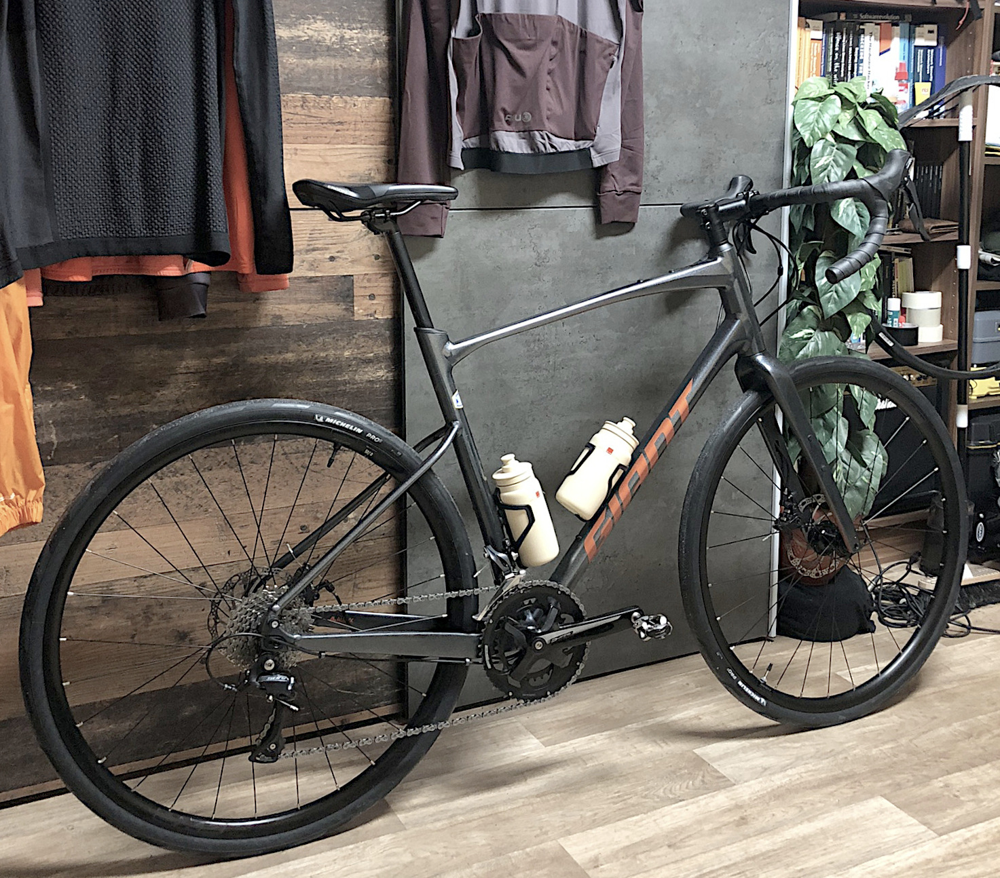
_(Abb.: 2026 im Allroad-Setup)_

### Komponentenliste Kaufdatum 9.6.23

ca. 1400 € (Einstiegsklasse bei _Sport_-Bio-Fahrrädern für tägl. Training bei höheren Geschw. und langen Strecken)

Die offizielle, frei zugängliche Spezifikation ist recht dünn; 
im folgenden Werte, die ich rechercheriert oder selbst am Rad ermitteln konnte:

| Fahrradteil           | engl.            | Original verbaut (Stock)
|-----------------------|------------------|----------------------------
| Lackierung            | paint job        | Black Diamond
| Systemgewicht         | tot. weight limit| max. 150 kg; 110 kg Fahrer/Gepäck unbedenklich zuladbar = &le;120 kg (20% Reserve) - 11–11 kg XL-Fahrrad-Eigengewicht; Laufräder/Speichen leiden zuerst
| Rahmen                | frame            | GIANT ALUXX-Aluminium, 12 x 142 mm Steckachse, Bremsscheiben, Flip-Chip-Ausfallende
| Rahmennummer          | serial no.       | unterm Tretlager zweigeteilt; bei GIANT-Werkstattanfragen immer nennen
| Reifenfreiheit        | tire clearance   | 53 mm falls Long-Flipchip-Position, 42 mm bei Short-flipchip-Position  [doku]
| Stoßdämpfer           | shock absorber   | N/A
| Pedale                | pedals           | N/A
| Gabel                 | fork             | GIANT Revolt Advanced Vollcarbon-Gabel (rly?)
| Gabelschaft           | steerer tube     | GIANT OverDrive-Gabelschaft (OD Version 1) aus Carbon-Verbundwerkstoff; tapered/konisch; OD=1 1/8" (28,6 mm), ID=???
| Gabelschaftexpander   | fork expander    | ???  compression plug; "PAT.NO:176446 4Nm" [mglw. Foto](https://img.yec.tw/ob/image/ce890db5-1b65-421b-b4de-a53e8e558b2a.jpg), [Foto 2](https://img.yec.tw/cl/api/res/1.2/FerNGcWZE_MX7Lyih.Lhxw--/YXBwaWQ9eXR3YXVjdGlvbnNlcnZpY2U7Zmk9ZmlsbDtoPTEyMDA7cT04NTtyb3RhdGU9YXV0bzt3PTEyMDA-/https://img.yec.tw/ob/image/a96fede6-75ca-4027-a848-4aec1f1e7915.jpg)
| Gabelkonus            | crown race       | Konus ist nicht separat, sondern im Carbonschaft integriert, also Teil der Gabelkrone
| Steuersatz            | headset          | voll-integriert (IS): statt Einpress- oder Ausschlagwerkzeug alles mit Hand in Rahmen-Ausbuchtungen legbar [erprobt]
| Steuersatzlager oben  | top bearing      | MH-P08F – 30.5 x 41.8 x 8 – 45/45 [erprobt],  OD=41,81 ID=30,47 mm [gemessen]
| Steuersatzlager unten | bottom bearing   | MH-P22  – 34.1 x 46.9 x 7 – 45/45 [erprobt],  OD=46,76 ID=34,0  mm [gemessen]
| Vorbaudistanzringe    | spacer           | AD=??? mm, ID=??? mm, Kunststoff?
| Vorbau                | stem             | GIANT Sport(?), 90 mm, 7&deg;, 27 mm horz. zw. Schraubenmitten [erprobt mit Stem-Mount]
| Lenker                | handle bar       | GIANT Contact XR Ergo-Control(?) Drop 460/510 mm (8&deg; Flare), kompakt, 31,8 mm, Alu, 337g, clip-on compatible, Reach 10 cm
| Lenkerband            | bar tape         | GIANT Gel(?) Cork, mittel
| Bremsen               | brakes           | Tektro MD-C550 mechanisch; 2-Kolben-Bremssattel (Double piston); 3er Inbus für Bremsbelagnachstellung
| Bremsscheiben         | brake disc/rotor | GIANT MPH Rotoren [V]160mm, [H]160mm, 6 Loch, Torx 25 [erprobt]
| Umwerfer              | front derailleur | Shimano Sora ST-R3000
| Schaltwerk            | rear  derailleur | Shimano Sora ST-R3000, langer Käfig
| Schalthebel           | shifter/lever    | Shimano Sora ST-R3000, 2x9
| Schaltröllchen        | jockey wheels    | Shimano Leitröllchen (guide pulley) oben = ?; Spannröllchen (tension pulley) unten = Gleitlager oder gedichtes Kugellager? Kunststoff oder Alu? Anzahl Zähne?; angeblich kompatibel mit 9-Speed Shimano RD6700 Ultegra XT Saint
| Kassette              | cogset           | Shimano HG400, 11x34
| Kette                 | chain            | KMC X9 EPT mit Missing Link, 114 Glieder
| Kurbelsatz            | crank            | FSA Vero Pro
| Kurbellänge           | crank length     | 175 mm	
| Kettenblatt           | chain ring       | FSA Omega/Vero Pro 48/32T, 4-ARM, 120/90 mm BCD Lochkreis [abgelesen] ab Modell 2017
| Kettenlinie           | chainline        | 44,5–45 mm
| Tretlager             | bottom bracket   | 68mm BSA threaded bottom bracket (cartridge BB)? FSA MegaExo Pressfit?? BB-7420 ST Square Taper (JIS)???
| Tretlager Achslänge   | bb axle length   | ???
| Laufräder             | wheels           | GIANT SX2 Disc-Radsatz, 28 Zoll, Legierung, tubeless-ready, Laufradsatz 2030g, ??? Speichen, für 150-kg-Fahrrad
| Felgeninnenweite      | intrn. rim width | 25 mm   (innere Felgenbreite/Maulweite/Innenweite) [622x25 steht auf der Felge]
| Felgenaußenweite      | extrn. rim width | 30 mm
| Felgenprofil          |                  | 23 mm tief, Tubeless (Rim bead lock+seat) mit Hooks (tats. nicht hookless)
| Felgenband            | rim tape         | GIANT Tubeless Rim Tape 28 mm(?)
| Laufradnabe Vorderrad | front hub        | GIANT, Konuslager mit 22 freien 1/8"-Kugeln (1 Lücke) (G5–G20 rund / HRC&ge;60 hart) [erprobt]; 2x 19mm-Konusschlüssel [erprobt]
| Laufradnabe Hinterrad | rear  hub        | GIANT, angebl. Wälzlager (6902 15×28×7 mm???), stabiler als Konus (Kraftangriff axial/torsional durch Antrieb statt nur radial wie bei besser rollendem Konus vorne)
| Reifen                | tyre             | GIANT CrossCut AT 2, 700x38C [misst 40 mm], robuster 680g [gewogen] / 35€ Semi-Slick-Drahtreifen, tubeless, 60 TPI [bescheidener Karkassenflex/poltert], Silica-Mischung
| Reifenpannenschutz    | puncture protect.| GIANT "Defect 2 lite" puncture protection Pannenschutzgürtel aus leichtem Nylon unter der Lauffläche des Reifens
| Reifen-Dichtmilch     | sealant          | GIANT Tubeless Sealant (angebl. Stans-Dichtmilch; GIANT nennt Stans auch als einzige Alternative)
| Sattel                | saddle           | GIANT Approach, 145 mm
| Sattelstütze          | seat post        | GIANT D-Fuse, Legierung, 14 mm Versatz
| Kabel Bremszug        | brake cable      | 5mm ??
| Kabel Schaltzug       | shift cable      | 4mm Jagwire LEX 1,1 mm, linear steels strands, non-lubed liner; angebl. 1,2 mm kompatibel, tats. Draht [misst] wohl 1,2 mm
| Kabel Schaltzuglängen | cable lengths    | Hülle STI rechts bis Steuerrohr = 51 cm; Hülle Sattel-/Unterrohr bis Schaltkäfig = 62 cm

### Komponenten abweichend vom Original getauscht/hinzugefügt:

| Fahrradteil        | Jahr    | Preis     | Wertung | Neu verbaut                       | Details
|--------------------|---------|-----------|---------|-----------------------------------|--------------------------------------------
| Steuersatzlager    | 2025    | 2x 20 €?  | ?       | CQ GmbH Edelstahl                 | Ersatz wg. rauem Lauf
| Konuslagerkugeln   | 2025    |  5 €?     | ?       | Woembi G20 HRC&ge;60 1/8"         | Ersatz wg. Korrosion
| Kabel Schaltzug    | 2024    | 14 €      | \*\*\*  | Shimano OT-SP41 Optislick         | ersetzt gerissenes Jagwire; Zugseil gleitet gut (STI-Widerstand), gut zu cutten
| Reifen             | 2025    | 2x 40 €   | Todo    | Tufo Thundero HD                  | 700x40C (41 mm),          je 439g, schneller Gravel-Semi-Slick-Faltreifen,      TPI 130/255, BRR 5/5 (19,2 W); 2,7 bar            (105 kg); 59 ml Dichtmilch, Stans/Tufo-Sealant würden nicht dichten, Orange aber
| Reifen             | 2025-02 | 2x 50 €   | \*\*\*  | Michelin Pro 5 TLR                | 700x35C [35 mm gemessen], je 390g, leichter/schneller Allroad-Slick-Faltreifen, TPI 120,     BRR 5/5 (13,8 W); 3,3–3,5 bar/offiz. (105 kg); 60 ml Dichtmilch initial, 30 ml top-up; [Handmontage+Standpumpe]; 32mm bei 105 kg zu hart = Energieverlust (springt/reibt gg realen Asphalt statt verformend zu gleiten) = langsamer/kurveninstabiler/unkomfortabler als 35er; 32er auf meine Felge auch grenzwertig
| Reifen-Dichtmilch  | 2025-02 | ?         | ?       | Orange Seal Endurance             | bleibe länger flüssig, dichte aber nicht so schnell/gut wie die normale Orange-Version; Orange scheint auch mit mehr Reifen verträglich zu sein als Stans; hat gut zw. Bead und Felgen abgedichtet
| Sattel             | 2024    | 100 €     | \*\*    | Fizik Terra Argo X5               | 160 mm, straff, gut, Hinternposition recht festgelegt; 100 km ohne nennenswerte Probleme
| Sattel             | 2025    | 93 €      | \*\*\*  | Ergon SR Allroad Core Comp Men    | M-L, 120 kg, 248 g, Chrom-Molybdän-Stahl-Gestell (CrMo), Nylonkomposit-Sitzschale, orthopäd. AirCell-Sitzschaum + Kern BASF Infinergy E-TPU Partikelschaum, Microfiber-Obermaterial: komfortabler, trotzdem noch flach, geht zeitw. ohne Polster, mehr Hinternpositionen; 0 Probleme
| Pedale             | 2023    | 85 €      | \*\*\*  | Shimano XT PD-T8000               | Plattform-SPD-Kombipedal, mein Übergangspedal fürs Clipless-Lernen; später nie Situation für Plattform gehabt
| Pedale             | 2024    | 83 €      | \*\*\*  | Shimano XT PD-M8100               | SPD-Klickpedal, SM-SH56 SPD Cleats für Unfall-Präventions-Reflexe
| Flaschenhalter     | 2023    | 2x 15 €   | \*\*\*  | SKS Germany DUAL SC RH und LH     | seitliche Entnahme rechtshändig; zerkratzt Flaschen, ansonsten top, stabil
| Computer           | 2023    | 260 €     | \*\*\*  | Wahoo Bolt 2                      | mit Gummi-Schutzhülle
| Computer-Halterung | 2025    | 63 €      | \*\*    | Framesandgear Aero 27 mm Wah/Sm.  | Stem-Mount; stabil, sieht gut aus/ragt nicht über Lenker; ragt nicht seitl. über Vorbaulenkerklemme = einzig mit meinem Jack-Frontrack+Lenker funktionierender; teuer und schlechter Transferwert durch feste Breite
| Lenkeraufsatz      | 2023    | &gt;100 € | \*\*\*  | Profile Design Sonic Ergo T5+     | 348 mm Länge (13&deg;), Alu 6061-T6, siehe Aerolenker-Abschnitt
| Lenker             | 2025    | 27 €      | \*\*\*  | Moquai Aero Rennradlenker         | 420/420 mm  (0&deg; Flare), kompakt, Alu 6061 "285g"; 4 cm schmaler/sportl. als Erstlenker; Logos subtil; ovalisierte, nicht zu breite Tops; flext in den Drops
| Lenker             | 2025    | 18 € Sale | Todo    | FSA AGX Adventure Compact         | 440/500 mm (12&deg; Flare), kompakt, Alu 6061 "325g", 2 cm schmaler als Erstlenker, für Bikepacking, Logos übertrieben
| Lenkerband         | 2023    | 25 €      | \*\*\*  | Profile Design Aerobar Wrap       | dünn,    gummiartig,  Klebestreifen,        für Lenkeraufsatz; dünner als Dropbar gegen Wurstoptik; nur Grip, kaum Dämpf.; Bandkante drückt sich als "Fortsetzungslinie" durch = gleichmäßiges Wickeln
| Lenkerband         | 2025    | 13 €      | \*\*    | FSA Ultra-Gel Kork                | mittel,  Kork,        Klebestreifen (Rückstände),  dämpft ohne zu dick aufzutragen, stufig/Grip ok, ging schnell drauf, mit ital. 8 genug Länge; hässl. Finishtape/Barends
| Lenkerband         | 2025    | 13 €      | \*      | Selle Italia SmooTape Gran Fondo  | 2,5 mm,  Schaumstoff (langweiliger als Kork), Silikonstreifen/Zug,  ½ oder ⅓ wickeln? aus Entfernung stufenfrei (auch nicht besser als andere); ledrigerer Look ok; weiße Logos = Vogelstange; hässl. Finishtape
| Lenkerband         | 2026-02 | 12 €      | \*      | Selle Italia Smart Tape Greentech | 2,5 mm,  gummiartig wie die Hoods (kein Handschmeichler wie Kork), hält allein auf Zug (gut), wenig Dämpfung trotz Dicke (nur Handfüller), integrierte "Endkappe" lässt sich verdrehen und löst Band (ist nur auf Zug, passiert 100% bei Unterlenker-Fahrt), und verlangt kürzere 2. Wicklung (uneinheitlich) oder hässliche Beule; verunmöglicht Klingel-Endkappe o.ä.; Endkappen verdecken nur dünn die Rohröffnungen = Sicherheitsrisiko bei Unfall; Länge passt mit ⅓-Wicklung und ital. Acht gerade so auf 42cm-Flattop-Dropbar inkl. Flattop-Bereich (stufenfrei!); klebriger gummi hält dreck fest, aber gut zu reinigen und wiederzuverwenden; unempfindlicher gegen Regen
| Lenkerband         | 2026-05 | 22 €      | \*\*\*  | Cinelli Gel Gork                  | Kork, mittel (muss straff gelegt werden, sonst Wurstoptik), Silikonstreifen, lässt sich gut wickeln und korrigieren, Cinelli-Logos helfen beim Alignment; dämpft auch noch ausreichend wenn straff gewickelt; etwas glatt, Hand kann rutschen
| Lenkerband         | 2025    | 10 €      | Todo    | SRAM SuperCork Bar Tape           | Kirk, mittel, Klebestreifen,        wie FSA Ultra-Gel Kork (white label produkt?); günstiges Notfall-Korkband (fahre Shimano)
| Lenkerband         | 2026-04 |  8 €      | \*      | DEDA                              | Synthetik, gun barrel grey (4800); Klebestreifen; sieht ok aus (all black aber doch schöner), lässt sich gut wickeln und korrigieren, aber hart-samtig-glatt = problematisch wenig Grip; wenig Dämpfung und Vorsicht beim Abziehen des Schutzes auf dem Klebestreifens, löst sonst gleich beides vom Band (ggf. von der Seite abfitzeln); Länge hat ohne ital 8 noch gereicht bei 42-cm Flattop-Lenker inkl. Tops; ok, falls es günstig sein muss; hinterließ beim Entfernen keine Spuren, war aber auch nur 1-2 Monate auf dem Lenker

### Drehmomente und Schmierplan

Vor-Reinigung außer Carbon (CfK) und Gummi: 90%-Isopropylalkohol (IPA), Bremsenreiniger, WD40 Rostentferner, Schleifvlies, Bürste, Plastikschaber (Pulleys)
Gummi-freundlicher: Mucoff Bio-Degreaser  

| Verbindung A          | mit B          | Nm ich    | Nm offiz. (max) | Schmierung
|-----------------------|----------------|-----------|-----------------|---------------------------------
| Vorbau           Alu  | Lenker     Alu | 4,5       | 6   ./.   5     | Schraubensicherung; sonst _alles_ trocken
| Vorbau           Alu  | Gabel      Cfk | 4,0       | 6   ./.   ?     | trocken
| Sattel           CrMo | Stütze     Alu | 6,0       | ?   ./.   8-9   | Antiseize Schrauben
| Sattelklemme          | Stütze     Alu | 5,0       | 7   ./.   ?     | Antiseize alles
| Sitzrohr         Alu  | Stütze     Alu | -         | -               | Anti-Seize über Stütze, D-Fuse-Adapter, und alle Teile des Schraubmechanismus = verhindert Knarzgeräusche (Carbon-Paste mit Partikel erzeugt bei Alu-Alu wie Dreck mehr statt weniger Knarzen)
| Schaltwerk            | Auge       Alu | handfest  | ?   ./.   ?     | 
| Pedale Shimano        | Kurbel FSA     | 25,0      | 35  ./.   ?     | Antiseize Gewinde (&#x21D2; 65-75% Drehm.)
| Steckachse H          | Hinterbau  Alu | handfest  | ?   ./.   ?     | Fett Gewinde und min. Schaft
| Steckachse V          | Gabel      Cfk | handfest  | ?   ./.   ?     | Fett Gewinde und min. Schaft
| Flaschenhalter   Cfk  | Rohr       Alu | handfest  | ?   ./.   ?     | Antiseize Schrauben
| STI-Hebel Shima.      | Lenker     Alu | handfest  | ?   ./.   ?     | trocken
| Bremsscheibe          | Nabe       Alu | 5,0       | 6   ./.   ?     | Schraubensicherung
| Kassette              | Nabe       Alu | ?         | ?   ./.   ?     | Antiseize zw. Feilauf und Kas.
| Kettenblatt           | Kurbel         | ?         | ?               | ?
| SPD-Cleat       Stahl | Schuh      PA  | 4,0       | ?   ./.   ?     | Schraubensicherung über Länge (trennt auch bisschen; Mischen mit Antiseize reduziert Wirkung)
| Radlager-Konus V      | Nabe       Alu | Spiel     | Spiel           | Finishline Premium Grease (Schale, Kugeln, Abdeckung)
| Steuersatz            | Steuerrohr Alu | -         | - (IS-Lagersitz)| Finishline Premium Grease (oben viel gg. Wasser, unten weniger da Dreck: Lagersitze, Film um Lager und Gabelkonus, dick unter oberer Abdeckkappe/Gummiring)
| Schaltw.-Leitrolle  O | Schaltschwinge | ?         | ?               | ?
| Schaltw.-Spannrolle U | Schaltschwinge | ?         | ?               | ?
| Schaltwerkfeder V/H   | Parallelogramm | -         | -               | Balistol PTFE-Trockenschmierung (Spray); Öl würde mehr Dreck anziehen und kann verharzen = schwergängiger; alternativ Brunox falls viel Regen/Wasser
| Schaltwerkgelenke     | Parallelogramm | -         | -               | " " "
| Pedal-Cleat-Federn    | Pedalkäfig     | -         | -               | Balistol PTFE-Trockenschmierung (Spray); alternativ Brunox falls viel Regen/Wasser
| Griffgummi            | STI-Hebel      | -         | -               | offiz. soll man STI abbauen und Gummi von hinten aufziehen; real von vorne Hand-Sanitizer aufs Gummiinnere für besseren Rutsch (verflüchtigt)
| Kette                 | Zahnräder      | -         | -               | Liquimoly Dry bzw. Wet Lube; kleiner fester Flach-Pinsel: Tropfen Öl drauf und streich dann eine Bahn von Pulley bis Kettenblatt, wdh. insg. 3 Tropfen pro Bahn, kurbel weiter: zügig-saubere Arbeit und Ergebnis
| Reifen Tubeless       | Felge          | -         | -               | Orange Seal Endurance bei allen Nicht-GIANT-Reifen; sonst GIANT Tire Sealant; 30-40 mm = 60ml initial, 30 ml top-up
| Schalt-/Bremsseil     | Bowdenzughülle | -         | -               | -, OptiSlick werkseitig geschmiert

handfest = Kontakt + leichtes Nachziehen mit kurzem Hebel, aber ohne Kraftaufwand oder letzten Ruck;  
Cfk = Carbon, Alu = Aluminium, CrMo = Stahl, PA = Nylon  
s.a. Abschnitt [Kleine Schmierstoffkunde](#kleine-schmierstoffkunde)

Flipchip:
	- short = quicker handling and acceleration
	- long = improved stability at speed

## Model Stadtrad / Beater-Bike

TODO

## Schalten

### Schaltnummerierung / Sprachregelung:

| Krafttreten für Speed in Ebene/Abfahrt  | Leichttreten für Anstiege (dafür mehr treten)
|-----------------------------------------|--------------------------------------------------
| hoher Gang                              | niedriger Gang
| hinten kleinstes Ritzel                 | hinten größtes Ritzel
| letzter Gang                            | erster Gang
| hohe Übersetzung                        | niedrige Übersetzung
| Kette entfernter vom Laufrad            | Kette näher am Laufrad

"Hoch" und "niedrig" beziehen sich auf den Weg, den das Hinterrad pro Pedalumdrehung weiterdreht (Übersetzung).  
_Niedrige_ Übersetzung: Eine Kurbeldrehung erzeugt relativ _wenig_ Radumdrehung (bei größerem Drehmoment - wie langer Hebel).
"Übersetzung" ist abstrakt das Verhältnis von Eingangsbewegung zu Ausgangsbewegung (z.B. Weg, Drehzahl, indirekt Drehmoment, ...): 
	Kettenblattzähne dividiert durch Ritzelzähne (hinten).  
Vorne 30 und hinten 40 = Übersetzung von 0,75  
Vorne 50 und hinten 10 = Übersetzung von 5 = Hinterrad dreht sich fünfmal so stark pro Pedalumdrehung.  

### Brems-Schalthebel-Kombination:

Bei Shimano Sora ST-R3000: Linke Hebel regeln vorne; Rechte Hebel regeln hinten (Rear)  
Im UK, in NZ, Japan, China u.a. wären Bremsen vertauscht im Vgl. zu USA und den meisten europ. Ländern inkl. Deutschland.

| Linker Bremshebel     | Linker Minihebel   | Rechter Bremshebel           | Rechter Minihebel
|-----------------------|--------------------|------------------------------|--------------------
| schaltet vorne        | schaltet vorne     | schaltet hinten              | schaltet hinten
| auf größeres Zahnrad  | kleineres Zahnrad  | größeres Zahnrad (leichter)  | kleineres (schneller)

## Fahrtechniken

### Schalten/Gangwechsel (Kettenschaltung):

- Gangwechsel erfolgt nur beim Pedalieren
- im Leerlauf schalten oder zumindest bei leichterem Treten
- nicht mit Kraft bergauf in neuen Gang treten, sonst kann Bowdenzug reißen o.a.
- Pedale beim Schalten nicht rückwärts treten
- vorausschauend schalten: Ampel, Hügel, stockender Verkehr, Kinder, ...
	- vorm Anhalten in leichteren Gang schalten, damit Antreten leichter und weniger belastend fürs Material
	- sonst Gang im Stehen korrigieren: s.u.
- höhere Trittfrequenz = weniger Belastung für Knie und Gelenke
- Radler trainieren für Ausdauer nicht Kraft, Krafttreten (hohe Übersetzung) eher sinnlos
- nicht über Kreuz schalten:
	- schlecht: kleines Zahnrad hinten (Ritzel) und kleines Zahnrad vorne (Kettenblatt) = klein-klein vermeiden (Kreuz)
	- schlecht: großes Zahnrad vorne und großes Zahnrad hinten   = groß-groß vermeiden (Kreuz)
	- ideal:    radnäheres Kettenblatt mit den radnäheren Ritzeln verwenden und umgekehrt (ideal halbwegs gerade Kettenlinie)
- beim Wiegetritt vorher auf etwas schwereren Gang schalten; Körpergewicht gibt mehr Power, beim leichten Gang fällt man durch
- s.a. Wartung-Schaltung-einstellen

### Schalten/Gangwechsel im Stand vor der Ampel (Kettenschaltung):

Kommt man mit schwerem Gang zum Stehen (vorausschauend Schalten!), 
dann wird das Wiederlosfahren für Radler und Rad unangenehm.
In so einem Fall:

1. leichteren Gang im Stehen schalten
2. Vorderrad-Bremse gedrückt halten
3. Fahrrad leicht nach vorne schieben = Hinterrad hebt an
4. Kurbel mit dem Fuß drehen bis Gangwechsel erfolgt (Vorsicht: gegenüberliegendes Pedal könnte Standbein treffen)
5. Hinterrad wieder absetzen

Alternativ: Statt Bremse+Vorschub den Sattel fassen und anheben und Kurbel drehen

### Bremsen:

- immer mit beiden gleichzeitig, nie nur vorne
- Vorderbremse hat immer mehr Bremswirkung
- s.a. Wartung: Bremsen einstellen

### Rollen: 

- Zeit gewinnt man auf der Ebene:
	- 23 km/h vs. 27 km/h auf der Ebene = enormer Zeitunterschied bei nur moderat mehr Leistung
	- gleichmäßige Leistung, hohe Trittfrequenz (80–95 rpm), aerodynamische Haltung auf Geraden
- Energie verliert man am Berg:
	- Geschwindigkeit ohnehin niedrig, mehr Kraft bringt nur wenig zusätzliche Geschwindigkeit, dafür Puls, Laktat und Ermüdung
	- Steile Anstiege vglw. langsam aber konstant in niedrigen Gängen angehen: einen Elefant verspeist man Stück für Stück
	- Wiegetritt (vorher Gang etwas schwerer machen)
- Erholung passiert bergab:
	- Luftwiderstand steigt extrem mit Geschwindigkeit. 
	- oberhalb von ca. 35–45 km/h kostet Treten sehr viel Energie für wenig Zusatztempo
- Zeitverlust am Berg ist nicht linear mit Zeitgewinn bei Abfahrten einzuholen
	- daher Training und Körperfett-reduzierende Diät, um am Berg leichter und schneller zu werden, ohne sich kaputt zu machen
- vorausschauend Schalten, insb. bei Ampeln/Verkehr
	- leichtere Gänge vorm Stehen beschleunigen das Anfahren; langsam annähern, Ampelphasen lernen; 
	- idealerweise gleitet man so ohne Absteigen/Trackstand schon in die nächste Grünphase

Durschnittsgeschwindigkeit steigern:
	- Hauptprinzip: Geschwindigkeit ist günstiger zu halten als neu aufzubauen
	- Leistung auf leicht ansteigendem bis welligem Terrain konstant hoch halten
	- noch 10-20 Sekunden über Hügelkuppen weitertreten statt nach höchstem Punkt sofort locker ausrollen:
		- man ist noch schnell genug, dass Luftwiderstand relevant ist, aber nicht schnell genug, dass Rollen von selbst stabil läuft
	- bremsfreieres Fahren der Kurven lernen
	- typisch Mecklenburg-Vorpommern: 1.) Ebene größter Hebel, 2.) Berg zweitgrößter Hebel, 3.) Abfahrt kleinster Hebel

### Kurven:

- vorm Einbiegen Pedal zur Kurvenseite (rechts-rechts) nach oben drehen, um Bodenkontakt beim Hineinlehnen in die Kurve zu vermeiden

Kurvenlinie

@todo

### Parkreihen:

- mind. 1 Meter Abstand zur Parkreihe halten, da Autotüren unerwartet aufgehen und Radfahrer unsanft stoppen könnten (engl. Dooring)
	- ist glaube auch STVO-Vorschrift @todo
- ignorieren, wenn Autos hinten Druck machen, weil man sich angeblich nicht weit rechts genug einordnet und Straße blockiert

### Radwege:

- Radwege müssen nur benutzt werden, wenn das Blaue-Lolli-Schild dies explizit vorschreibt (STVO), sonst optional
	- wissen viele Autofahrer nicht und ermahnen teils Radler zur Nutzung von Radwegen, die sie gar nicht nutzen müssen = Nötigung?
- Radwege sind fast immer in schlechterem Zustand als die Straße: aufgebrochen durch Wurzeln, Schlaglöcher, Glas, 
	nebeneinanderfahrende/-flanierende Rentner, Fußgänger mit Hunden, zugeparkt usw. - ungünstig für Roadies bei 30-40 km/h
- manchmal hat jede Straßenseite einen eigenen Radweg: "Geisterfahrer" fahren entgegen der vorgesehenen Verkehrsrichtung
- Radwege haben fast immer Vorrang, trotzdem bei Wegkreuzungen auf Autoverkehr von beiden Seiten achten 
	- Autos fahren manchmal mit der Nase über den Radweg um Straße einsehen zu können und blockieren Radfahrer
	- Autos biegen manchmal ohne Schulterblick achtlos rechts ein und stoßen gegen heranfahrende Radler
	- lieber gesund bleiben statt sein Recht erzwingen: Radler sind zwar die härtere Typen als Autofahrer, aber durch den fehlenden Schutz nicht ganz so hart wie deren Autokühler; 
		das Theater anschließend ist auch Zeitverschwendung

### Busse, LKW:

- sich dahinter zurückfallen lassen, nicht daneben warten bzw. mithalten; toter winkel; gibt komplette Ass1s @todo

## Diebstahlschutz

Hatte erst ein 16mm-Bügelschloss vor dem Kauf meines neuen Fahrrads, 
dann gegen Faltschloss getauscht, 
da sich paar Sekunden Sicherheitsgewinn nicht lohnen:

| Schlossart                               | Installation                                                        | Abschließen | Sicherheit | Gewicht | Preis
|------------------------------------------|---------------------------------------------------------------------|-------------|------------|---------|---------------
| Bügelschloss Trelock U6 16mm             | in Rahmen hässlich und sperrig, behindert Trinkflasche etc                                                                                                          | Passte bei mir nicht um Rahmen und Hinterrad; Kaum Länge oder Durchmesser für Geländer, Bäume, Laternen  | 150-€-Akkuflex ~60s, örtl. Unflexibilität kompromittiert Sichtweite                                               | merkbar hoch mit 1-2 kg                 |  75 €
| Faltschloss ABUS Bordo 6000K Big 120 cm  | relativ schmal im Rahmen, besser als Bügel, klaut Platz für Trinkflasche; Billo-Plastikhalter-Klappe bricht schnell=Schloss kann rausfallen, mit Klettband ersetzen | passt um fast alles                                                                                      | Flex in 20s(?) durch; Rad eher in Sichtweite platzierbar                                                          | halb so schwer, aber leicht auch nicht  | 130 € (überteuert im Fahrradladen)
| Kettenschloss                            | um Rohre oder Sattelstütze wickelbar; oder Radtasche                                                                                                                | passt um fast alles                                                                                      | bei 3 mm: Flex 3s, großer Bolzenschneider 3s; hält Gelegenheitsdieb ab und widerstandsfähiger als Minischloss  | bei 3 mm: 300g                          |  40 €
| Textilschloss                            ||||
| Kabelschloss                             ||||

#### Wegfahrsperre ohne Schloss gegen Gelegenheitsdiebe bei Sichtweite:
- Kette vom vorderen Zahnrad nehmen 
- sehr hohen oder sehr niedrigen Gang einlegen
- Radhelm um Reifen/Rahmen klicken
- Hiplock Z-Lok
- Klettbänder
- Steckachsen heraus- und mitnehmen
- kann man irgendwie Bremsen schnell de- und reaktivieren? wenn Dieb schnell losradelt, dann knallt es vllt

#### Komponentenklau:
- "schmier ich aushärtende Dichtmasse in die Inbusaufnahme, Hoffnung:da muss man ne zeitlang puhlen....",
	"So ähnlich mach ich das auch. Ich nehme aber 2-Komponenten Kleber, schmiere damit den Sechskant zu"
	- verschlechtert Wartbarkeit
- Inbus-Schrauben mit exotischem Format ersetzen: TODO
- dünnes Stahlseil zwischen Sattel- und Sitzstreben

#### Verstecken:
- "Laubwäldchen, haben das Rad flachgelegt und mit abgerissenen Zweigen getarnt"
- mit Cover verhängen? Für Dieb umständlicher an Einzelteile zu kommen und unklar für Dieb, ob sich Aktion lohnt
	- Rad macht Anschein, dass Besitzer weit entfernt ist und Dieb viel Zeit damit haben könnte 
		(kann aber dazu führen, dass der zu lange wartet)
	- Cover möglichst ranzig aussehen lassen; irgendwie Hinweis "gleich wieder da!"?
- Rad absichtlich hässlich, unverkäuflicher, identifizierbarer machen: Aufkleber, Beschmierungen, Kratzer, ... (eher für Beater-Bike/"Stadthure")

#### Verfolgen:

- todo

#### Versichern:

- todo

#### Sonstiges:
- wer dicke Faltschlösser knacken kann, hat Werkzeug auch für Bügelschlösser
- es heißt: Schloss sollte 10% vom Fahrradpreis kosten
- dünnere Kabelschlösser gelten als "Geschenkbänder"
- Zahlencode scheint bei einigen beliebter als Schlüssel, gerade wenn man nur kurz weg ist; bei manchen lässt der richtige Code aber ertasten
- zeitlang fuhr ich nur mit dem Hiplock Z-Lok herum, 
	keine Lust/Sinn 2-kg-Schloss herumzufahren; 
	hatte das Rad bisher auch immer Auge/Armweite (Cafeterasse);
	sah mal ein Video, wo einer im Laufen mit Kraft und Schwung einfach ein Fahrrad mit sich riss und das Schloss dabei abbrach.
	Das Schloss hatte sicherlich nicht weniger Masse als so ein dünnes Hiplock.
	Dieses spontane Wegrollen-Szenario sollte mit solchen Minimalschlössern eigentlich verhindert werden, die sonst nichts anderes verhindern.
- das (kaum genutzte) Hiplock Z-Lok hat irgendwann selbständig den Öffnungs-Code um eine Ziffernposition verändert
- ich hatte das 129 cm lange, 300 Gramm schwere, 3mm dickes Stahlketten-Zahlenschloss _Kohlburg Reykjavík_ verwendet,
	das auch durch die Laufräder reicht und nicht so leicht abreißbar sein sollte;
	die Kette kann man während der Fahrt gut um Sattelstütze/Sitzrohr gewickelt tragen.
	Leider [taugt das Schloss wenig](https://www.amazon.de/gp/customer-reviews/R1WWS0RF0RA7SX?ref=pf_ov_at_pdctrvw_srp), 
	mit der Kette + alternativem Schloss kann man aber arbeiten
	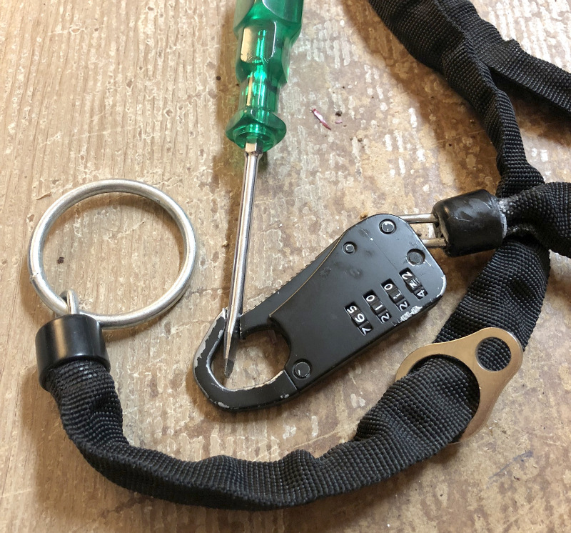

## Straßenzulassung StVoZ 2025

- 4 Reflektoren in den Pedalen (Deutschland Pflicht "2 Rückstrahler")
- 2 Reflektoren in den Speichen (180 Grad versetzte Katzenaugen oder Speichensticks rundum), 
	oder Rundum-Reflektorstreifen im Mantel
- 1 aktive Vorderlampe     (Akku erlaubt)
- 1 aktives Rücklicht rot  (Akku erlaubt), 
	darf nicht blinken (Hoheitsfahrzeuge); Kleidung darf wohl blinken;
	Bremslichtfunktion wohl erlaubt
- 1 passiver Rückstrahler rot, 1 passiver Frontstrahler weiß (können auch in den Lampen verbaut sein)
- 1 Klingel (nicht elektrisch)
- 2 voneinander unabhängige Bremsen
- Licht darf nicht von anderen Bauteilen oder Ladung verdeckt sein
- 20 Euro Bußgeld; höher falls Gefährdung oder Sachbeschädigung

Mit "Rentner-Reflektoren" verliert man beim Sport-Rad Street-Credibility.
StVoZ-ungültige, aber funktionale, ästhetischere Alternativen:

- schwarze Reflektorstreifen auf schwarzer Felge (nicht übertreiben)

## Kleidung

Kleine Materialkunde:

| Material               | Trocknung | Waerme | Kühlung | bleibt geruchsarm | Hautgefühl | Preis   | Kommentar
|------------------------|-----------|--------|---------|-------------------|------------|---------|----------------
| Baumwolle              | \*        | \*\*\* | \*\*\*  | \*                | \*\*       | \*\*\*  | 
| Merino-Wolle           | \*\*      | \*\*\* | \*\*\*  | \*\*\*            | \*\*\*     | \*      | 
| todo...                |           |        |         |                   |            |         | 

Helm:
- einfarbig weiß oder schwarz mit allen Kleiderfarben kombinierbar
- Größe gut, wenn man noch Spiel beim Einstellrädchen hat:
	- lockern bei Druckschmerzen nach längerer Zeit (Kopf schwillt auch an)
	- Platz für Unterhelmmütze
- Polster entfern- und reinigbar? Ersatzpolster kaufbar? (musste meine aum Ausland bestellen)
- Unterscheidungen:

| Rennradhelm (Giro Synthe 2 MIPS)                      | Stadthelm                                | Aerohelm |  ...
|-------------------------------------------------------|------------------------------------------|----------|--------
| starke belüftet                                       | weniger belüftet für mehr Crash-Masse    | weniger belüftet   |
| MIPS (mglw. nur Marketing Gimmick)                    |                                          |          |
| "GIRO"- und MIPS-Logoaufkleber entfernt               |                                          |          |

Temperaturen Deutschland Ostsee (bei Kälte auch essen!):

**Helm + Klarsicht-/Sonnenbrille + Sommer-Gravel-Radschuhe +**

| Temperatur     | Kopf                                                 | Torso                                       | Hände                        | Beine                            | Füße                                    | Regen
|----------------|------------------------------------------------------|---------------------------------------------|------------------------------|----------------------------------|-----------------------------------------|-----------------------
| **-5-4&deg;C** | Unterhelm-Mütze dünn + Merinobuff Hinterkopf/Gesicht | Thermo-Softshell, Trikot lang, Basel. kurz  | dicke Krebs-Handschuhe       | Wind-Thermo-Tights/Überhose lang | Neopren-Überschuhe, Wandersocken mittel | - (Softshell reicht, Nassregen selten)
|  **4-7&deg;C** | Unterhelm-Mütze dünn, Merinobuff Gesicht             | Thermo-Softshell, Thermo-Baselayer lang     | mittelisol. Handschuhe lang  | Wind-Thermo-Tights/Überhose lang | Wind-Socken angeraut                    | Regenjacke/-poncho Gepäck, Velotoze
|  **7-9&deg;C** | Unterhelm-Mütze dünn, Merinobuff in Rücktasch        | Thermo-Softshell, Baselayer kurz            | mittelisol. Handschuhe lang  |      Thermo-Tights/Überhose lang | Wandersocken mittel                     | Regenjacke/-poncho Gepäck, Velotoze bei Langfahrt
| **9-13&deg;C** | -                                                    | 80%-Windjacke, Thermo-Baselayer lang; Trikot lang, Base angeraut lang, Windweste | unisol. Wind-Handschuhe lang | Wind-Thermo-Bibshort + Beinlinge;   Bib + Beinl. + Überhose kurz | Wandersocken mittel | Regenjacke/-poncho Gepäck, Velotoze bei Langfahrt
|**13-18&deg;C** | -                                                    | Trikot, Windweste/-Basel., Armlinge Rückta. | Handschuhe kurz              | Bibshort + Beinlinge Rückta. /&frac34; gekrempelt  | Rad-Socken mittel     | Windjacke, Velotoze bei Langfahrt
|**18-30&deg;C** | -                                                    | Trikot/ Merinoshirt                         | Handschuhe kurz              | Bibshort                         | Rad-Socken dünn                         | - (aushalten)

- Sportbrille:
	- bruchsicher
	- großer Sichtbereich
	- gegen Zugluft (auch seitlich), Insekten, Split, ...
	- verdeckt erschöpften Blick
	- Sonnenschutz (UV)
	- Bügel nicht gebogen sondern gerade:
		- passen in Radhelm-Lüftungsschlitze, falls man sie eine Weile nicht tragen möchte
		- leichter aufsetzbar/abnehmbar ohne sich in Helmbändern zu verheddern
	- wird _über_ statt unter dem Helmriemen getragen, damit kein Gefriemel im Unglücksfall und Rüffel durch Stylepolizei
		- Nachteil: Vergessen beim Helmabsetzen = Brille fliegt auf den Boden
	- ...
	- Klarsicht für Abend/Herbst/Winter, oder photochromatisch
- Handschuhe:
	- schützt Hände beim Hinfallen, Weiterfahren sonst schmerzhaft
	- Lenkerband verschmutzt weniger schnell
	- Wind-/Kälteschutz
	- Polsterung
	- Kurzfinger: Castelli Men's Entrata V Glove
	- Langfinger: Gripgrab Herbst (schwarz), Gripgrab Deep Winter (schwarz), Castelli Perfetto Light Glove (sehr dünn, 0 Polsterung, winddicht)
- Trikot: 
	- weites Hemd mit engen Bibs = Fred-Vibes: locker-locker oder eng-eng
	- Gravel-Style: fahre Frühsommer bis Frühherbst meistens ein dünnes, etwas lockerer liegendes Langarm-Merino-Hemd mit Halb-Reißverschluss: 
		UV-Blocker und gutes Klima drunter gehabt; steckt in einer dünnen, enger geschnittenen Überhose; 
		nicht Presswurst-eng figurbetont wie Roadies und nicht zu baggy wie MTB-Fahrer; Ärmel kann man bei Bedarf hoch/runterziehen
- Radhose:
	- Polster: mMn. schwimmende besser als statische; 3d-geformte Polster vermutl. sinnvoller wenn man ungepolsterte Plastikschalen-Rennradsattel hat,
		sonst addieren sich die Polsteroptimierungen u.U. ungünstig und die Polsterhügel wandern unterm Hintern;
		ich komme jedenfalls mit den neutralen/flachen Polstern besser klar bei meiner leichten Sattelpolsterung (Ergon SR Allroad Core).
	- siehe auch Abschnitt Sattel
	- Trägerhose (Bib) rollt nicht vom Bauch
	- zusammen mit Überhosen ergeben auch "Bib-Liner" Sinn; sind luftiger und Rückentaschen des Liners ersetzen fehlende Rückentaschen am Trikot/Hemd
	- System für Herbst/Winter: mehrere hochwertige Sommer-Bibs mit polsterfreier Thermo-Überhose = bessere/gewohnte Polster, ökonomischer: kann 1 lange Hose länger tragen und Bibs durchwechseln/waschen
- Überhose kurz:
	- Anmutung kompatibler mit ländlich wohnenden Hillbillies als enge, abzeichnende Bibshorts
	- Taschen, erspart andere Taschen am Rad oder Trikot
	- Hose "Sportful Supergiara" taugt, wäre das Bundsystem nicht so dumm: reißt schnell und hält kaum Gewicht, z.B. Handy in der Tasche, kein Silikongripper;
		auf dem Rad egal, aber Hose rutscht beim Gehen, was sehr stört
- Überhose lang:
	- habe eine Fahrrad-Winterhose (Überhose) ohne Polster, die ich über meine Sommerbibs ziehe = ökonomischer, bessere Polster, mehr Sommerbibs zur Verfügung;
		meine Hosen mit Polster bekamen irgendwann Probleme mit dem Polster, auch umständlicher mit reinigen/Verfügbarkeit
- Schuhe:
	- für Klickpedale (clipless)
	- mit SM-SH56-Cleats (erlaubt schräge Panikausstiege, taugt trotzdem sehr gut zum Pedalziehen)
	- Boa-Verschlussmechanismus vs Schnürsenkel vs Klettstreifen
	- Radschuhe mit Schnürren haben oft eine flexible Lasche auf der Zunge, 
		unter die man die Schnüren fixieren kann, damit sie sich nicht aufs Kettenblatt oder Pedalgewinde wickeln
- Herbst/Winter:
	- Langärmel-Trikot in orange (wobei dann eh meist Windweste oder Jacke drüber ist, highvis-Trikot eher sekundär; 
		hatte nur 1 oder 2x Windstopperhemd drunter, Tage schnell kälter geworden)
	- Thermojacke
- Regen:
	- im Spätsommer mal einfache Regenjacke angehabt 
		und darunter dann durch Schweiß so nass gewesen 
		als hätte ich mich gleich vollregnen lassen können;
		probiere es seither mit Fahrrad-optimierten Poncho, 
		der breiter belüftet wird
	- Merino schwierig: 
		trocknet langsamer als technische Plastikkleidung 
		(aber schneller als Baumwolle)
	- das Trocknen nasser Schuhe (innen) dauert lange
	- Haut nasser Füße reibt sich über die Zeit auf und führt zu Entzündungen; Füße sind wichtiger Kontaktpunkt beim Radfahren: 
		Velotoze nerviger anzuziehen, haben aber ein gutes Packmaß und halten dicht (es gibt Gesonderte für MTB/SPD und Rennrad/SPD-SL)
- HighVis (v.a. Herbst-Winter, nachts):
	- nicht kleidsam: statt Neongelb lieber weniger grelle Signalfarben wie orange, rot, matteres gelb
	- Autofahrer finden es gut; als Radfahrer sieht man grelle Radler auch in Entfernung gut
	- Problem imho weniger, dass Radler nicht wie Tannenbaum leuchtet, sondern Autofahrer nicht hingucken (Handy, Fahrerfensterseite) oder Radfahrer verdeckt wird
	- Farbe nachts egal, Reflektoren wichtiger
	- Debatte (inkl Reflektoren) macht Radsicherheit zum Privatproblem des Individuums und 
		ignoriert allgm. Verkehrsinfrastruktur mit Gefährdungsstellen für Radler, Autos, Fußgänger
- Sonstiges:
	- Armlinge und Beinlinge verwende ich selten im Alltag; nur noch, wenn Packvolumen problem wird; 
	  meist stimmt dann schon die Langarm-/Langbein-Auswahl; die nervt auch weniger als das Anzuppen;
	  im letzten Sommer/Herbst gab's mal einen kalten Tag entlang des Wassers, da war ich froh über die Beinlinge;
	  Vorteil ist das kleine Packmaß (Rückentaschen etc)
	- die Beinlingphase im Jahr ist auch vglw. kurz, dann greift man eh zur Langhose
	- habe eine dunne und dicke Unterhelmmütze von Gripgrab; bei Temperaturen -2 bis 2 hat die dünne immer gereicht, 
		wenn man das Buff auch noch bis über den Hinterkopf gezogen hat (und daruber dann die dünne Mütze), 
		dann wurde aus beidem quasi eine dickere Unterhelmmütze,
		und die Wangen usw. wurdem auch noch geschützt

### Meine Radhosen

| Modell                                  | Polster        | Einsatz (Saison)  | Sattel  | trocknet | Bewertung | Kommentar
|-----------------------------------------|----------------|-------------------|---------|----------|-----------|--------------------------------
|  Gore Wear Bibs                         | Schaum         | max 3h   (Sommer) | G, F, E | \*\*     | \*\*      | Polster-Falten/Ablösung n. 1-2 Jahren = Saddle Sores (Oberstoff löst sich und bildet Rubbel-Falten); gute Standard-Hose
|**Gonso SQLab GO M Bibs (2x)**           | Gel/Elast. 6mm | max 6h   (Sommer) | F, E    | \*\*\*   | \*\*\*    | Polsterkomfort konstant gut genug, kein Durchsitzen; Träger beim alten Modell zu kurz; *gut für Radreisen* und Standardrunden
|  Castelli Unlimited Ultimate Bib-Liner  | Schaum         | max 2-3h (Sommer) | E       | \*       | \*\*\*    | Progetto X2 Polster genial, guter Sitz der Hose; mein *Fav für Standardrunden*; für Radreisen eher ungeeignet; hat Rückentaschen z.B. für Fahrrad-Portemonnaie
|  Gore Wear Tights                       | Schaum         | max 3h   (Herbst) | F       | \*\*     | \*\*      | Polster-Falten/Ablösung n. 1-2 Jahren = Saddle Sores; gute Hose sonst
|  GripGrab AquaRepel Bibs                | Schaum         | max ?    (Herbst) | E       | \*\*     | \*\*\*    | Kurze Hose für Herbsteinsatz mit Beinlingen bis 8 Grad
|  Gore Wear Tights Windstopper           | Schaum         | max 3h   (Winter) | F       | \*\*     | \*\*      | Polster-Falten/Ablösung n. 1-2 Jahren = Saddle Sores; Rest der Hose ist genial, fuhr damit problemlos bei Minustemperaturen
|  Gonso Essential Softshell              | ohne           | &infin;  (Winter) | E       | ?        | \*\*      | Winterhose, die ich über Sommer-Bibs mit gutem Polster ziehe; muss weniger Winterhosen kaufen
|  Überhose Sportful Supergiara 002 ('24) | ohne           | &infin;  (Sommer) | F       | ?        | \*\*      | viele kluge Taschen, dümmste Bundsystem ever: hält beladene Hose nicht und ist mir irgendwann beim Nachspannen gerissen
|  Überhose Maloja StagiasM Gravel        | ohne           | &infin;  (Sommer) | E       | \*\*\*   | \*\*\*    | richtige Länge, leicht, punched in früherer Version, aber nur 1 Tasche (Smartphone)

## Werkzeuge

Allgemein:

- Minitool
	- besser man kauft die Teile einzeln in kleiner Form, da dickes Minitool sperrig zw. Speichen etc und Inbus dort oft zu kurz
- Schrauberbitset (BOSCH Professional 32tlg.)
- Drehmomentschlüssel, vermeidet "nach fest kommt ab"
	- "handfest" keine Einheitsvorstellung (bei mir leicht in den Widerstand reinfahren, also spannen, bei Anderen mimikverzerrt solange Kraft drauf bis sich nichts mehr regt, also "anknallen"; taugt beides nichts)
	- bis 15 Nm reicht Auslösung für nur Rechtsgewinde (Ratsche links egal); Proxxon ist gut und Preis noch ok;
	- 15-60 Nm braucht es beim Fahrrad unbedingt Auslösung für Rechts- und Linksgewinde (Pedale, ...), sonst Fehlkauf;
		- bei manchen großen günstigeren Rechtsgewinde-Drehmos kann man den Kopf drehen, wenn man 2 Schrauben löst (Proxxon), Sache von 1 Minute
	- festes Anziehen in gleichmäßigen Viertelumdrehungen mit der Ratsche – nicht zu kleine, aber auch nicht zu große Schritte. So spürt man das Auslösen klarer und verringert die Gefahr des Überdrehens.
	- immer am Griff anfassen – der Schlüssel ist für diese Position kalibriert; falsches Greifen verändert den Hebelarm und verfälscht das Drehmoment.
	- nach dem Einstellen den Drehring arretieren – verhindert ungewolltes Verstellen während der Arbeit.
	- nach Gebrauch entspannen – Einstellmoment auf den Minimalwert zurückdrehen (nicht unter den Minimalwert), um ein Setzen der Feder zu vermeiden. Beim Proxxon MC15 also bei 3 Nm; komplett entspannt klappert er
	- geforderte Drehmomente gelten in der Regel für trockene Schrauben. Bei geölten oder gefetteten Schrauben verringert sich die Reibung, die Vorspannkraft steigt deutlich – Drehmoment entsprechend reduzieren. Bei Flächen (nicht Gewinden) können bestimmte Montagepasten (z.B. Carbonpaste) die Reibung bewusst erhöhen, so dass man materialschonender mit weniger Anzugsmoment klemmen kann.
	- Drehmomente nur bewusst anpassen – bei unkritischen Schrauben kann man zur Materialschonung leicht unter den Herstellerwert gehen, bei sicherheitsrelevanten Verbindungen jedoch immer den exakten Sollwert verwenden. Falls man unterschiedliche Materialien klemmt, z.B. bei Sattelstützklemme oder Klemmkopf für die Sattelschienen, dann natürlich nicht den Sollwert vom härteren Material nehmen.
- hochwertiges Set Inbus-Schlüssel, das genau sitzt und Schrauben nicht ausnudelt (Inbus Original)
- Pinsel fürs Auftragen von Fetten beim Montieren oder Lösemitteln beim Reinigen
- Flachrundzange 
	- z.B. für Splints bei den Bremsen, oder Festhalten von Bowdenzügen; 
	- Knipex 25 01 125 ist so klein, dass sie noch in die Werkzeug-Satteltasche passt, alternativ die kleine Knipex Kobra
- Montageständer (CXWXC für nur 70 Euro) 
	- Gewichtsklasse Biobikes vs E-Bike
	- kompakt verstaubar

Antrieb:

- Kettenverschleißlehre (Rohloff Caliber 2)
- Kettenschlosszange (Shimano TL-CN10)
- Kettennieter (Topeak All Speeds Chain)
- Kasettenabzieher (UNIOR Kassettenschlüssel mit Führungsstift + GEDORE 29cm-Quergriff)
- Kettenpeitsche oder besser: Kettenzange  (weniger Risiko mit der Hand in den Zahnkranz abzurutschen)
- Kurbelabzieher für Kettenblattwechsel (UNIOR)
- Mess- und Richtwerkzeug fürs Schaltauge (Wolftooth Pack Hanger Alignment Tool oder klassisch/günstiger von ZTTO)
- ...

Laufrad:

- Luftpumpe:
	- unterwegs kleine Teleskop-Pumpe für mehr Power (SKS Supershort)
	- gibt auch kleine Pumpen mit ventilschonendem Schlauch
	- Keller: Standpumpe mit Manometer (SKS Rennradkompressor)
	- Tubeless-Kompressor-Pumpe/Druckbehälter/Booster (Airshot) um unwillige Reifen zu setzen
- Ausrichthilfe für Bremsscheiben
- Ventileinsatzschlüssel (Parktool VC-1)
- Reifenheber (UNIOR, blaue von Schwalbe)
- Speichenspanner
- Speichennippelwerkzeug (Speichennippeldreher von Innenseite der Felge)
- Zentrierständer (UNIOR 1688)
	- Achsenadapter (die kleinen Magnetischen von UNIOR sind für das Modell ineffizient/unbrauchbar; besser mit Stange, da man Rad öfter umschlagen muss mit 1 Sensor)
	- Sensor Bremsscheibe
- Dichtstoffspritze (STANS Notubes Injector) oder direkt aus kleiner 59ml-Dichtmilch-Flasche
- Konusschlüssel falls Konuslager (UNIOR)
- Ein- und Auspresswerkzeuge falls Cartridge-Lager
- ...

Reinigung:

- Bürsten von PEATY'S
- Handtücher und viele Lappen
- Carbon-verträglicher Radreiniger
- Kercher Mobile Outdoor Cleaner OC3 Plus 7l Niederdruckreiniger (geht schnell und bequem, vielleicht aber doch schädlich für Fett/Lager auch wenn Niedrigdruck)
- ...

Ständig am Fahrrad bzw. Fahrer:

- ~~Werkzeugtasche (SKS Explorer Straps 800 ml)~~ Fahrrad-Portemonnaie (The Pack) in Trikot/Jacken/Bibliner-Rückentasche:
	- Inbus 3,4,5  (3er bei mir für Bremsbelagnachstellung)
	- Bits PH1, PH2 mit kleinem Daumenschrauber (Shimano-Schaltgruppe)
	- Tubeless-Würstchen mit Pieker und klappbarem Minimesser
	- Reifenheber Schwalbe 2x
	- TPU-Schlauch
	- TPU-Schlauch-Reparatur-Kit
	- Reifen-Reparaturkit (Boots)
	- ~~Minizange Knipex Kobra~~  (kein Platz mehr)
	- Mini-Kettennieter mit Griff = Ventileinsatzschlüssel
	- Speichennippel-Spanner
	- Nitril-Handschuhe
	- RIAS Trockentücher in Tablettenform (Schmutz am Rad oder Öl-Hände abwischen, Frischmachen im Schwitz-Sommer, Notfall-Klopapier)
	- Mülltüte für Reparaturreste (z.B. Tücher voll mit Dichtmilch oder Öl)
- Smartphone in Klapphülle mit Fächern für
	- Geldkarte
	- Personalausweis
	- Bargeldscheine (5-50 Euro)
	- Krankenkarte passt bei mir nicht mehr rein (kann man aber immer nachreichen, Foto auf Smartphone für Daten)
- Minipumpe (SKS Supershort) am Sitzrohr (unauffälliger als am Unterrohr)
	- darauf paar Meter Panzertape gewickelt

## Kleine Schmierstoffkunde

| Schmierung          | Konsistenz            | Zusammensetzung | Anwendung | Haftung /Haltbarkeit | Gesundheit | Entsorgung
|---------------------|-----------------------|-----------------|-----------|----------------------|---------|---------
| Öl                  | flüssig bei Raumtemp. | reine Grundöle + Additive                                    | schnell-bewegliche Teile                                                                                            | dringt in enge Zwischenräume, bildet dünnen Schutzfilm, wäscht sich schnell aus                                                   | ?                             | Schadstoffstelle, nicht Abfluss/Boden (Öl verschmutzt Wasser)
| Fett                | halbfest bis fest     | Mischung aus Öl und Verdicker (Lithiumseife, PTFE)           | stark belastete, langsam bewegl. oder dauerhaft geschützte Teile, Lager, Tretlager, Gewinde, Steuersatz             | haftet länger an, besserer Wasserschutz; ungeöffnet 5-10 J. lagerbar, sonst 2-5: Öl trennt sich irgendwann /klumpig /dünnflüss.   | gelegentl. Hautkontakt ok     | Schadstoffstelle, nicht Abfluss/Boden (Öl verschmutzt Wasser)
| Antiseize           | zähflüssig, pastös    | Grundöl + Metall- /Keramikpartikel (Kupfer, Nickel, Graphit) | Schrauben, Gewinde; verhindert Festfressen                                                                          | gute Haftung, stabil bei Hitze und Vibration, langzeitbeständig, temperaturfest, wasserabweisend                                  | ggf. hautreizend o. allergen  | nicht Abfluss/Kanalisation (Öl verschmutzt Wasser), Restmüll nur getrocknet
| Schrauben-Sicherung | flüssig bis gelartig  | anaerober Klebstoff + Farbpigmente (Farbcode=Härte)          | härtet bei Sauerstoffentzug + Metall(ionen)-Kontakt: verhindert Losdrehen durch Vibration, leichter Festfressschutz | montiert jahrelang; ungeöffnet 1-2 Jahre lagerbar                                                                                 | ggf. reizend, nicht einatmen  | fest Hausmüll, flüssig Sondermüll/Schadstoffstelle
| Dichtmilch          | flüssig bis gelartig  | Wasser- oder Glykolbasis mit Latex- /Polymerpartikeln        | dichtet kleine Reifen-Einstiche ab, verschließt Lücken zw. Tubeless-Reifen und Felge                                | montiert 2-12 Monate wirksam je nach Temp. und Bewegung; ungeöffnet 6-18 Monate lagerbar                                          | ggf. reizend                  | nicht in Abfluss
| Wachs               | TODO                  | TODO                                                         | TODO                                                                                                                | TODO                                                                                                                              | TODO                          | TODO

- Bauteile vor dem Auftragen von Fett gründlich säubern, sonst erzeugt man eine Schleifpaste
- meisten Fette sind lithiumverseift und nicht so wasserfest wie calciumbasierte Fette wie Motorex 2000
- Calcium-verseiftes Fett nennt sich auch Staufferfett
- Silikonfett wird als synthetisches Fett betrachtet, 
		weil es auf synthetischen Silikonölen basiert, 
		anstatt auf natürlichen Ölen oder Fetten;
		greift Kunsstoffe (Carbon) nicht an
- auf Grund der elektrochemischen Spannungsreihe erzeugt Kupferpaste bei Alu und Stahl unter Feuchtigkeit Korrosion

Allgemein:
- Auf alles was klemmen soll, kommt (Carbon/Alu-)Montagepaste mit Schleifpartikeln
- Auf alles, was sich im Betrieb drehen/bewegen soll, kommt Fett
- Auf alles, was im Betrieb fest sein soll, aber rein/raus geschraubt werden muss, kommt Montagepaste.
	Wenn man keine Montagepaste hat, kann man auch einfach Fett nehmen.
	Fett zu nehmen ist besser, als das Gewinde trocken zu schrauben.
- Nicht mischen, verändert Eigenschaften = unbrauchbarer
	- Schraubensicherung und Antiseize

### Typische Produkte

Siehe auch Abschnitt [Aktueller Schmierplan](#aktueller-schmierplan).
Folgende Liste mit Produkten, die mir mal untergekommen sind (also nicht alle verwende):

| Produkt                             | Typ                | Hauptzweck         | Do                           | Don't                | Kommentar
|-------------------------------------|--------------------|--------------------|------------------------------|----------------------|-----------------------
| Shimano Anti-Seize Motorex Anti-Seize | Montagepaste| Trennmittel        | Gewinde zw. Kurbel und Pedal,  Bolzen Sattelklemmung,  Sattelstütze-Sitzrohr-Klemmung,  Gewinde Kurbelarme,   Vorbauschrauben | nicht auf Carbon (macht Oberfläche zu glatt),  Sattelstreben-Klemmfläche | Montagepaste mit niedrigem Reibungswert; verhindert Korrosion und Kaltverschweißung von Alu und Stahl; trennt Kontaktflächen/Festbacken von Metallen = leichtere Enfernbarkeit; nur geringe Schmierung für bewegl. Teile (anders als Fett), Partikel könnten sogar Lager/Gewinde beschädigen; zuvorderst Trennmittel; reduziert Knarzgeräusche von Mikrobewegungen zw Stütze und Rahmen / Fugen zwischen den Bauteilen aufgefüllt und ein flächiger Kontakt hergestellt also die Haftung verbessert- keine Bewegungen und kein Knacken mehr
| Motorex 2000                        |                    |                    |                              |                      | "Steckachse und im Steuersatz nicht optimal finde. Durch die Rotationsbewegungen scheint es sich mit der Zeit etwas zu verklumpen."
| ??? Alu-Montagepaste                | Montagepaste, Reibungspaste | Reibung erhöhen   | Klemmfläche Alu-Alu (z.B. TT-Aerobars/Auflieger)  || Montagepaste mit hohem Reibungswert; erlaubt Anzug mit weniger Drehmoment/Schraubenvorspannkraft = materialschonender;  alternativ Silikonpaste mit hohem Reibungswert 
| Muc-off Carbon Gripper Muc-Off Carbon Assembly Paste Finish Line Carbon Fiber Paste Park Tool CSG-2            | Montagepaste, Reibungspaste | Reibung erhöhen   | Klemmfläche Carbon-\* | Klemmfläche Alu-Alu (knarzt)  | Montagepaste mit hohem Reibungswert; erlaubt Anzug mit weniger Drehmoment/Schraubenvorspannkraft = materialschonender; MucOff Gripper für höher belastete Sachen wie Vorbau/Lenker/Sattelstütze
| Muc-off Bio Degreaser               | Entfetter          | Entfetten          |                              |                      | weniger aggressive zu Gummi-/Kunststoffteilen (Dichtungen) als Bremsenreiniger
| Muc-off Bike Cleaner                |                    |                    |                              |                      | 
| Pedros Green Fizz Bike Wash         |                    |                    |                              |                      | soll wohl carbon/lack-freundlicher sein als mucoff
| WD40 Silikonspray                   |                    |                    |                              |                      | auf tuch sprühen, evtl. glanz bei stumpfgewaschenen Carbongabel wiederherstellen?
| WD40 Rostentferner                  |                    |                    |                              |                      | 
| WD40 Kontaktspray                   |                    |                    |                              |                      |
| WD40 klassisch                      |                    |                    | für nichts am Rad einsetzen  |                      | immer falsch
| Finishline Premium-Grease           | Fett               |                    |                              |                      | alte PTFE-Version mit "Trilinium" (Eigenbezeichnung) ersetzt
| Shimano Premium-Fett                | Fett               |                    |                              |                      |
| Inbus Schraubensicherung Loctite | Klebstoff          | Loslösen hindern   | Bremsscheiben-Bolzen, Cleats-Schrauben (Schuh), Bremsgriff-Schrauben, Lenker-Schrauben  |  | sicherheitsrelevante Teile; gg. Lockerung durch Vibration; bietet auch Korrossionsschutz (Antiseize extra unnötig; vermischt kann sogar Wirkung aufheben); Loctite blau ist niedrigfest bis mittelfest, rot ist hochfest
| Liquimoly LM47 Langzeitfett         | Fett (Lagerfett)   | Reibung reduzieren |                              | von Carbon fernhalten (Fett bläht Carbon-bindendes Epoxidharz)  | 
| Liquimoly Silikonfett               | Fett (synthetisch) |                    | Carbon                       |                      | 
| Liquimoly Dry oder Wet Lube         | Öl                 | Reibung reduzieren | Kette im Sommer/Herbstwinter | nicht auf Kassetten-Ritzel (verschmutzt ohne Nutzen), Bremsscheibe | punktuell auf Kettenglieder, nur dort muss Öl hin, sonst sauber
| Liquimoly Multi-Spray Plus 7        |                    |                    |                              |                      |
| Nigrin Bike-Care Fahrradreiniger    |                    |                    |                              |                      |
| Nigrin Bike-Care Feinöl             | Öl (Kriechöl)      |                    | ?                            | niemals Bremsscheibe | 
| Brunox Turbo-Spray                  | Öl (Kriechöl)      | Reinigen           | ?                            | niemals Bremsscheibe | lockert festgefressene Teile, Schmierun, Wasser fernhalten, Korrossionschutz; wohl überall dort falsch, wo WD40 falsch wäre
| Balistol PTFE-Trockenschmierung     | PTFE+Lsgmittel     | Reibung reduzieren | Schrauben, Gewinde, Schaltwerk-Federn/-Gelenke   |  | nicht fettig oder klebrig bleibt, sondern eine trockene, schmierende Schicht hinterlässt, die weniger Schmutz und Staub anzieht
| Würth Bremsenreiniger               | Entfetter          | Entfetten          | Bremsscheibe                 |                      | Bremsenreiniger oft auf Alkoholbasis (alt. reinen Alkohol nehmen)
| Würth Industrie Clean               | Spezialreiniger    | Etiketten lösen    | Etiketten, Kleberückstände   |                      | erstaunlich gut z.B. bei Etiketten auf Folientüten (draufsprühen, warten, Etikett fällt komplett spurenlos ab)
| Giant Tire Sealant                  | Dichtmilch         | Löcher schließen   | Tubeless-Reifen              |                      | angeblich umetikettierte Stans-Dichtmilch; offiziell bei Giant auch nur Empfehlung für Giant oder Stans bei Giant-Reifen/Felgenband/Rädern
| Orange Seal Endurance               | Dichtmilch         | Löcher schließen   | Tubeless-Reifen              |                      | Endurance bleibt länger flüssig als die normale Version bei etwas vermindeter Abdichtung; wäre besser und verträglicher als Stans bei Nicht-Rennrad-Drücken unter 5-6 bar
| Schwalbe Easy-Fit Montage Fluid     | Reifenmontierflüss.| Reibung reduzieren | Reifen                       |                      | vereinfacht Reifenmontage auf Felge
| ??? Kettenwachs                     | Wachs              |                    |                              |                      | Alternative zum Kettenöl
| ??? Steuersatzfett                  | Fett               |                    |                              |                      | s.a. Kugellager-Abschmierfett (salzwasserbeständig), s.a. Wälzlagerfett, Siliconpaste bei Carbon (Faser ist chemiebständig, aber deren Harz-Einbettung nicht)
| Isopropyl-Alkohol, Hand-Sanitizer   |                    |                    | Bremsscheiben, Hoods-Griffgummi-Inneres für Gleitfähigkeit bei Montage | |
| Talkumpulver                        |                    |                    | Reifenschlauch               |                      |

## Verschleißteile bevorraten

Auf Verschleißsteile gibt es idR. keine Gewährleistung vom Fahrrad-Händler.

Immer in bestimmter Menge vorhalten, 
weil nicht immer in der gesuchten Ausführung in Shops verfügbar (Corona), 
manchmal auch länger nicht oder gar nicht mehr. 

Mit Vorrat hat man Zeit für Suche/Nachschub.

- Antrieb:
	- 3x Kette (längt sich mit der Zeit, Schaltung wird ungenauer, Ritzel nutzen sich stärker ab)
	- 2x Kassette (Ritzel) wird abgeschliffen/verformt und beeinträchtigt Schaltung, Kette rutscht durch bei Kraft
	- 1x Kettenblatt (wird abgeschliffen/verformt, Kette rutscht durch bei Kraft; weniger Verschl. als Ritzel da größer/mehr Auflage und weniger Kraft); evtl. 2x falls erwartbare Beschaffungsprobleme für verwendete Kurbel
	- 1x Schaltungsrädchen oben (Leitröllchen / Guide Pulley)
	- 1x Schaltungsrädchen unten (Spannröllchen / Tension Pulley)
- Bowdenzug (reißt):
	- 2x Schaltzug (1-3 Jahre Lebensdauer bei sportlichen Fahrern/Pendlern/...), Fein-Einstellschraube evtl. wiederverwendbar
	- 2x Bremszug
- Bremsen:
	- 4x Bremsbelag (wird dünner/abgeschliffen)
	- 2x Bremsscheibe (wird dünner/abgeschliffen:
		(Breite min 1,5 mm, oder Min-Wert steht drauf, oder Kaufbreite-(Kaufbreite\*0,35), 
		Messung nicht über die Ränder (bleiben dick) sondern quer auf die Bremsfläche) + ggf je 6 Schrauben
- Lenker:
	- 2x Lenkerband (löst sich auf, sitzt nicht mehr, reißt)
	- 3x Haubenabdeckungen/Griffgummi-Paare, ggf. mehr Vorrat bei alten/auslaufenden Gruppen (Bracket Covers bei den Bremsschalthebeln werden ungleichmäßig abgerieben = nicht hübsch; schnell Knicke/Risse durch Wartungsarbeiten am Lenkerband oder der Hebelposition)
	- 2x Steuersatzlager exakt mit Außen- und v.a. Innendurchmesser und z.B. 45-Grad-Kanten, Edelstahl (nicht nur Werkzeugstahl oder brüniertes Metall)
- Laufrad:
	- ?x Reifenmantel (Profil) wird abgerieben 
	- 2x seltener Felgenband kann reißen, z.B. bei Wartung oder durch Reamer/Plug-Gabel bei Tubeless-Panne
	- ?x Schlauch reißt ein oder Tubeless-Dichtmilch trocknet ein
	- 6x Ventileinsätze verstopfen durch Dichtmilch, verbiegen beim Aufpumpen oder brechen sogar ab, werden undicht
	- 4x Speichen brechen (ideal selten), Speichennippel mit Speichenresten nach Bruch, Korrossion
	- Konus und Konuslager-Kugeln falls Konuslager (Kerbungen/Mulden/"Pitting"), je Größe z.B. 22 pro Rad-Seite, 100 also für 2 Laufräder; 200 evtl. auf Vorrat
		Konusse sind tats. als Verschleißteile konzipiert und angeblich etwas weicher als die feste Schale an der Nabe;
		manche schleifen sie wieder glatttrund (Dremel/Bohrer+Sandpapier);
		manche Schalen sind nur eingepresst, aber einzelne Ersatzschalen zu besorgen ist idR. schwierig, oft dann neue Nabe oder Laufrad;
		Lager mind. 1x Jahr inspezieren
- Kleinkram:
	- Endhülsen für Schaltzug/Bremszug
	- Endkappen in versch. Ausführungen für Schaltzug/Bremszug
	- Schrauben Flaschenhalter
	- Schrauben Lenkervorbau
	- Ventilkappen
	- ...
- Pflegeprodukte:
	- Schmierstoffe (s. Abschnitt "Kleine Schmierstoffkunde")
	- Putzmittel (s. Abschnitt "Radwäsche")
	- Werkstatt-Handschuhe
	- ...

Verschleiß feststellen:
- Ersatz-Kettenblatt gegen montiertes Blatt halten und Zähne vergleichen: Grate, spitzrunde Haifischzähne, ...
- Kettenlehre (Werkzeug)
- Durchrutschen neuer Ketten

Kein Verschleißteil, aber proprietär und zu bevorraten, weil Bezug schwer werden könnte:
- Schaltauge (Sollbruchstelle zw. Rahmen und Schaltkäfig, falls Rad zur Seite fällt; kann verbiegen und brechen)  
  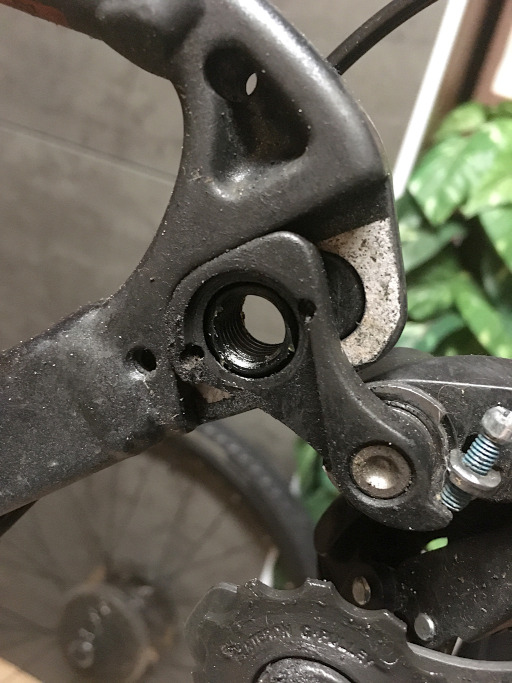
- Sitzstangenschraube (beim Revolt, Adapter auch?)

Stahl rostet,
Alu rostet nicht aber oxidiert weißlich - diese Patina sieht nicht gut aus, wäre aber nicht weiter schlimm (rostet nicht durch wie Stahl),
Carbon? Titan?

Nach 200 km sollte man bei Neurädern den Erst-Service machen:
- neue Bowden-Züge längen sich 
- Speichen müssen nachgespannt werden
- tats. hatte ich nach 500 km Klimpergeräusche im Hinterrad, der Klang, 
	wenn man Speichen an den Speichenkreuzpunkten zusammendrückt.;
	Werkstatt meines Händlers hat 2x nachgespannt und 
	danach war wieder alles ok. War auch erst nach 500 km dort

## Radwäsche

"Ich benutze nie aber niemals Kettenreiniger; 
es haut die ganze schmierung zwischen den Glieder raus. 
Kette reinigt man mit der Zahnbürste und etliche saubere Lappen. 
Kassette wird abgezogen und So gereinigt. 
Dann Fahrrad mit schlauch komplett nass machen. 
Bike cleaner ordentlich drauf sprühen fertig abspülen fertig. 
Trocknen Rahmen polieren mit entsprechenden Mitteln. 
Freilauf fetten zusammen bauen. 
Kette neu schmieren paar mal auf und ab schalten. 
Kette durch ein sauberes Tuch nochmal ziehen und fertig.
So und wenn du mit Kettenreiniger die schmierung zwischen den Glieder raus waschen tust 
wirst du die schmierung zwischen den Glieder nicht mehr hinbekommen 
und deine Kette Verschleißt schneller. 
Zur Info bin Zweirad Mechaniker und im Amateur Bereich ein erfolgreicher Fahrer weiß auf was es ankommt."

Manche Mechaniker empfehlen weniger als häufiger zu reinigen.
Wasser spült viel aus, 
Wasser bleibt irgendwo stehen und lässt korrodieren.

Motorrad-Reiniger mehr und billiger 
(hab ich damals vom Fahrradladen bekommen, die würden das auch so machen)

- Sprühflasche 1000 ml, z.B.
	- JMC Gel-Motorradreiniger

- Bürsten, 2x Schwämme (Antrieb und Rahmen, sonst schmiert mal Kettenöl auf Rahmen),

- besser: Kärcher Niedrigdruckreiniger (großes Volumen 7L reicht für 1 Wäsche, nicht kleiner kaufen):
	Hochdruckreiniger (Tankstelle) vermeiden (bzw. mit viel Abstand nutzen), schießen Schmierung aus den Lagern 

- Handtuch (kein Wischmopptuch, das fusselt brutal) zum Trocknen von Rahmen, Lenker, Sattel und und Laufrädern

## Bremsen einstellen

- TODO

## Kettenschaltung einstellen

### 4 Einstellschrauben:

- kleinster Gang = geringste Zugspannung
- Test: in kleinstes Ritzel und dann Gang für Gang nach oben und wieder zurück
- Zugspannung hinten: Rädchen an dem Zeugs hinten in die Richtung drehen, in die es besser schalten soll (rechts -> kleine Ritzel)
- Zugspannung Umwerfer: Rädchen vorne am Lenker
- Umwerfer: Anschlag
	- H-Schraube (Highspeed):  R| #|  (# Kette, | Leitblech, Z Rahmen)
			1. vorne großes Kettenblatt, hinten kleinstes Ritzel
			2. drehen, bis sichtbar an die Kette drückt
			3. dann viertel zurückdrehen, damit 1mm Abstand sichtbar wird zw. Blech und Kette
	- L-Schrauber:  R|# |
			1. vorne kleinstes Blatt, hinten größtes Ritzel
			2. 
	- nur relevant, wenn oberste oder untereste Zahnrad nicht richtig wechselt; alles dazwischen unbetroffen von den Einstellungen:w
	- Umwerferkäfig und die Kettenblätter sollten zueinander parallel stehen
	- B-Schraube: Abstand oberes Röllchen im Schaltwerkkäfig vom Ritzel der Kassette (Umschlingungswinkel)
- Umwerfer: Höhe
	- vorher: kleinste Gang
- Start: kleinstes Blatt vorne, größtes Ritzel hinten

### Schaltauge:

- verbindet Rahmen mit dem Schaltwerk
- Sollbruchstelle, falls das Fahrrad umfällt und aufs Schaltwerk kippt = Rahmen schonen (teuer);
- kann verbiegen = Schaltprobleme
- meist proprietäre Form, Standardisierungsversuch mit UDH
- Ersatzteil bei modernen Rädern, sonst Teil des Rahmens

daran ist das hintere Schaltwerk angebracht/eingeschraubt; wenige Grad Abweichung schon ändern ganze Schaltgeometrie; fängt Seitenschläge auf;
austauschen, wenn verbogen; gerade biegen kann dazu führen, dass es bricht und ganze Schaltkäfig in die Speichen kommt und viel kaputt macht;
Ersatzschaltauge besorgen (kann dann z.B. auf Reisen Werkstatt einbauen); s. Abschnitt Schaltung

| Mess-/Richtwerkzeuge                 | Messweise | Bemerkungen
|--------------------------------------|-----------|----------
| Park Tool DAG                        | radial    | im Auge verschraubt Messung rundum an der Felge (traditionell); enge Toleranzen/wenig Spiel/Steifigkeit nötig; Rad drehen und *immer am Ventil messen* = unabhängiger vom Felgenzustand; einfacher, wenn man Messstab drehen kann, um besser an den Ketten-/Sitzstreben vorbeizukommen; Stangenlänge verstärkt die sichtbare Ungenauigkeit = genauere Arbeit; Günstigere Alternativen: ZTTO, Topeak
| Wolftooth Pack Hanger Alignment Tool | axial     | vergleicht die Parallelität zweier Balken, die ins Schaltaugen- und Radachsengewinde geschraubt werden
| Tune Linientreu Precision Laser      | axial     | verwendet Laser um Parallelität von Ritzel und Pullies zu vergleichen; Schaltwerk muss nicht abgebaut werden

## Kette schmieren

- ideal biologisch abbaubares Öl
- ideal leicht auswaschbares Öl, da man sich 100% damit immer mal wieder irgendwo einsaut (bei normalen Hosen: Hose unten nah ans Bein abbinden)
- manche nutzen Wachs statt Öl, erfordert aber Komplettreinigung
- angeblich beste: ein Tröpfchen auf jede einzelne der 57 Gliederrollen (Start-/Endpunkt Kettenschloss) - zeitintensiv
	- meine version: Tropfen auf Pinsel (flach, nicht breiter als Kette) 
	  und immer ein Kettensegment von oben einstreichen (unterer Kettenlauf), 
	  dann halbe- oder vierteldrehung weiterkurbeln - sauberer und schneller; abwischen muss man Ende bei allen Methoden
	- schlechteste: direkt auf Kette ausgiesen und drehen
- Öl einwandern lassen - angeblich stunde warten, angeblich ideal über nacht
- am Ende immer nochmal abwischen: 
	Ol muss nur _in_ die Glieder, nicht auf der Kette bzw. an den Kettenseiten; 
	dort zieht es nur Dreck an und verschleißt den Antrieb mehr statt weniger
- korrekt geölte Kette bleibt silbern (schwarz = zu viel/zu viel Dreck); auch korrekte Ritzel sind silber und nicht schwarz;
	erkennt man den newb

## Kette wechseln

- Kette längt sich über die Zeit
	- abh. von Qualität, gefahrenen Gängen und Krafteinwirkung usw.
- gelängte Kette verschleißt auch Ritzel und Kettenblätter stärker
	- neue Ketten passen dann evtl. nicht mehr richtig drauf = Schaltprobleme, springende Kette
	- meine war schon nach etwa 1300 km gelängt, neue Kette passte gut; manche nutzen Ketten angebl. 5000-10000 km
- Kette abhängig von der Anzahl der Ritzel kaufen (9-Speed etc), je mehr Ritzel, umso dünner die Ketten
- Kettenmesslehre (z.B. Rohloff Caliber 2) 
	- Stahl vs Aluseite: Magnettest (Alu ist nicht magnetisch)
	- Kette erneuern, falls Lehrnase durch die Glieder fällt

1. Kette entspannen: kleinstes Ritzel, kleinstes Kettenblatt
2. Kettenschloss öffnen
	- spezielle Zange
	- oder Schnur in Nachbarglieder und mit Stock o.ä. zudrehen
	- oder Kettenschloss aufs Kettenblatt führen (3 oder 4 Uhr), Glieder abwinkeln und mit Minitool oä. draufschlagen
3. Kettenlänge ermitteln und einkürzen
	- Vergleich mit alter Kette: Glied mit Glied vergleichen, da alte Kette gelängt ist
	- meine KMC-Kette war out-of-the-box richtig gelängt
	- Kette wirkt oben auf den Zahnrädern ("Zugtrum") und kann theoretisch unten locker herumbaumeln ("Leertrum");
		das Schaltwerk mit Pulleys halten den unteren Teil auf Spannung;
	- auf kleinstes Ritzel und kleinstes Kettenblatt; Schaltkäfig klappt komplett ein; so Ablängen dass beim Einklappen bisschen Spiel bleibt (wegen Kettenlängung):
		https://www.youtube.com/watch?v=2OsM7Tou5Iw
4. Schaltkäfig, Schalträdchen etc säubern
5. Kette richtig einfädeln (über kleinstes Ritzel)
	- korrekter Lauf über Schalträdchen und Führungen beachten
	- manche Ketten haben eine Laufrichtung (Shimano), oft Text nach außen (Richtung bei KMC egal)
6. Kettenschloss schließen
	- spezielle Zange
	- oder Kette mit Kettenschloss nach oben drehen, Bremse halten und in Pedale treten
7. neue Kette säubern, evtl. schmieren

## Pedale wechseln

- Links/Rechtsgewinde! beide Seiten jeweils Öffnen in Richtung Hinterrad und Schließen in Richtung Vorderrad [TODO nochmal gegenprüfen]
- Schmieren z.B. mit Shimano Anti-Seize für dichte starre Verbindung, die nicht festrosten/festfressen soll
- TODO

## Pedale schmieren

- außen
- innen
- TODO

## Felge zentrieren (engl. Truing)

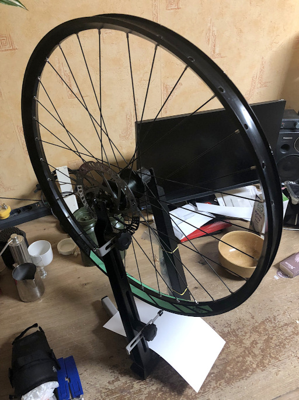  
_(Abb.: Übungslaufrad im UNIOR-Hobby-Zentrierständer – verwindungssteif & zusammenlegbar; weißes Papier verbessert Sicht auf Lücke zw. Fühler und Felge)_

Professionellere Zentrierständer haben Messuhren mit 2 oder mehr beweglichen Fühlern. 
Manche bauen sich selbst welche aus Systemprofilen. 
Für Andere reicht ein Kabelbinder an der Sitzstrebe.

- Speichen sind wie Seile: sie können nicht drücken, nur ziehen 
- Nippelspanner: ... TODO
- Ständer mit Zange muss wg. Mittlungsfehler kalibriert werden, 
	einseitiger Ständer wie im Foto (UNIOR 1688) nicht, dort nutzt man die Umschlagsmethode 
- Nippel: Messing (schwerer/stabiler) vs Alu (leichter/schwächer)
- Speichen: J, ... TODO

### Wo beginnen? 

Beide Seiten im Zentrierständer testen und schauen, welche Seite insgesamt mehr am Fühler reibt – dort anfangen und Felge in die andere Richtung ziehen

### Was korrigieren? 

Anfänge & Mitte des Schlags an der Felge finden, markieren und anteilig über mehrere Speichen arbeiten: 

1. Zuerst Seitenschläge < 1 mm bringen 
2. Danach Höhenschläge < 1 mm 
3. Zuletzt Felge mittig zur Nabe (engl. Dishing) < 1 mm  
	- = Mittigkeit des Laufrads im Fahrradrahmen
	- Hierfür das Rad wdh. umschlagen – Achse identisch einspannen! – und beidseitig gleichen Abstand zw. Fühler und Felge herstellen:  
	  ALLE Nippel der A-Seite +¼ und B-Seite –¼ paarweise gleichzeitig drehen.
	- am Ventilloch starten und enden (erleichtert Überblick).  
	- Messung am Ventilloch als einheitlichen Referenzpunkt.  
	- spezielles Wheel-Dishing-Tool ist hier unnötig bzw. optional (wohl eher bei Radbau)

### Wie ziehen? 

- Seitenschlag: Speiche links BZW. rechts spannen (s.o.) 
- Höhenschlag: Speiche links UND rechts spannen 
- kleinschrittig Viertel-Umdrehungen + überprüfen 
- Kombinieren: 1 spannen, direkte Nachbarn ½ lockern 
- starkgespanntes Altrad eher lockern als spannen 
- Neurad eher spannen als lockern 
- neue Speichen sind steifer
- Gegenseite lockern falls Nippel max. angezogen 
- Tropfen Öl auf schwergängige Nippel (nur diese, sonst Speichenbewegung beim Fahren) 
- die Speiche ist die Schraube und woran man dreht die Mutter (Nippel) = Drehrichtung also umgekehrt als bei Schrauben
- Spannung: ... TODO
	- Speichenwinkel/-Spannung (Nicht-)Antriebsseite verschieden = verschiedene Tonhöhen;  
	  Nicht-Antriebsseite hat meist eine geringere Spannung (60–80 % der Antriebsseite).
	- typischer Wert für Rennrad-/MTB-Hinterrad (Antriebsseite) liegt bei 1000–1300 N
	- manche Hersteller stellen Tabellen bereit, die zeigen, welche Spannung für gekaufte Speichen ideal ist
	- relativ gleichmäßige Speichenspannung wichtiger als extrem genaue Zentrierung
- Abdrücken/Setzarbeit: ... TODO
	- nach jedem Zentrierschritt: sich kreuzende Speichen zusammendrücken rund ums Rad

## Bowdenzug ersetzen

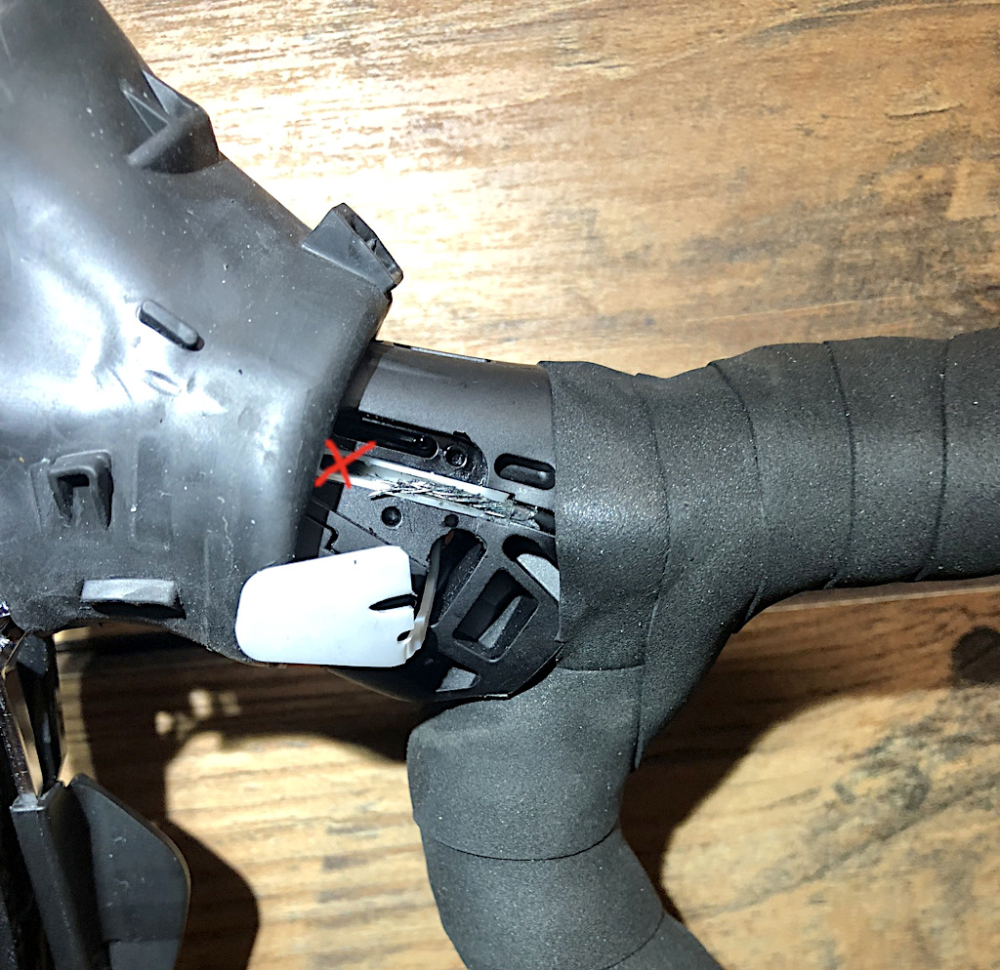

- STI-Brems-Schalthebel-Kombination Shimano
- mechanische Schaltung/Bremsen
- innenverlegte Züge

Gerissener Zug zählt wohl zum Verschleiß und Verschleißteile sind bei Gewährleistung meist ausgenommen. 
Zusätzliche (freiwillige) Garantien gibt es nur vom Hersteller Giant 
und auch dort nur auf den Rahmen und paar andere Teile
(wie z.B. damals mit meinem korrodierten Steuersatz).
Außerdem bin ich mittlerweile in der Nachweispflicht und wüsste nicht, 
wie ich nachweisen sollte, dass das Ganze bereits bei Auslieferung mangelhaft war. 
Angeblich hätten solche Züge tats. nur eine Haltbarkeit von 1-3 Jahren bei sportlicheren Fahrern.

- Schaltzug 4mm, Bremszug 5mm, also das dickere, kann beim Erkennen des Kabels helfen, wenn es unterm Lenkerband irgendwo hinführt...
- Radien beachten, also das alles schön rund und nicht zu eng läuft, nichts knicken, sonst reibt der Zug 
- 

Begriffe:

- Drahtzug / Seil: Geflecht aus vielen dünnen Stahldrähten
- Außenhülle
- Zugnippel
- (Hüllen-)Endkappe, ggf. gedichtet, schließen die Hüllen, so dass nur noch der blanke Zug durchguckt, 
	sind oft auch nötig, um den Bowdenzug in Führungen usw. einzustecken;
	die Endkappen gibt es in verschiedenen Ausführungen, nicht nur modisch begründete
- Zugend-Hülse verhindert Ausfranzen des Zugs am Ende, schützt vor allem den User vor Verletzungen
- Schaltkäfig
- Fein-Einstellschraube
- Klemmschraube / Klemmung

Nicht verkehrt "Sets" zu kaufen, da ist vieles drin, was man vielleicht vergessen hätte.

Werkzeuge (teils optional):

- Bowdenzug-Cutter, evtl. mit Crimp-Funktion für Hülsen und (Metall-)Kappen (z.B. Gedore GEDORE Bowdenzug-Zange 170 mm 8317-160 JC)
	für ein sauberes Schnittbild, damit der Zug nicht ausfranzt bzw. die Hülle murks wird;
	allgemeine Kabelscheren oder Seitenschneider nur mit Vorsicht
- Feile bzw. Schleifpapier, um eine geschnittene Hülle eben/glatt zu machen, ideal bis gleichauf mit Metal innen, und nichts schief hängt
- konische Nadel / Pieker, um die Hülle wieder rund zu öffnen, falls sie beim Cutten zusammengedrückt wurde
- 1-2mm Schrumpfschlauch oder Stoßverbinder, 
	um alten und neuen Zug zu verbinden und beim Ausfädeln des alten Zugs den neuen Zug gleich nachzuziehen, 
	hauptsächlich bei innenverlegten Zügen;
	beim Schrumpfschlauch nur die Enden schrumpfen und in der Mitte nicht so sehr, sonst rutschen die Züge aus dem Schrumpfschlauch raus oder die Verbindung wird beeinträchtigt.
	daher bisschen Zugfestigkeit testen; wenn ausreichend fest, funktioniert es auch ganz gut, damit durch kleine Löcher zu kommen
- Haken o.a., um Züge aus Öffnungen rauszufischen
- Lineal, um beim Ablängen die alte Zughüllen als Referenz für neue zu nehmen (kann man auch direkt zusammenhalten, wenn es einfacher geht)
- evtl. was zum Schmieren der Züge in den Hüllen, aber z.B. Shimano OT-SP41 soll nicht geschmiert werden, da die von Haus aus vorgeschmiert kommen, Ol ist sogar nachteilig, zieht Dreck rein
- Inbus-Schlüssel für Schraube am Schaltkäfig, alles Andere wird bei meinem Rad sonst nur mit der Hand rausgezeogen, gesteckt und gefädelt
- Silikonspray zum Schmieren der Zugaufnahme im Bremsschalthebel, kein Öl; der Zug macht auch an der Stelle noch kleine Bewegungen
- Druckluft zum Ausblasen von Drahtresten (mit Vorsicht verwenden: nur bei Zugführung einblasen)

Gerissenen Schaltzug im STI-Bremsschalthebel entfernen:

den Griffgummi kann man nach vorne und nach hinten (richtung Lenker) wickeln.
den Griffgummi kann man direkt unter dem Hebel greifen und etwas nach vorne Ziehen, dann löst sich der Gummi auf der Hood-Spitze beim Bremshebel.

Auf der Innenseite des Hebels ist eine helle Klappe, die kann man mit den Fingern oder etwas Spitzel heraushebeln.

Kleinen Hebel nutzen, damit die Zugnippelaufnahme Richtung Außenöffnung kommt (von Außenseite auf den Schalter gesehen)

Von Unten auf den Hebel geschaut befindet sich ein Service-Fenster, verdeckt mit eine Klappe mit Schraube: Nach Lösen kommt man an das Schaltwerk heran
und kann abgerissene Zugteile vorsichtig herausziehen.
Um diese Klappe wieder anbringen zu können sollte man den Griffgummi erst nach hinten Richtung Lenker wickeln.

Drahtzug maximal 3-5 cm (inkl. Endhülse) hinter der Klemmung überstehen lassen;
kürzer wirkt professioneller: sauberer (kein unnötiger Drahtüberschuss), 
weniger Risiko für Kontakt mit Bauteilen, Kleidung oder Gestrüpp und entsprechende Geräusche;
mind 1-2 cm aber unbedingt stehen lassen, damit man den Zug noch beim Nachjustieren greifen kann.

Schaltzug:

Shimano-Züge sind 1,2 mm - viele andere nur 1,1mm, macht die Verwendung mit markenfremden Außenhüllen evtl. schwieriger
Jagwire LEX Außenhüllen wären wohl mit Shimano bzw. max 1,2mm kompatibel. 
Mein Fahrrad kam mit Jagwire-Hüllen trotz Shimano-Gruppe ausm Radladen.

TODO

Beim Einfädeln immer schön Radien lassen, nichts knicken;
wenn man eng um die Ecke muss, erstmal eine Schlaufe drehen und den Enden Spielraum lassen, der Zugnippel muss nicht gleich eingelegt sein;
hab das erst am Ende gemacht, wenn alles verlegt war;

Schalttest mit Finger am Zugende, nur fürs Auge nicht gleich gut erkennbar

kleinste Ritzel und den Zug dann leicht gespannt fixieren; Rest über Feineinstellschraube

s. Schaltung einstellen

Bremszug:

## Steuersatz/Gabel warten (engl. Headset)

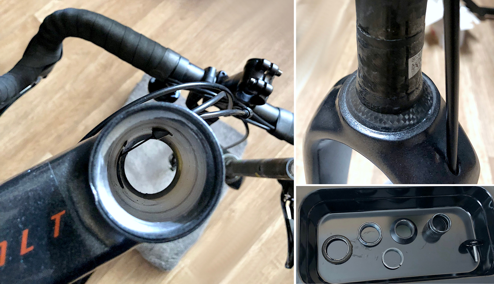

- Knackt oder quietscht beim Einschlagen des Lenkers und 
	- Grund ist keine der Klemmungen am Vorbau 
	- Grund ist kein reibender Bowdenzug
- Gabel-Service mind. 1x im Jahr = Selbermachen
- hatte nach dem ersten Winter Knacken durch korrodierte Lager, 
		und jetzt nach dem zweiten Winter (obwohl nur Trockenfahrt) ein Quietschen wie Gummi auf Metal

- Unterscheidung 1: 
	[ ] Gewinde-Steuersatz (alt),
	[x] gewindeloser Ahead-Steuersatz (modern)
- Unterscheidung 2: 
	[ ] außenliegende Schalen (EC External Cups), 
	[ ] semi-integrierte Lagerschalen (ZS Zero Stack), 
	[x] voll-integrierte Lagerschalen (IS Integrated Standard)
- Unterscheidung 3:
	[ ] gerader Schaft
	[x] "Tapered" = konischer Schaft, nach oben verjüngt; verschieden große Lagerdurchmesser
- Unterscheidung 4:
	[x] Expander im Schaft bei Carbon; gibt lange und kurze
	[ ] Kralle im Schaft (eigentlich nie bei Carbon)
- Bei einigen Modelle bilden die Lager und die Lagerschalen eine Einheit
- Reduzierhulesen und Reduzier-Steuersätze helfen beim Einpassen dünnerer Gabelschäfte
- Fahrradteilhersteller 2010 auf Standard "SHIS" zur Angabe des Steuersatz-Typs: 
	z.B. EC34/30 mit 
	Bauart (EC,ZS,IS), 
	erste  Zahl = Steuerrohr-Durchmesser
	zweite Zahl = Gabelschaft-Durchmesser

### Schmieren, Fetten

- Nachfetten von Lagern, Lagersitzen, Lagerschalen, Gabelschaft 
		und allen Kontaktflächen verhindert Korrision und erleichtert die Demontage/Montage
- zum Nachfetten reicht es, wenn man die Gabel nur ein Stück herauszieht 
- Bei offenen Lagern fetten Sie die Kugelringe mit Wälzlagerfett
- Man kann das Lager etwas zusätzlich gegen die Elemente schützen, 
	indem man Fett außen aufs Lager anbringt, optimalerweise eines, das für die Verwendung bei Carbon offiziell zugelassen ist
- Da Aluminium im Steuerrohrbereich durch Feuchtigkeit korrodieren kann, 
	ist es sinnvoll, eine dünne Schicht Fett (z. B. Montagefett oder Korrosionsschutzfett) 
	auf die Innenwände aufzutragen, besonders bei Fahrten in feuchtem Klima;
	ABER kein Fett auf die Lagersitze, da dort präziser Halt erforderlich ist [widerspricht dem was ich sonst so sehe; meint vielleicht nicht IS?].
- Gabelschaft (Carbon) vs. Spacerringe oder Vorbau:  
	Falls deine Gabel einen Carbon-Schaft hat, 
	könnte das Geräusch von einer trockenen oder unsauber montierten Verbindung zwischen Gabelschaft und Spacern oder Vorbau kommen.
	Lösung: Gabelschaft reinigen und eine dünne Schicht Carbon-Montagepaste auftragen (falls Carbon auf Metall trifft).
- Steuersatz (Lager oder Dichtung):  
	Manche Steuersätze haben eine Gummidichtung zwischen Rahmen und Lager. 
	Wenn diese trocken ist oder leicht verschoben sitzt, 
	kann sie beim Drehen des Lenkers ein quietschendes Geräusch machen.
	Lösung: Lagerdeckel und Dichtung reinigen, leicht mit Silikonfett oder PTFE-Spray schmieren (kein Öl oder dickes Fett).
- Lagerschale im Steuerrohr:  
	Falls dein Steuersatz ein integriertes oder semi-integriertes Lager hat, könnte es sein, dass die Lagerschale nicht perfekt sitzt oder leicht klemmt.
	Lösung: Lagersitz prüfen, reinigen und evtl. eine sehr dünne Schicht Fett auftragen.
- Carbon-Schmiererei:
	- NUTZE Carbon-Montagepaste für Klemmstellen, z. B. Vorbau, Sattelstütze
	- NUTZE PTFE-/Teflon-Fett für Lager, Steuersatz, Schrauben, Gewinde
	- NUTZE Silikonfett für Dichtungen, Steuersatzkappe, Spacer
	- KEIN Kupfer- oder Aluminiumfett (kann mit Carbon reagieren), 
	- KEIN normales Mehrzweckfett wie Lithiumfett oder Marinefett bzw. mineralölbasiertes Fett (kann das Harz im Carbon angreifen),
	- KEIN Lithium- oder Kalziumseifenfette (häufige Metallfette)
	- KEIN Kupfer- oder Aluminium-Anti-Seize-Pasten (enthalten oft aggressive Zusätze)
	- KEINE lösungsmittelhaltige Schmierstoffe (WD-40, Aceton, Bremsenreiniger), machen Harz spröde
	- KEIN WD-40 oder Öl als Ersatz für Fett (bietet keinen Langzeitschutz)
- Silikonfett wird nicht direkt in den Lagermechanismus 
	(also zwischen die Kugeln oder Rollen) selbst geschmiert, 
	sondern ist vielmehr für Dichtungen, 
	Gummiteile und Kunststoffkomponenten rund um das Lager gedacht. 
	Es wird verwendet, um Dichtungen zu pflegen und Reibung an Gummiteilen 
	zu reduzieren. Für die inneren Lagerteile (wie Kugeln und Rollen) sollte hingegen spezielles Lagerfett verwendet werden

Teile:
	- Ahead-Expander sitzt mit Gewinde im Gabelschaft = leicht PTFE/Teflon-Fett
	- Steuersatz-Kappe: Schraube für die Ahead-Kappe sizt in einem Gewinde = leicht PTFE/Teflon/Silikon-Fett
	- Steuersatz-Gummi-Dichtungen = Silikonfett (zur Not weniger lang haltendes Silikonspray), verhindert Austrocknung oder Quietschen
	- 

### Vollintegrierte Lagerschalen (IS Integrated Standard)

- braucht kein Einpresswerkzeug
- Lager liegen in Buchten und können mir Finger oder Plastikpieker rausgeholt werden
- AHead-Kappe nur für Lagerspiel zuständig, nicht zum fixieren - das macht die Klemme am Vorbau; daher auch nicht zuknallen, sondern sanft:
	1. nur soweit, bis die spacer unterm Vorbau nicht mehr beweglich/drehbar sind; nicht darüber hinaus!
	2. gezogene vorderbremse, griff an vorbauschaft und fahrrad leicht vor- und zurückwippen lassen; darf nichts "klopfen" (gefühl), sonst fester ziehen
	3. Lenker muss butterweich drehbar bleiben
	4. zu locker = Schaden am Carbon (z.B. Ring of Death durch den Kompressionsring)
	5. zu fest   = Schaden vorzeitig am Lager

Mein Fall: Giant-Overdrive-Steerer, konische Carbon-Gabel in Alu-Rahmen, Vorder-Bremskabel im Gabelholm (aber nicht im Steuerrohr) integriert

Aufbau:

mehr oder weniger sichtbar:
1. [x] Spannschraube/Stellschraube durch Ahead-Kappe
2. [x] Ahead-Kappe auf Gabelschaft
3. [ ] Ahead-Kralle (Metallgabel, Spezialwerkzeug) oder [x] Ahead-Klemme/Plug/Expander (Carbon, Inbus) im Gabelschaft
		[x] CARBON: hier darf keine Aheadkralle eingeschlagen werden! 
		Diese würden den Schaft beschädigen, wodurch er an Stabilität verliert und brechen kann. 
		Bei Carbonschäften ausschließlich geschraubte Krallen!
4. [x] Vorbau um Gabelschaft ("Stem")
5. [x] "Spacer"/"Washer" um Gabelschaft
6. [x] Abschlussdeckel/Staubring ("Dust Cover") / Lagerkonus oben

innerlich oben:
7. [ ] Zentrierring ("Compression ring")
8. [x] Lenkkopf-Lager ("Bearing")

falls semi-integriert:
9. [ ] obere Lagerschale ("Upper Cup"),  nach oben geöffnet
10. [ ] untere Lagerschale ("Lower Cup"), umgedreht/nach unten geöffnet

innerlich unten:
11. [x] Lenkkopf-Lager ("Bearing")
12. [ ] Konusring ("Race Crown") - möglicherweise schon integriert bei Voll-Carbon-Gabelschaft, sonst evtl. aus Alu bei Carbongabel
13. [x] Gabelbrücke und Gabelschenkel

Werkzeug:
- [x] Aufschlagwerkzeug für den Gabelkonus
- [ ] Einschlagwerkzeug für Aheadkrallen (hab ich nicht)
- [x] Inbus-Schlüssel
- [ ] Fett? Eventuell Fett (in der Regel sind die Sätze jedoch vorgefettet)

Öffnen:

1. Bei jedem Schritt Fotos machen!
2. Vorderrad ausbauen
3. Gabel am Unterrohr mit Band sichern, ggf. Kissen/Bettdecke o.a., damit eine herunter fallende Gabel weicher landet
4. AHead-Kappe abschrauben
5. Vorbauschrauben lösen - Gabel könnte jetzt schon rausfallen!
6. Lenker abziehen und vorsichtig hängen lassen oder irgendwo mit Band fixieren, ggf. auf Lappen, um Schrammen zu verhindern
7. Spacer und Abdeckung vom Gabelschaft nehmen
8. Ideal: Bremskabel lang genug und nicht im Rahmen integriert, sonst Scheibenbremse vom Rahmen lösen; 
		Gabel baumelt zwar am Kabel rum, aber genug Spielraum zum Säubern
9. Gabel vorsichtig rausziehen

Schließen:

HEADSET:
	ChatGPT:
		Die Lagerdimensionen eines Steuersatzes sind genormt, 
		sodass du Ersatzlager auch von anderen Herstellern verwenden kannst, 
		solange sie die richtigen Spezifikationen haben.
		Das bedeutet, du kannst Ersatzlager von anderen Herstellern wie 
		Cane Creek, FSA, Acros oder Ritchey verwenden, 
		solange sie dieselben Maße haben.
		Manche Hersteller spezifizieren den Winkel der Lagersitze (z. B. 36°/45° oder 45°/45°).
		Stelle sicher, dass dein Ersatzlager den richtigen Winkel hat, um ein optimales Sitzverhalten zu gewährleisten.
	
	
	OVERDRIVE STEERER (Version 1):
		Giant's original oversized fork steerer-tube technology. 
		Designed to provide solid front-end steering performance, 
		the system's oversized headset bearings and tapered steerer tube provide optimal steering stiffness. 
		Road models feature 1 1/8-inch top and 1 1/4-inch bottom bearings, 
		while the mountain version features 1 1/8-inch top and 1 1/2-inch bottom bearings.
		OverDrive provides up to 15 percent more torsional steering stiffness than straight steerer-tube designs. 
		This translates into much more accurate steering input from a rider's hands, 
		through the handlebar and stem, 
		and down to the front wheel. 
		Whether hammering uphill or carving through a corner, 
		OverDrive transmits input directly to the front wheel for more precise handling.

Gabel untersuchen:
- "Ring of Death"

## Radlager warten

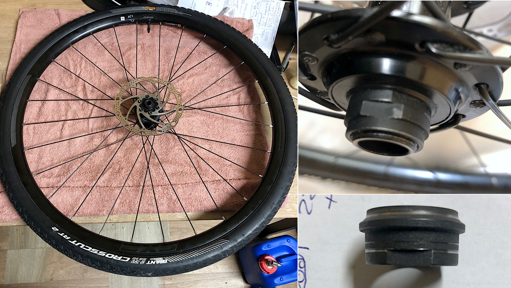

Unterscheidung:
- [ ] Cartrdige-Lager abgedichtete Lager
	- Ein- und Auspresswerkzeug mit korrekten Adaptern/Drifts
	- Fett
- [x] Konuslager mit Kugeln
	- Werkzeug: Konusschlüssel in den richtigen Größen (2x 19 mm bei mir): zum Kontern und schrauben
	- Lagerfett (s. Abschnitt Schmierstoffkunde)
	- Lagerkugeln (bei mir 22 x 1/8 Zoll je Seite): 
		- Bevorzugt Wälzlagerstahl 100Cr6 / 1.3505, 
		- gehärtet auf HRC 60–66 (HRC 40 ist Baumarktqualität),
		- mit Genauigkeitsklasse irgendwo zw. G5-G20 (also der Rundschliff, niedrigere Zahl = höhere Präzision, G20 ist noch ok, darüber nicht mehr), 
		- nach DIN 5401 / ISO 3290.
		- Optional auch in Edelstahl (z.B. 440C), 
		  falls mit vergleichbarer Härte ≥58 HRC verfügbar
	- Magnet zum Entfernen der Kugeln: habe "Cat-Eye-Magnete" aus der Nagelkosmetik gekauft und den Magnet nochmal mit Superkleber in der Fassung verhaftet, 
		klein mit Griff; Teleskopmagnet wohl auch ok;
		Magnet nur zum Entfernen und wenn man sie nicht wieder einsetzen möchte (magnetische Kugeln haften sich sonst angeblich an pitting)
	- Pinzette zum Einsetzen der Kugeln
		(evtl. Trick mit eingesetzter Achse einfach die Kugeln reinfallen zu lassen); habe eine von Knipex, funktioniert ganz gut

Bei meinem Modell wäre vorne Konuslager und hinten Cartridge/gedichtetes Lager:
- vorne wirke nur Kraft von oben und hinten (radial); Konus rolle besser als Cartridge (keine Frage von billig oder teuer; auch immer noch in teuren Rädern verbaut)
- hinten wirken noch seitliche Kräfte durch den Antrieb (axial/torsional), wo Cartridge-Lager stabiler sind

					Giant-Naben merkst du es oft erst sehr spät, wenn sie rau laufen 
						und dann sind die Laufflächen innen schon angefressen = irreparabel. 
						Darum lieber präventiv fetten, nicht erst auf Geräusche warten:
						Schönwetterrad: alle 1-2 Jahre
						Regen/Wetter/Pendler: alle 6 Monate

### Vorbereitungen:

- Handtuch auf Montagetisch, Rad auf dem Handtuch: hält herausfallende Kugeln auf; alternativ über einem Eimer arbeiten
- Bremsscheiben entfernen (Torx 25, 4-6 Nm) kann es leichter machen - falls man an dieser Seite zumindest an der Achse was korrigieren muss, im Idealfall nicht
- Ablagen für die Einzelteile, ggf. getrennt nach Antriebs- und Nichtantriebs-/Bremsseite
- Kugeln später immer mal wieder abzählen

### Vorderrad-Lager öffnen

1. ganz Außen sitzen die Sicherungsmuttern (Mutter mit zusätzlichem Plastikring), 
	dann eine Staubkappe, 
	dann der Konus, der Lagerkugeln auf der inneren Lagerschale mit einer definierten Spannung hält
2. zuerst an der Antriebsseite öffnen (also gegenüber von der Bremsscheibe)
3. Konusschlüssel an Konus, dort kontern und Sicherungsmutter gegen Uhrzeigersinn aufdrehen
4. Sicherungsmutter, Staubkappe, Konus entfernen (bei Komplettwartung)
	- überall merken, wo oben und unten war: entweder durch entsprechendes Ablegen in einer Schale oder Skizze auf Notizzettel
5. Kugeln entfernen mit Magnet oder Pinzette
6. Rad umdrehen, dabei die Achse festhalten (sonst fliegen Kugeln raus) und Achse an der Bremsseite entfernen
7. Kugeln entfernen

### Vorderrad-Lager reinigen

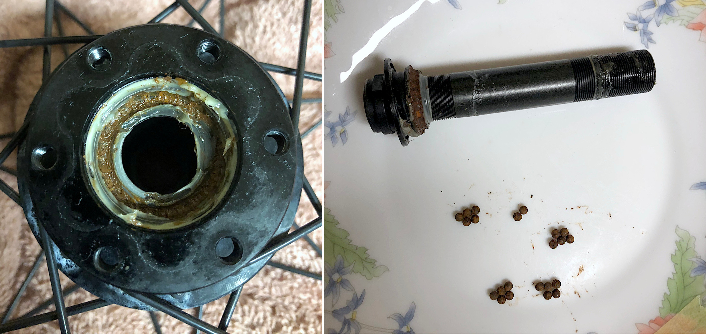
_(Abb.: Korrosion im Radlager, Fett ausgewaschen; ab Werk in 2.5 Jahren nie gewartet; Antriebsseite halbwegs ok, bremsenseitig obiges Bild)_

- alles reinigen: Achse, Konus, Schale, Kontermutter; Kugeln nur wenn neueren Datums
- Bio-Degreaser aufsprühen
- mit Wattestäbschen den Grind entfernen
- Bio-Degreaser, IPA, Rostentferner, Polieren, je nachdem - bis alles wieder glänzt

### Lagerteile untersuchen

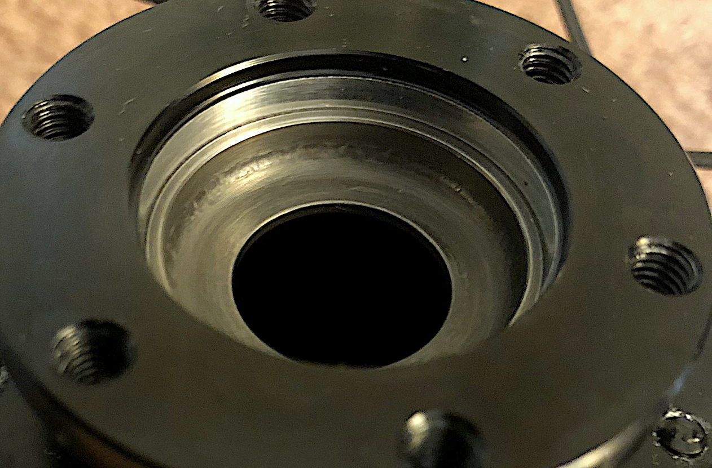
_(Abb.: Pitting in der Lagerschale)_

- minimalste Kerben/Mulden-Bildung (engl. Pitting) in der Lagerschale oder an der schrägen Lauffläche des Konus sorgen schon für sandiges Feeling/rauen Lauf;
	sollte tats. perfekt glattrund sein für minimalsten Punktkontakt zw. Kugel und Flächen; 
	das Rad hier läuft nach Instandsetzung wesentlich besser als vorher (mit der Hand gedrehte Achse klemmte stellenweise) und auch nur leicht sandig (trotz Pitting), 
	aber nie wieder butterweich und mehr Verschleiß ist zu erwarten
- Kugeln idealerweise entsorgen und neue nehmen, nicht alte und neue mischen, kosten nicht die Welt (siehe Abschnitt [Shops](#shops))
- manche Lagerschalen sind nur eingepresst und könnten theoretisch getauscht werden, 
	scheitert aber an Ersatzteilen, bzw. Notwendigkeit, gleich eine ganze Ersatznabe kaufen zu müssen;
	ansonsten ist die Nabe am Ende bzw. das komplette Laufrad, wenn man keine Lust aufs Einspeichen einer neuen Nabe hat

### Vorderrad-Lager schmieren und Kugeln einsetzen

- lieber zu viel Fett als zu wenig (trotzdem nicht übertreiben), wenn es rausquirlt ist auch nicht verkehrt (Wärmeentw. und Bremswirkung wohl vernachlässigbar)

1. bei der Nondrive-Seite (also Bremsschreiben-Seite) anfangen
2. erste Fettschicht auf der Lagerschale
3. Kugeln einsetzen, sollte Ring ausfüllen + 1 Lücke
	- manche Schalen hätten Vertiefungen für die Aufnahme der Kugeln, meine ist plan
4. zweite Fettschicht über die Kugeln
5. Achse, Konus, Staubkappe leicht einfetten
6. Achse mit dem Konus einsetzen und bisschen wackeln und drehen, damit sich die Kugeln richtig setzen
7. Rad umdrehen, Achse dabei festhalten, und auf der anderen Seite dann schmieren und Kugeln einsetzen

### Vorderrad-Lager schließen und justieren

Unterscheidungen:
	- [ ] Schnellspanner
			- minimales Spiel der Achse erhalten, kaum fühlbar; Schnellspanner presst/spannt zusätzlich und kompensiere das Lagerspiel
	- [x] Steckachse
			- kein Spiel der Achse

Beachten:
	- gleiche Abstände an den Achsenenden (wenn es dumm kommt, war das ab Werk schon ungleich und man müsste evtl. Scheibenbremse korrigieren)
	- gutes Rad läuft butterweich, 0 Widerstand, kein leichtes sandiges Reiben, das Lager sollte man 0 spüren, als wäre es gar nicht da

Trick:
1. Achse auf der gegenüberliegenden Seite richtig andrücken, damit auf der anderen Seite vollständiges Gewinde verfügbar ist (sonst später ungewolltest Achsenspiel)
2. Konus ranschieben bis man Kugeln kontaktiert
3. Sicherungsmutter auf den Konus mit der Hand drehen
4. Konus jetzt gegen die Mutter sichern (statt umgekehrt), so dass der Konus beim Spannen gegen die Mutter von den Kugeln minimalst zurückgeht

### Nachbereitungen

- nach 50 km nochmal prüfen: Achsenspiel (kippelt das Laufrad in der Gabel), Rauheit, ...

## Dichtmilch erneuern

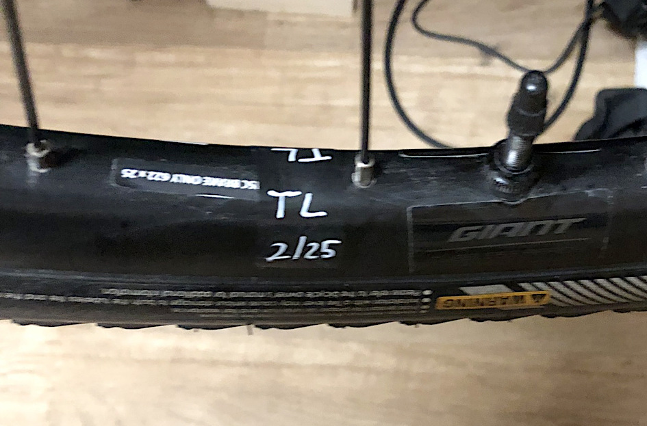

Ich notiere das Datum meiner letzten Erneuerung direkt auf den Laufrädern:
Das Etikett besteht aus einem schwarzen Stück 3M 33+ Scotch Elektroisolierband mit 19mm Breite
und einem weißen Schriftzug aus einem Edding 780 Glanzlackmarker weiß 0,8mm Rundspitze.

Nach einigen Monaten trocknet die Milch aus.

Mit Dichtmilch sollte man regelm. fahren und nicht lange im Keler stehen lassen, 
sonst bildet sich im Reifen am Boden eine Verklumpung und damit eine Unwucht.

Nachfüllen:

- man kann häufiger direkt nachfüllen, das Gewicht getrockneter alter Dichtmilch beträgt nur wenige Gramm und ist vernachlässigbar.
- es gibt 59ml-Flaschen direkt mit Spitze, die man in die Ventilöffnung drücken kann:
	1. Luft rauslassen, sonst fliegt einem der Ventileinsatz um die Ohren
	2. Ventileinsatz herausschrauben
	3. Ventil auf 12 Uhr, damit man mit der Flasche nicht rumsaut
	4. Flasche ansetzen und zusammen mit dem Ventil auf 6 Uhr drehen
	5. ausdrücken
	6. Ventilöffnung bisschen säubern, z.B. mit Ohrstäbchen
	7. Ventileinsatz reinschrauben
	8. aufpumpen, nicht knallvoll
	9. paar mal Rad seitlich nach vorne wenden, dann wie uhr drehen, dann zu sich drehen, wieder wie uhr drehen, wiederholen

Säubern:

## Herbst/Winter

- Schutzbleche, gibt welche die kann man schraublos verbauen, z.B. bei Rädern ohne Anbaupunkte
	- SKS S-Blade / S-Board Schutzblech (aus Kunststoff)
- "Salzwasser tödlich"
	- immer gründlich säubern
	- hatte ein Lager in meinem Steuersatz korrodiert, musste ersetzt werden (Lenker knackte immer beim Einschlagen in beide Richtungen)
- Lampen-Akkus ins Haus nehmen
- siehe [Kleidung](#kleidung)

## Reifen

### Reifenwahl

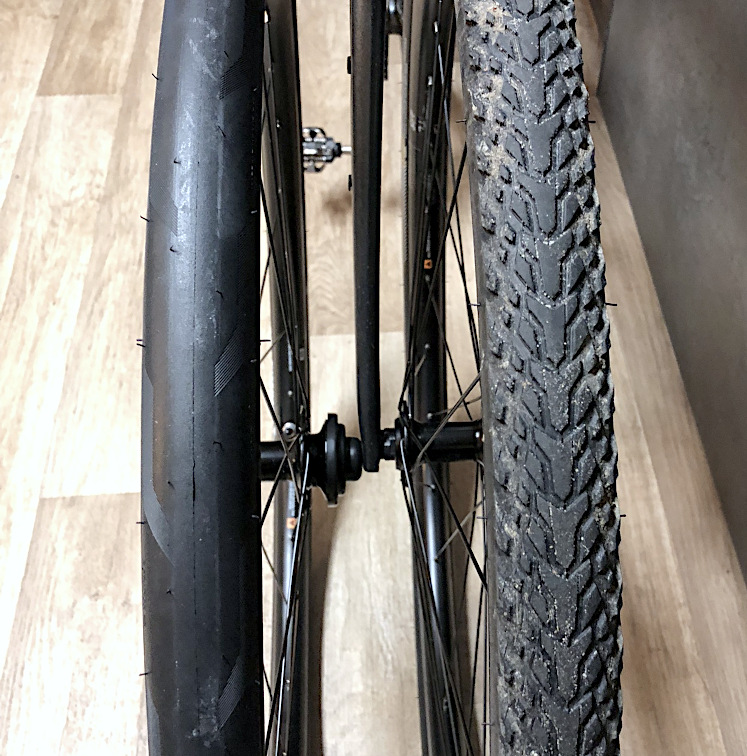

*Merksatz: "Hinten Speed, vorne Grip"*

- fehlender Grip vorne wirft dich übel vom Rad, fehlender Grip hinten rutscht eher durch und lässt sich wieder einfangen
- unwichtig, dass beide Reifen gleichen Typs und gleichen Gewichts sein muessen
- Kombination von Unterschieden kann Vorteile haben / asymmetrisches Setup
- manche Hersteller bieten sogar Front/Rear-Sets an
- Vorn=Hinten:
	- Traditionsautomatismus, Marketing
	- ähnliches Feedback vom Boden
	- gleiches Nassgrip-Verhalten beider Reifen
	- Reifentausch HR/VR mgl.; allerdings schlechterer Reifen vorne = erhöhtes Sturzrisiko
	- symmetrisch ästhetischer
	- einfacher/gut genug; asymetrisch mehr Knobelei
- Nasshaftung (Wet grip) _auf Asphalt_ bei profillosen Slick-Reifen besser (mehr Kontaktfläche) als bei profilierten Noppen-/Stollenreifen,
	off-road ist es umgekehrt

| Gesichtspunkt  | Hinterreifen (=Vortrieb) | Vorderreifen (=Handling) | Bemerkung
|----------------|--------------------------|--------------------------|--------------------------
| Antriebskräfte | Großteil                 | -                        | HR belasteter
| Tragegewicht   | 60%                      | 40%                      | HR belasteter
| Verschleiß     | schneller                | langsamer                | manche tauschen irgendwann HR und VR (falls identisch)
| Compound       | härter                   | weicher                  | HR robuster, VR mehr Grip für Kurven, Notbremsung
| TPI            | weniger                  | mehr                     | HR robuster, VR geschmeidiger/Grip
| Reifenbreite   | schmaler                 | breiter                  | max. 3mm Unterschied, sonst wabbeliges Fahrverhalten
| Rollwiderstand | *entscheidend*           | -                        | für Gesamtgeschw. auf gerader Strecke; lahmer VR weniger Einfluss auf HR als umgekehrt
| Reifengewicht  | -                        | -                        | Rollwiderstand unabh. vom Reifengewicht sondern von Abroll-Verformung (Material, Aufbau, Breite, Luftdruck) \* Normalkraft auf Reifen (Gewicht Fahrer + Rad, Reifengewicht +300g Bruchteil); aber: leichte Reifen beschleunigen/bremsen schneller und sind agiler in Kurven (Inertia/rotierende Masse), halten Speed aber nicht so lange (Momentum)

- Karkasse
	- TPI = Threads per inch, Fäden pro Zoll, Dichte des Gewebes (auch: EPI, ends per inch);
		Je höher der Wert, desto besser soll der Reifen walken können
- Laufleistung
- Rollwiderstand
- rotierende Masse, die man beschleunigen oder hochtragen muss: Reifengewicht \* x?
- Schwingungswiderstand
- Geräuschentwicklung
- Nasshaftung
- Pannenschutz
- Gummimischung
	- Shore­Härte (z.B. 60a), je höher, desto weicher das Gummi
- Wulst, Drahtwulst vs. Faltwulst
- Maßhaltung 
	- Angabe der Reifenbreite vs. reale/gemessene Breite auf der verwendeten Felge
- wann wechseln?

Ich hatte mir bei Kleinanzeigen.de ein Hinter-Laufrad (mit Kassette und Bremsscheibe) für wenige Euro besorgt,
an dem ich lernen und üben konnte (anstelle meiner teureren Räder): 
Mantel/Schlauch (de)montieren, 
Zentrieren der Felge und der Bremsscheibe, 
Einspeichen, CO2-Kartusche mal in Action erleben, 
Gefühl für Lage- und Größenverhältnisse entwickeln, 
die Kassette abziehen usw.
Die Felge entsprach der Größe meiner Rädern, war allerdings breiter.
Vor Kauf vor Ort habe ich auf Felgenrisse bei den Nippeln gesucht, Freilaufgängigkeit, Speichenspannung mit den Fingern geprüft.
Nach der Säuberung sah es fast wie neu aus, fahren würde ich damit aber nicht.
Siehe auch Abschnitt zum "Zentrieren"

### Reifen-Demontage (Tubeless oder Schlauch)

- Luft vollständig ablassen (nicht einfach Ventilkern rausdrehen, der schießt sonst durch die Gegend)
- Mantel vorsichtig überall in die tiefere Felgenmitte (Felgenbett) drücken (engl. Unseating) 
  und dabei die Verklebung zw. Reifenwulst (engl. Tire Bead) und Felgenhorn/-flanke brechen;
	- flüssige Dichtmilchreste sammeln sich am Boden des Reifens, 
	  an der Felgenflanke ist idR alles schon fest; 
	  trotzdem vorsichtig bleiben, damit man nicht kleckert
- _am bzw. direkt neben Ventil anfangen_: 
	mit Reifenheber unter den Mantelwulst greifen und über die Felge drücken, 
	den Reifenheber mit dem anderen Ende dabei in eine Speiche einhängen/fixieren (schlechte Reifenheber haben keine Öffnung dafür)
- zweiten Reifenheber daneben ansetzen und Mantel über Felge ziehen und bei Erfolg den Reifenheber nach rechts ziehen, 
	so dass sich der Mantel "von alleine" Stück für Stück rausdrückt
- Mantelseite, die noch auf der Felge sitzt, lässt sich leicht von Hand von der Felge abheben
- Dichtmilchreste mit Papiertüchern auswischen oder mit Spritze einsammeln

### Reifen-Montage (Tubeless)

- Laufrichtung des Reifens beachten
	- nach einem Pfeilsymbol auf dem Mantel suchen: rechtsherum = Antriebsseite rechts
	- Profilmuster mit Fotos im Web vergleichen
- Reifen-Logo mittig am Ventil positionieren: 
	- traditionell: erleichtert Lochsuche bei Schlauchpanne (gleiche Position vom Ventil/Logo aus)
	- einheitliches Erscheinungsbild beider Laufräder = ästhetischer (Mechanikerstandard)
- _gegenüber des Ventils anfangen_
	- Ventilteil in der Felge hebt sonst Reifen wieder aus der tiefern Felgenmitte = fehlen paar mm Spiel
- erste Mantelseite mit linker und rechter Hand von oben nach unten ins Felgenbett drücken 
- alles in die tiefere Felgenmitte legen = paar mm mehr Spiel; erste Reifenseite evtl möglichst nah am Außenrand
- von oben mit Kraft nach unten Richtung ventil massieren/ziehen, damit sich Reifen dehnt = paar mm mehr Spiel
- Wulst der noch nicht eingelegten Seite innen/außen/unten  evtl. mit Montageflüssigkeit benetzen, damit besser flutscht
- prüfen, ob gleichmäßig aufgezogen: alles schön in die Mitte massieren
- aufpumpen / kompressor (airshot) mit 4 bar (max 5 idR bei Tubeless/Gravel)
- Linie vom Reifen sollte direkt an der Felge drumherumlaufen
- auf 3 runter und dann über Nacht stehen lassen und schauen, ob der Reifen Luft hält
- Luft ablassen, Ventilkern rausschrauben und Dichtmilch einfüllen; wieder aufpumpen

### Reifen-Montage (Schlauch)

- Schlauch vorm Einlegen minimal aufpumpen, damit er die Form hält und nicht so leicht bei der Mantelmontage eingeklemmt wird
- falls Tubeless-Setup:
	- Tubeless-Ventil entfernen TODO

## Sattel

### Sitzknochenabstand ausmessen

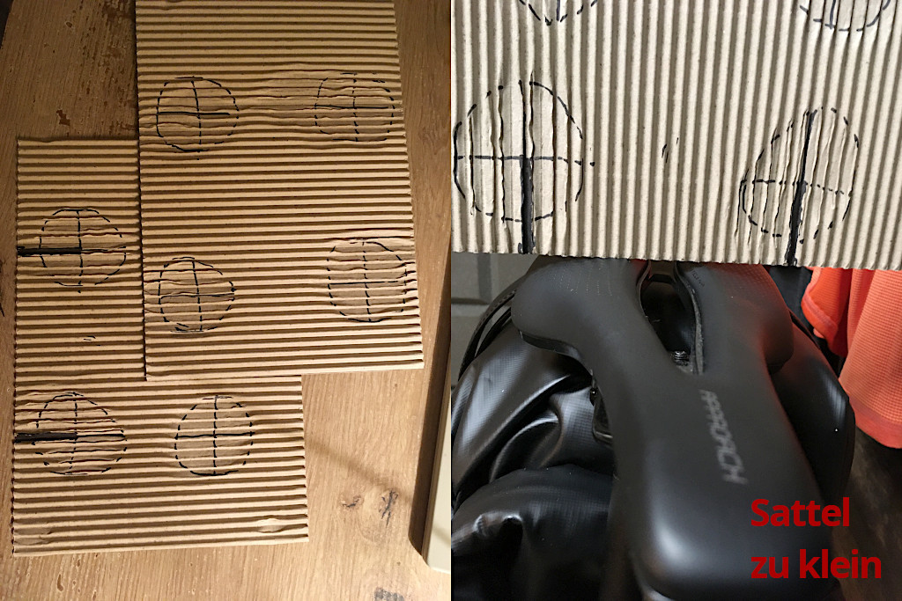

1. Wellpappe auf harten Tisch legen
	- Wellpappe kostenlos zusammen mit SQLab-Werbematerial bestellbar, gute Werbeidee, die Links bringt: 
		https://www.sq-lab.com/en/products/equipment/sqlab-family-friends-sitbone-measurement-set.html
2. draufsetzen, Knie höher als Hintern, bisschen wackeln
3. Abdrücke mit Stift als Kreis umranden, Kreuz in Kreis einzeichnen (Mittelpunkt)
	und Abstand zw. Kreuz-Schnittpunkten messen
4. 4x wiederholen und Durchschnitt/Median bilden 
	(bei mir war 3x identischer Wert, 1x 1,5 cm Abweichung)

### Optimale Breite

Bei Sitzknochenabstand _x_ (Tabelle von Fahrrad-XXL):

| Fahrradtyp                        | Sitzhaltung       | Sattel-Mindestbreite
|-----------------------------------|-------------------|---------------------
| TT/Zeitfahrrad                    | aerodynamisch     | _x_ +   0 cm
| Rennrad, CX, sportl. Gravel       | sportlich         | _x_ + 1-2 cm
| MTB, Fitnessbike, Gravel-Reiserad | entspannt-sportl. | _x_ + 2-3 cm
| Trekkingrad, Citybike             | leicht vorgeneigt | _x_ + 3-4 cm
| Hollandrad                        | aufrecht          | _x_ + 4-5 cm

Bei Zwischengrößen, die größere nehmen

### Polsterung, Form, Material

TODO

- Flach vs Curved = aero vs aufrechte Sitzposition (commuter, endurance), mehr Bewegung auf Sattel mgl. vs lock-in
- Kurz vs Lang = Aero-Position (Nase drückt nicht in Weichteile) vs mehr Bewegung und Offroad-Kontrolle mit Oberschenkeln
- zu breit: Oberschenkel schleifen
- Cut-Outs / Pressure reliefs:  
	- sollten nicht einschneiden, nicht zu groß
	- bei Gravel / MTB besser nicht komplett offen wg. Spritzwasser
- Leder: break-in-zeit, schlechtere wetterfestigkeit, bisschen wartungsaufwendiger (nachspannen, einschmieren, ...), dafür guter butt-fit
- Polsterung: so wenig wie möglich, vorzugsweise Hosenpolster
	1. Reibung/Chafing beim Pedalieren ist dann zw. Sattel und Hosenpolster und nicht zw. Sattelpolster und Haut
	2. That padding moves with you and stays at the anatomical locations where you will need it, regardless of how you sit on the saddle
	3. I can throw my chamios shorts in the wash when they get funky. A cushioned ass-sweat soaked seat, not so much.
	4. level and positioning of padding that you want is different according to how hard you are pressing on the pedals (and unweighting the saddle) and how upright you are sitting
- fore/aft-einstellungen:
- Satteltasche befestigbar?
- Rails kompatibel mit seat post klemme? einige carbon-rails haben einen ovalen statt runden Durchschnitt
- Fahrergewicht
- Brooks-C17-Oberfläche soll Hosen fressen

- Hersteller empfehlen bei vielen sportlicheren Sätteln die Verwendung zusammen mit einer Radhose – siehe auch Abschnitt "Meine Radhosen"

## Lenker

#### Fitting

- Compact Dropbar: 
	Öffnung des Unterlenkerrohrs muss 90 Grad an einer Vertikalen vom Boden anliegen, also ohne Winkel gerade nach hinten zeigen.
	die Hoods dann übergangslos bzw. mit minimalem Wellental (mit Lenkerband ranhalten) ansetzen und den Händen "anbieten" 
	(sollten gefühlt autom. in die Hand fallen statt dass die Hand danach suchen muss)
- Lenkerbreite bei Bügellenkern/Dropbar: Breite zw. den Knochenhügeln auf den Schultern;  
- Werkslenker fast immer zu breit bei Gravel und ggf. Renner
- Flattop-Lenker sind schwerer zu fitten:
	will man die Drops ebenerdig machen, dann stimmt evtl. das Flattop nicht mehr;
	evtl. will man flache/ovalisierte Tops nicht ebenerdig sondern 1-n Grad geneigt, 
	so dass sich der Fahrer darauf etwas abdrücken kann und nicht flach rüberrutscht;
- Reach: 
	- bisschen korrigierbar mit Lenkerrotation und Schalthebel nach oben/unten schieben
	- TODO

#### Lenkerband

- Lenkerband mit Logos: an den Drops angefangen Logos zum Hinterrad ausrichten, also so dass man von Fahrerseite normal ablesen könnte.
	Steht dann beim Hochwickeln nicht auf dem Kopf.
- weiße Logos auf schwarzen Lenkerband ergeben einerseits interessantes Muster - gut passend zu weißer Schrift auf dem Reifen;
	sehen andererseits aber aus wie Hühnerstange bzw. Bestuhlung durch Vogelschar.
	Erwarte Sprüche.
- einheitliche Bandabstände in Geraden und an den Kurven-Außenseiten, nach innen kann uneinheitlicher werden
- Abschlussstreifen: Silikon-Reparaturband als besseres finishing tape; 
	wirkt matter/weniger billig als nur Isotape, 
	v.a. aber löst es sich nicht von alleine/pult nicht ab, sondern verschweist (isotape hatte sich bei mir bisher aber auch nie gelöst, falls letzte Isotape-Wicklung locker gelegt);
	auf Zug halbiert sich die Breite und wird flach wie Isotape (also 2 cm auf 1 cm Isotape)
	zum Tape mitgelieferte Abschlussstreifen waren bei mir bisher immer hässlich
- Lenker mit Aero-Flattops: Reverse-Wrapping ist hübscher, also von oben nach unten in die Drops. 
	Band am Oberlenker dort anfangen/enden lassen, wo das Lenkerrohr noch gleichmäßig dick ist, nicht in die Verjüngung reinkommen, nicht mal bisschen.
	Nachteil von Reverse: Kante zur Reibrichtung mit der Hand more or less.
	Falls normale Wicklung, auch dort versuchen, Zipfel zu schneiden, so dass man nur max 2 cm Isoband braucht.
	Sicherung mit 4 cm Isoband sieht billig aus.
- Lenkerband und Sattel sollten idealerweise einheitliche Farbe haben, um symmetrischer/stimmiger zu wirken
- Videos:
	- _breiter_ Gravel-Unterlenker (andere Hand-Drehrichtung) und gute Abschlussband-Technik!: https://www.youtube.com/watch?v=K_BBKeH_9Co
	- Road bike ohne ital. Acht mit Extrastreifen: https://www.youtube.com/watch?v=5MzIiv7pewE
	- beste Methode für den Schnitt am Bandende: https://www.youtube.com/watch?v=O1Uvh6jhqc4

#### Ausrichten des Lenkers

TODO

### Aerolenker / TT-Bars / Auflieger

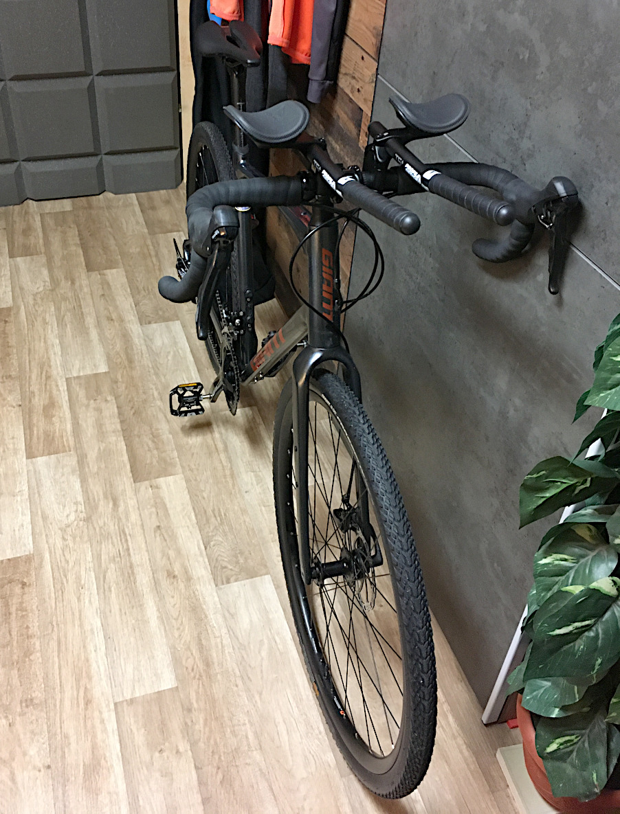

- Bequemlichkeit: zusätzl. Griffposition/Entlastung der Handgelenke
- Aeroposition: mehr Speed, unterm Wind wegtauchen
	- schmale Figur wichtiger als tiefe Sitzposition
	- kein Geschwindigkeitsvorteil, wenn man Position nicht lange fahren kann / zu unbequem ist, deswegen vllt. langsamer tritt
	- je nach Sattel drückt evtl Spitze; gibt Stubby/Short-Nose Saddles (ISM), gibt speziellen Redshift-Seat-Post zum Vor/Rückklappen
	- paar km/h Gewinn, am Ende macht aber die Fitness den Unterschied
- Armpads müssen Ellenbogen aufnehmen, nicht nur Unterarme, sonst Belastung Schultern statt Entlastung (Stütze über Skelett)
	- Abhängigkeit von der Rad-Geometrie
	- Adjustierbarkeit der Arm-Pads
	- Abstand der Stangen zueinander: beeinflusst auch Lenkverhalten, enger = empfindlicher
	- mit Spacer nach oben bringen = evtl. näher an Ellenbogen (Steuerrohr meist zum Fahrer geneigt)
	- alternativ mit "Fredbar" montieren 
- Lenkerband dünner als bei den Griffen, sonst Wurstoptik
	- nach innen vs. nach außen wickeln
	- untere wicklung drückt sich durch die obere und gibt rille für die nächste wicklung vor (immer mittig) = sauberes bild: gleiche abstände und winkel
	- am Ende mit Elektroband abschließen UND mitgeliefertes Abschlussband drüber; erste Wicklungen spannen, 
		letzte Wicklung von diesen Bändern nicht spannen, sondern leicht legen, sonst rupft sich das von alleine wieder ab
- Radästhetik schlechter; Sportrad eigtl. max. minimalistisch und 'Unterlenker vs TT-Bars'?; 
	- bei Gravel baut das Rad dadurch optisch nach rechts-oben auf wie Sprungschanze in Himmel, 
		schöner wäre parallel zum Boden und gleichhoch/unterhalb zum Sattel (eher Rennrad-Geo)
	- Winkel ausrichten am oberrohr falls mgl./noch sinnvoll
	- weiterer Baustein zur Fred-Werdung
- Klemmung mit Montagepaste, einheitliche Gaps bei den Schraubklemmen beachten
	- Schutz der Lenkerstange mit Elektroisolierbar fraglich bzgl. Haltfestigkeit, eher abzuraten
- ich verwende Profile Design T5+ mit dazugehörigem Profile Design Lenkerband; 
	Stangen sehr nah beeinander aber Pads max Außen und zum Körper,
	so liegen/"fallen" meine Arme natürlicher = anstrengungsfreiere Position;
- Totgewicht in der Stadt und Offroad

Habe den Auflieger wieder abgebaut, auch wenn er Spass macht. Schlankeres Bike gefällt mir letztlich besser.
Mag sich ändern, falls ich mal in Richtung 200-300 km am Tag oder Ultracycling tendiere.

## Hygiene / Medizin / Diät

> Ein Radrennfahrer muss seinen Hintern besser pflegen als sein Gesicht. (Radrennprofi Rudi Altig)

Jede Tour:
- Not-Chamois-Creme (Kleinstabfüllung): versuche ich möglichst selten zu verwenden, kann Poren verstopfen und Probleme erst erzeugen
- After-Ride-Creme fast nach jeder Tour: _Assos Skin Repair_ ist mein Zaubermittel, hatte seither keine Probleme mehr 
	(bei Mehrtagestouren in kleineres Gefäß abgefüllt, ist recht ergiebig)
- Unterleib müsse nicht mit Seife gewaschen werden, wird sogar abgeraten (zerstöre hauteigene Abwehr-Fettschicht);
	verwende trotzdem eine sanfte Frauen-Intimseife

Längere Tages-Touren:
- large Body-Wipes, einzelverpackt

Mehrtagestour: 
- RIAS-Tuchtabletten + flache 50- oder 100ml-Flasche mit Flüssigkeitsmix aus Wasser/Teebaumöl/Glycerin/Campseife/Vitamin-E-Öl = spart Wasser und viel Platz
- guter Schrupp-Waschlappen und Wasser aus der Trinkflasche

Road-Rash:
	TODO

Knieschmerzen

Diät (Gewichtsabnahme):
	- ?
	- ?

Fettstoffwechsel trainieren

"Aerobes Training" bedeutet "Training mit Sauerstoff" bzw. Ausdauersport (Cardio), 
da Atmung die Menge Oxygen kontrolliert, das die Muskeln zur Energieproduktion erreicht.
"Anaerobes Training" umgekehrt dann Training *ohne* Sauerstoff.
Aerobes Training: Umwandlung findet in S-Fasern (Slow-Fasern) der Muskeln statt, also bei anhaltender aber mäßiger Belastung.

Nachbrenneffekt: Erst 1-2 Stunden nach Radfahren essen, damit Körper im Energiestoffwechselmodus bleibt und Fett abbaut.
Zufuhr von Kohlehydraten wechselt sofort den Modus.

Muskelauffbau: Muskeln verbrennen Energie auch im Ruhezustand, erhöhen den Grundumsatz.

Laktatschwelle = Übergang von aeroben zum anaeroben Bereich; 
Laktat = Milchsäure entsteht, wenn Energiestoffwechsel ohne Sauerstoff stattfinden muss, weil davon zu wenig geatmetet wurde;
übersäuern aber Muskeln mit Leistungsabfall.

## Bike-Fitting

TODO

## Bikepacking

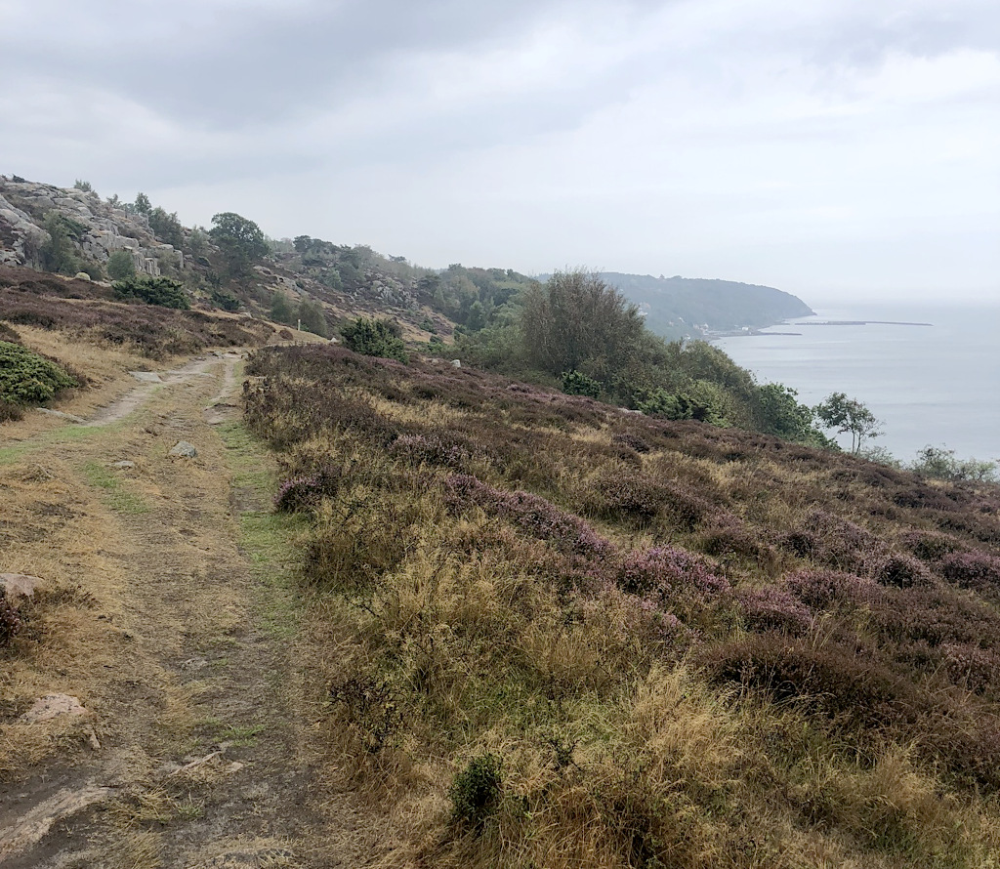  
_(Abb.: Entdeckungsreise mit Fahrrad und Gepäck)_

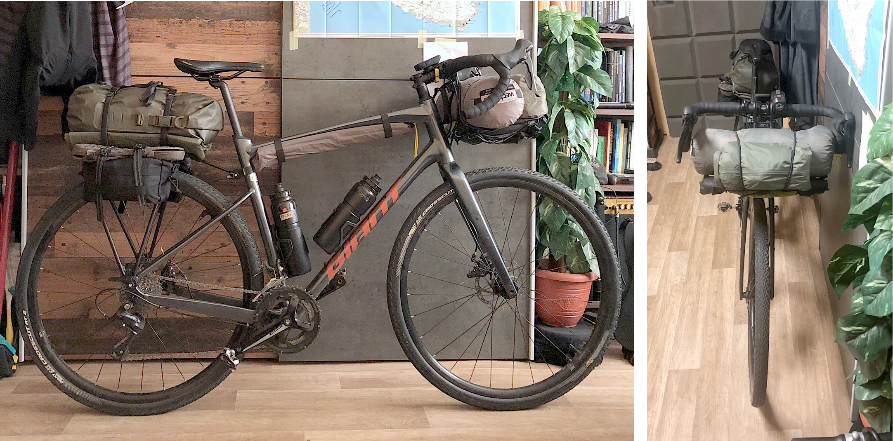  
_(Abb.: Frühherbst-Setup mit Vorderrack = Zelt/ Isomatte/ Wetterschutz/ Faltrucksack, 
Rahmen = Zeltstangen/ Wasser, Trunkbag = Schlafsack/ Kleider/ BW-Elefantenhaut, 
Links-Pannier = Tools/ Elektro, Rechts-Pannier = Nahrung/ Hygiene)_

- die einzige Form des Reisens: zu Fuss ist man nach Stunden noch am selben Ort, im Auto fliegt alles vorbei, 
	Flugzeug, Bus oder Zug ist kein Reisen sondern Transport (_Reisender vs Passagier_),
	auf dem Fahrrad reist man langsam um alles aufzunehmen, aber schnell genug, um vorwärts zu kommen

- Bikepacking vs. Radreise/Biketouring
	- Bikepacking begriffl. von Backpacking abgeleitet – dem Reisen nur mit Rucksack (engl. Backpack)
	- Bikepacking urspr. für Offroad
	- entsprechend oft höherer "Hike-a-Bike"-Anteil (also Schieben)
- Hauptproblem: Packmaß und Gewicht, Packmaß aber wichtiger
- Schwere Sachen niedrig (weniger balancieren) 
	und im Zentrum des Fahrrads (frontal und seitlich)
- 0 &lt; Rad-Systemgewicht - Fahrergewicht, Fahrradgewicht, Taschengewicht, ggf. Lenkeraufsatz, ...

- je leichter das Rad, umso besser: Gewicht nervt bei Anstiegen und 
   ermüdet über lange Strecken schneller und geht auch stärker auf die Substanz/Gelenke etc. 

### Reine Lehre

- Gabeltaschen (ästhetisch weniger bloat mit schmaler Tasche an nur einer Seite und kontrastierender Flasche auf anderer statt 2 Taschen)
- Rahmentasche (Halb- oder Vollrahmentasche)
	- Giant Halbrahmentasche H2Pro, gefällt mir bisher
	- verhunzen aber Radästhethik
- Arschrakete (Satteltasche): 
	- Zefal Z Adventure R17: kein separater Packsack, aber trotzdem ok, wasserdicht, wackelt wenig
	- umso hässlicher je länger und höher sie absteht
- Oberrohrtasche
	- ~~Giant H2Pro~~, wackelt, Reißverschluss ausgefädelt und nicht mehr reinbekommen, weggeworfen
	- Craft Cadence Bolt-on mit bequemerer Klappe statt Reißverschluss, 
		Schrauben für meine Anschraubpunkte (statt Riemen), (angebl.) wasserdicht, taugte bisher
- Lenkertasche
	- Giant H2Pro 12 Liter Harness + Drybag
	- Altura Vortex 11 Liter Rolltop Toploader (2024-Version mit orangem Strap)
	- Drybags taugen für leichte, ausfüllend-weiche, sperrige Items wie Zelt, Isomatte, Schlafsack;
	  sind aber nicht formstabil und gut ins Harness einklemmbar bei 
		vielen kleineren, härteren Einzelteillen z.B. Kochset, evtl Lebensmittel,
		da eignen sich Taschen besser
	- manche stützen Taschen mit Front-Racks oder kleiner "Pec Dec" bzw. "Rod Steward"
- untypisch: Rear-Rack/Gepäckträger und Paniers/Gepäckträgertaschen;
	- der Lehre nach dann zumindest nicht bulky (Micro/Mini-Paniers)
	- oder Rack-Trunk

Zeltstangen bekomme ich zw. Rahmentasche und Oberrohr 
mit verlängerten Klettbändern von der Rahmentasche, das hält sehr gut.

Für Tagesstouren komplett ausreichend, 
bei Mehrtagesstouren bei meinen "Reine-Lehre"-Kapazitäten nur mit Biwaksack 
(Doppelwand-Zelt bekomm ich nicht mehr unter/kleiner ohne aufs Koch-Set zu verzichten).
Nötigt auch viel zu Tetris.
Oder eben dann Hybridlösung.

Viele Taschen zerstören die Rad-Ästhethik (leicht und schlank).
Idealerweise in einer anderen Farbe als der Rahmen (z.B. schwarzer Rahmen, grüne Taschen).
So verschwimmt die Tasche nicht mit dem Rahmen und lässt das Rad klumpiger erscheinen.
Der Rahmen setzt sich besser ab, das schlanke Rad bleibt erkennbar.

Entscheiden: Komfort während der Fahrt (wenig Gewicht/Ausrüstung) oder nach der Fahrt (viel Gewicht).
Vielleicht braucht es mehr Komfort am Ende, weil man wenig während der Fahrt hatte.
Andererseits ist ein Faltstuhl vor dem eigenen Zelt schon eine tolle Sache, um lesend oder mit einem Podcast Zeit tot zu schlagen.

### Hybridlösung

- Gepäckträger + 15-35 Liter Rucksack oder Drybag mit Trage-Gurten
	- mehr Platz als in der Arschrakete
	- "Hike-a-Bike" (klettern etc) einfacher mit Rucksack auf dem Rücken 
		statt auf dem Rad, oder 2x laufen
	- anspruchsvolleres Gelände mit Ausrüstung auf dem Rücken statt Hinterrad (?)
	- Ausrüstung leichter irgendwo hinzunehmen
	- morgens leichter/schneller zu packen
	- Ästhetik nicht hässlicher als die Arschrakete
	- siehe YouTube Tristan Ridley Perfect Setup
- Ortlieb Quick Rack: 15 Sekunden Anbau, 5 Sekunden Abbau ohne Schraubengewinde auszuleiern,
  verschandelt das Rad auch nicht zu stark; musste den Stab etwas kürzen (hab meine Flex genommen, 
  Alu macht keine Funken; kleine Metallsäge oder Drehmel ginge auch);
  Extragewicht ist noch ok (real ~650 g)
- ggf. Mini-Panniers oder Rucksack-Molle-Pouches, jedenfalls keine Maxi-Panniers (Bike-Touring)
- Front-Rack Jack The Bike Rack:
	- kein Fixierung an meiner Carbon-Gabel
	- weniger Rieb auf den Bowdenzughüllen
	- Platz auf dem gesamten Lenker für die Hände
	- werkzeuglos an- und abbaubar in paar Sekunden
	- mehr Mglk. zum improvisieren
	- weniger Gefrickel als mit einer Lenkerrolle

### Basisausrüstung

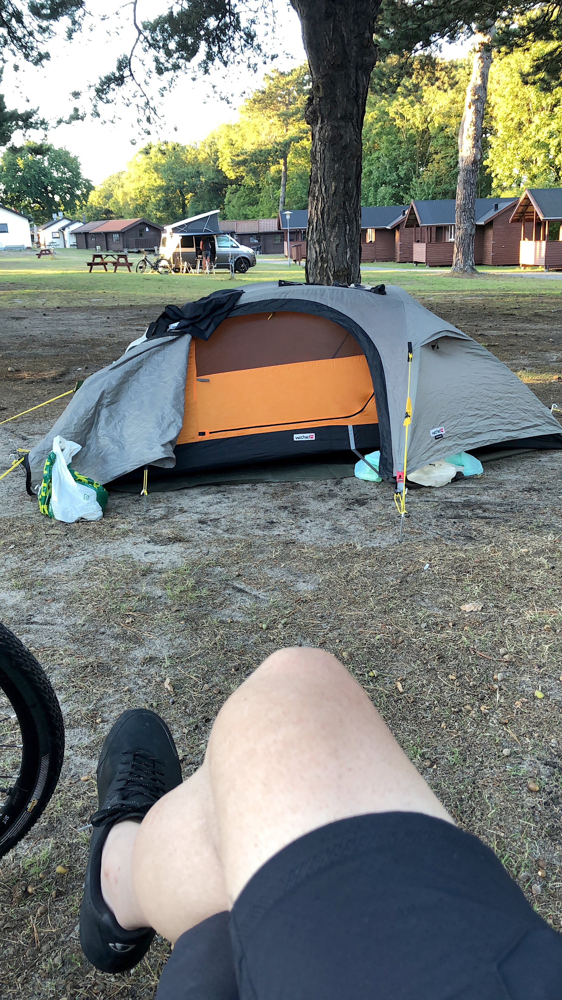  
(Abb.: Zelt auf dem Camping-Platz lieber etwas ordentlicher aussehen lassen als hier)

TODO muss ich komplett überarbeiten bzw. mein tats. Planungs-Spreadsheet verlinken

- Lebensmittel
	- siehe [Reiseküche](#reisekueche)
- Kochset: 
	- siehe [Reiseküche](#reisekueche)
- Wasser-Alternativen: 
	- siehe [Reiseküche](#reisekueche)
- Schlafsystem Frühling-Sommer-Herbst:
	- Hauptprobleme: 
		- Hitze/Kälte,
		- wasserdicht/atmungsaktiv
		- Insekten, Kleintiere (Nagetiere), große Tiere (Wildschwein, Rehe, ...)
		- Lage (Wildcamping/Campingplatz/Fewo/Hotel)
	- Isomatte: 
		- Thermarest Neoair Xlite, bequem und Packmaß noch ok (XL ist schon größerer Klotz als die S-Version in der Werbung)
	- Schlafsack:
		- Sommer: Carinthia G90 (hab meinen Carinthia Tropen verkauft: würde auch nichts militärisches mehr kaufen, da schwerer und Körper mehr Stauraum erwärmen muss; zivil ist oft effektiver/effizienter), 
			Sommer hat hier morgens schonmal 10-11 Grad
		- dünner Schlafsack wird gepimpt mit Daunenjacke und Thermohose, die ich auch außerhalb tragen kann = modularer, platzsparender
	- Shelter:
		- untested: Robens Mountain Biwak (mit kleinem Insektennetz-Fenster aber ohne Hoop-Stangen, was sehr nervt; 
			Kaputze aber aufhängbar, ideal separate Schnur quer zw. 2 Bäumen spannen und dann Kaputzenschnur dort mittig einhängen;
			für Sommer vermutl. eher ungeeignet
		- Wechsel Pathfinder TL Zelt: etwas bulky und ~2 kg, aber noch ok, kein (bequemes) aufrechtes Sitzen, sonst sehr gut/robust, hohe Wassersäule;
			man kann aber aufrecht sitzen, wenn man dabei aus dem Fenster ragt z.B. beim Kochen; oder aufrechter mit einem Packsack im Rücken (wie Couch zuhause)
	- Liner, damit weniger Wäsche = mehr Haltbarkeit; alternativ Base-Layer tragen (Multi-use)
	- Unterlage, damit nichts durchsticht und die Bodenfeuchtigkeit nicht durchdringt (auch im Sommer)
		- Bundeswehr Elefantenhaut (bulky, schwer, stabil, günstig)
		- Wechsel Pathfinder Footprint (bulky, passgenau, teuer)
		- Six Moon Designs Footprint Large Polycro (klein, ultraleicht, günstiger) 
		- genau unter Zelt legen, damit nichts auf den Überstand regnet und unters Zelt läuft
- Nacht:
	- Stirnlampe (abends/nachts Shelter-Suche und -Aufbau (Rotlicht empfohlen), Backup-Rad-Frontlampe)
		- sinnvoll, wenn man im Zelt eine Aufhängung hätte
	- Reifenreflektoren: Habe Katzenaugen gegen schwarzen Reflektorklebestreifen ersetzt
	- Akku-Rücklicht: Ersatz in Tasche (Redundanz)
	- Akku-Frontlicht
- Müll-Management:
	- ?
- Hygiene-System: siehe Abschnitt Hygiene
- Wechselkleidung / Warm-Kit:
- Kommunikation & Informationstechnik:
	- Smartphone
	- kleine Klapptastatur fürs Smartphone (Admin/Programmierung SSH, Mails, Recherche schneller)
- Wartung:
- Sonstiges:
	- Schutzfolie gegen Abrieb durch Taschenriemen

Gutes Setup auf YT:
- TODO
- TODO

## Tourplanung

- Planung leichter am PC statt Smartphone:
	- Komoot
	- ungetestet: Ride with GPS (RwGPS)
- Info-Basics notieren (Wetterdaten):
	- Vergleich mit Vorjahren bei Anreise erst in paar Wochen: https://de.weatherspark.com/
	- aktuelles Wetter:        https://www.meteoblue.com/
	- von wo kommt der Wind (üblicherweise)  = Richtung der Route so fahren, dass man Wind im Rücken statt Gegenwind hat, vor allem am Ende, wenn Kraft und Psyche nachlassen
	- wann geht die Sonne auf                = gute Aufbruchszeit während der Reisetage, bei Wildcamping evtl. späteste Abfahrzeit
	- wann geht die Sonne unter              = spätester Zeitpunkt für Schlafplatzsuche
	- wie kalt wird es in der Nacht          = Schlafsetup-Limits
	- wie kalt wird es am Tag                = Kleidungsmenge/Packvolumen
	- Regenwahrscheinlichkeit/-intensität    = Regen-Set (s. Abschnitt Kleidung); Trocknungsmglk. Fewo/Zeltplatz
- Mehrtagestour:
	- in mehrere Tages-Touren aufteilen (Ziel=Schlafplatz?)
	- 3+ Schlafplätze pro Tag planen: gute/normale/schlechte Tagesfitness
	- an Bahnhöfen entlang planen für schnelle Rückfahrt im Zug (Infekt etc)
	- an Trinkwasser/Resupply-Stellen entlang planen: 
		- Friedhöfe, Imbiss, Tankstellen, Supermärkte, Trinkbrunnen, ... 
		- manche Cafés machen erst nachmittags auf
	- Fewos/Hotels spontan erst am vorabend oder selben Tag buchen (wenn die Strecke und Fitness klar ist) = weniger Stress; 
			scheinbar finde sich immer etwas, zur Not wildcampen;
			als Soloradler mit 1P-Zelt finden Zeltplätze nicht selten noch Lücken (ggf. vorher anfragen, wie spontan man kommen kann)
	- einfacher mit fester Zeitvorgabe zu planen (timeboxing: was schafft man in 3 Tagen bei je 8h zu sehen/was weglassen) 
		anstelle einer Planung der benötigten Zeit für welche Ziele (analysis paralysis)
	- Liste/Map mit Schlaf-/Einkauf-/Sehensw.-POIs eher als spontane (Um-)Entscheidungshilfe statt genaues Zeitregime
		- Muss-Zeitfenster (Zeltplätze, Fähren, ...): restliche x in Fenster 1 skippen, um Startzeit für Fenster 2 zu erreichen
	- ersten Tag evtl. ruhiger angehen
	- den letzten Tag möglichst nah am Abreise-Bahnhof/Fähre o.a. planen/beginnen = weniger Stress; weniger, das schief gehen kann; Zeit zum Orientieren
	- rückwärts planen: Routen-Ende (Schlafplatz/Bahnhof) zu Anfang und die Zwischen-Etappen dem Zeitrahmen anpassen
	- beliebte Orte an unmöglichen Tageszeiten durchfahren, sehr frueh oder spät; in der Woche statt Wochenende (auch einfacher mit Versorgung)
	- Google MyMaps (My!) mit POI-Suche
		- Region recherchieren und attraktive Regionen auf MyMaps markieren und Route dort langführen
- Navigation: Wahoo Elemnt Bolt V2
	- separat zum Handy: bessere/separate Akkuzeit, wasserdicht, kleiner etc
	- POI-Funktionalität schlecht v.a. mit Hinblick auf Resupply- und Schlafplätze-Planung (siehe Abschnitt "Wahoo Hackerei")
- Navigation-Backup: Smartphone
	- Komoot
	- OsmAndMaps (Offline-Karte mit vielen POIs)
		- Komoot-GPX-Track in OsmAndMaps laden
	- Google Maps
	- ungetestet: Orux Maps, MagicEarth, PocketEarth
- Navigation-Backup (Radcomputer und Smartphone tot oder absent): Physische Karten
	- Kleiner Kompass schadet nicht, um Karte zu norden (z.B. mind. SUUNTO Clip-Dingsda), also wo man hinguckt und weitergeht (Kompasse auf Nord- oder Süd-Hemisphäre kalibriert)
	- phys. Karte an der Wand als Vorbereitung auf ein unbekanntes Gebiet: 
		nicht wirkl. nötig bei PC-Planung aber hilft beim Verinnerlichen, Distanzverhältnisse, ..., beschriften (wasserfeste Folienmarker + IPA als "Radierer"), Sticker aufkleben
	- alles unnötige (Legende, fernere Gebiete, ...) mit Schere wegschneiden = kleineres Packmaß
- Wildcamping-Platzsuche TODO
	- Stealth-Camping
	- Wild-Shelter-Apps

### Wahoo-Hackerei:

see [my Github Wahoo-repository](https://github.com/andre-st/wahoo)

## Reiseküche

### Lebensmittel

| Prio | Bedarfsart    | Zweck              | Wann             | Bezugsquelle                               | Beispiele                                                          | Kommentar
|------|---------------|--------------------|------------------|--------------------------------------------|--------------------------------------------------------------------|-----------|------------------
|    1 | Wasser        | Kreislauf/ Kühlung | immer            | Markt, Tanke, Imbiss &gt; Trinkbrunnen &gt; Friedhof &gt; Anwohner, Waschbecken öff. WC                        || wird ausgeschwitzt; Naturquellen eher vermeiden oder filtern (Landwirt.-/Stadtchemie, Kadaver, ...)
|    2 | Kohlenhydrate | Energie            | Fahrzeit/ Vortag | Markt, Tanke, Imbiss, Gaststätte, Drogerie | Brötchen, Banane, _gekochte_ Kartoffeln, Brezel, Laugenstange, Reiswaffel, belegte Brötchen ohne Mayo, Dönerwrap, Rossmann Energy-Gel (Ausnahme) | beim Pedalieren verbrannt; Fettiges vermeiden (Pommes); "bonking" plötz. Müdigkeit; Carboloading; sonst Energie aus Körperfett (Normalfahrt / aerob trainiert) oder begrenzten Glykogenspeicher (Muskeln und Leber) bei Intensivbelastung
|    3 | Elektrolyte   | Krampfprävention   | Fahrzeit         | Drogerie                                   | Rossmann Hydraid Trinkpulver-Sticks; Salz in Mineralwasser rühren  | wird ausgeschwitzt; für Nervensignale an Muskeln;  besser vorkaufen und in kleinem Gefäß mitnehmen
|    4 | Proteine      | Regeneration       | Ruhephasen/ Camp | Drogerie, Markt                            | Rossmann Proteinriegel, Thunfischbüchse                            | während Leistung kaum Nutzen/evtl. Magenproblem; Muskeln reparieren

Ziel: halbwegs gesunde Lebensmittel mit guter Nährstoffdichte auf kleinstem Stauraum bei geringem Gewicht

Stauraum- und Gewichtsreduktion:
- häufiger Nachkauf entlang der Reisestrecke
- verdichtet, z.B. Pulverform im Wasser gelöst oder Öl
- ... 

Kalte Küche &gt; warme Küche:
- unabhängig von Kochgelegenheiten/Feuerverboten, kleineres Packmaß/größere Mengen, kürze Dauer, kaum Trinkwasserverbrauch, ...
- Rossmann Früchte-Müsli mit Milchpulver oder Haferdrinkpulver, Mandeldrinkpulver leider zu mehlig, 
	löst sich nicht gut; in 1,2l-Ziploc-Tüten, direkt aus Tüte essbar
- paar kleine flache Dosen mit Thunfisch-Couscous (363 kcal); sonst nur Zucker eklig
- Proteinriegel eher salzig als süß
- Powergels (Zucker)
- warmes Essen oft unterwegs abgreifbar

Warme Küche:
- Pesto
- chin. Nudeln, die unter 5 Minuten kochen
- ...

Zucker gibt zwar kurzfristig Energie, aber schädlich (kleine Kristalle schneiden überall herum) und hängt irgendwann zum Hals raus.
Abwechslung/Alternativen wichtig.
"Echtes" Essen auf Dauer bekömmlicher als Spezialfood.

### Kleine Materialkunde zum Koch-/Essgeschirr:

| Material                         | Gesundheit&sup1; | Wärmeleitf. | Gewicht  | Preis    | Kommentar
|----------------------------------|------------------|-------------|----------|----------|---------------------
| Aluminium                        | \*               | \*\*\*      | \*\*     | \*\*\*   | Ablösung bei Abrieb und Säuren (Tomaten etc), Ablagerung im Körper, komme durch Bluthirnschranke
| eloxiertes/anodisiertes Alu      | \*               | \*\*\*      | \*\*     | \*\*\*   | festere Schicht gegen Abrieb und Säuren
| hart-eloxiertes/anod. Alu        | \*\*             | \*\*\*      | \*\*     | \*\*     | noch festere Schicht
| Edelstahl                        | \*\*\*           | \*          | \*       | \*\*\*   | evtl. minderwertiger Alu-Topf schwerer als hochwert. dünner Edelstahl
| Duossal                          | \*\*\*           | \*\*        | \*\*     | \*\*     | Duo-StainlessSteel-ALuminium: SS innen, Alu außen
| Titan                            | \*\*             | \*          | \*\*\*   | \*       | 
| Keramik                          |                  |             |          |          | 
| Porzelan                         | \*\*\*           |             | \*       | \*       | 
| Silikon lebensmittelecht         | \*               |             |          |          | 
| Nylon                            | \*               | \-          | \*\*\*   |          | 
| Polypropylen PP                  | \*               | \-          | \*\*\*   | \*\*\*   | Trinkflaschen hitze-/chemiebeständiger als PET; aus Erdöl
| Polyethylenterephthalat PET/rPET | \*               | \-          | \*\*\*   | \*\*\*   | Trinkflaschen; 'r' steht für recycled
| Polylactid PLA/rPLA (Bioplastik) | \*               | \-          | \*\*\*   | \*\*\*   | Trinkflaschen aus Maisstärke oder Zuckerrohr, kompostierbar; aka Polymilchsäure
| Glas                             | \*\*\*           | \*          | \*       | \*\*     | hohes Bruchrisiko für Bikepacking ungeeignet
| Melamin                          | \*               |             | \*       |          | 2023 von Europäischer Chemikalienagentur als besonders besorgniserregender Stoff (SVHC) eingestuft
| Emaille                          | \*\*             |             | \*       |          | Verzchmelzung (frz. émailler) von Glasstaub mit Eisen o.a.
| Holz                             |                  |             |          |          | Bakterienfänger durch offene Struktur

&sup1;) Disclaimer: Meinung/Präferenz des Autors, der weder Mediziner noch Chemiker ist

### Wasser:

- Adventure Hydration 3-Liter-Cranktank = 4x 750ml-Flaschen; perfekter Schwerpunkt mitte unten im Rad
	- da SPoF, habe ich noch ein Katadyn-Hydrapak-Wasserfilter-Set (2 Liter), das sich klein packen lässt
- Trinkblase in Vollrahmentasche und evtl. Extra-Flasche(n) in den Stem-Bags/Food-Pouches
- Cargo-Cages statt Flaschenhalter und dann 2x 1,5l-Flaschen (z.B. aus Edelstahl oder Supermarkt-Plastikflasche)
- 2 normale Flaschenhalter mit 1L-Plastik-Flaschen, ausreichend für viele Touren mit Resupply-Punkten

### Mein größeres Kochset:

- 1,5L-Duossal-Topf Trangia (236g) mit: 
	- 550ml-Titanbecher Toaks (73g)
	- 100g-Gaskartusche Optimus
	- Griffzange Trangia (48g), 
	- Zündstahl, Feuerzeug BIC 
	- Stove Edelrid Kiro St (80g)
	- Kartuschenfuß MSR Universal (33g); Kartuschengrößen sind nicht wirkl. standardisiert, der MSR-Fuß ist flexibel; hatte vorher einen von Edelrid mit 2 oder 3 festen Fassungen, auf dem die Colman-Kartusche nicht passte (wenige mm Abweichung)
	- Lappen, Scheuervlies-Topfschwamm (3g)
	- Topfschaber-Plektrum
	- stabiler Dosenöffner Nogent 3 Etoiles 04020H Mini-Kim
	- alles im Netzbeutel
- Schneidbrett/Nudelsieb Trangia Multidisc 18 cm
- 25-cm-Nylon-Löffel mit Topf-schonender Silikonlippe GSI Essential Spoon (26g)
	- anstelle langer Titan-Göffel/Sporks, die gut für Trekking-Tüten sind, aber Töpfe verkratzen;
	  müssen zudem bei Gabel/Messer extra verpackt werden, 
	  um nicht durch Drybag o.a. durchzustoßen
- Wasserfilter-Set Katadyn Hydrapak 2l
- Kaffee-Los 125-ml-Schraubbehälter
- 1,2l Ziploc-Tüten IKEA Istad mit Lebensmitteln, Dehydriertes zusammengekippt, ...

### Mein kleineres Kochset:

Falls man nicht zivilisationsfern unterwegs ist,
dann ist nur spontaner Kaffee relevant.
Alles andere lässt sich unterwegs lösen.

- schmaler Titan-Topf:  Boundless Voyage 900 ml _oder_ Toaks 550 ml
- 100g-Gaskartusche Optimus
- Zündstahl, Feuerzeug BIC 
- ~~Stove Edelrid Kiro St (80g)~~ kleinster Gaskocher BRS-3000T (26g)
- Kaffee-Los 125-ml-Schraubbehälter
- Kartuschenfuß MSR Universal (33g)
- stabiler Dosenöffner Nogent 3 Etoiles 04020H Mini-Kim
- Titan-Göffel
- 1,2l Ziploc-Tüten IKEA Istad mit Nudeln, ...

### Mein Kalte-Küche-Kochset:

- Klappbarer Göffel für Supermarkteinkäufe

### Gaskartuschen:

- Entsorgung: 
	- Wertstoffhof, falls nicht entleert, da "toxisch"
	- entleert: gelbe Tonne
	- es bleibt immer etwas über, 
	  daher manuelle Entleerung mit Durchstecher (Jetboil CrunchIt),
	  oder irgendwie Loch bohren
	- alternativ mit Adapter nachfüllen
- Lagerung:
	- rechtl. maximal 2 Kartuschen pro Raum, egal wie groß
	- nicht in Schlafräumen
	- nicht unter "Erdgleiche" (unter Erde wie Keller, da Blasenbildung)
	- in gut durchlüfteten Räumen

### Feuer:

- Gaskocher gilt rechtl. als "offenes Feuer" und ist im Wald idR. verboten 
	(Kerzen sind schon "offenes Feuer")

### Rezepte:

- TODO

### Inspiration aus Survival/Bushcraft/Prepping:

- TODO

## Shops

| Alle_Bestellungen_top                                  | Teile                     | Versand     | Kommentar
|--------------------------------------------------------|---------------------------|-------------|--------------------
| [bike24.de](https://bike24.de)                         | alles                     | DHL/GLS     | Rücksende-Etikett direkt im Paket, schneller Versand; 99% DHL, leider mal GLS
| [bike-discount.de](https://bike-discount.de)           | alles                     | DHL         | oft gute Preise; Rücksendungen unproblematisch
| [kugellager-shop.net](https://www.kugellager-shop.net) | Wälzlager, Lagerkugeln G10 auf Anfrage  | ? | Edelstahlversionen kaufen
| [decathlon.de](https://decathlon.de)                   | Kleidung, Bikepacking     | ?           | bisher immer alles bekommen, Rücksendung unproblematisch; günstige "Szenetipps" wie brauchbare Forclaz MT100 Daunenjacke oder gut verpackbare Forclaz MT500 Sandalen
| [agu.com](https://agu.com)                             | Kleidung                  | DHL/Hermes  | Niederlande, Rücksendung unproblematisch, manchmal 50% Preisnachlass im Shop
| [globetrotter.de](https://globetrotter.de)             | Bikepacking               | DHL         | 
| [r2-bike.com](https://r2-bike.com)                     | alles                     | DHL         | Dresden

| Bisher_erste_Bestellung_top                            | Teile                     | Versand | Kommentar
|--------------------------------------------------------|---------------------------|---------|--------------------
| [raaad.de](https://raaad.de)                           | alles                     | DHL     | Würzburg
| [enjoyyourbike.com](https://enjoyyourbike.com)         | alles                     | DHL     | iLOPACK GmbH Fulfillment
| [woembi.de](https://www.woembi.de)                     | Lagerkugeln G20 HRC&ge;60 | ?       | 97849 Roden
| [giantbikespares.com](https://giantbikespares.com)     | Giant-Ersatzteile         | DHL     | trotz UK-Export billiger als beim lokalen Händler
| [framesandgear.com](https://framesandgear.com/)        | Computer-Halterung        | UPS     | Dänemark; teuer, aber sehr clean, stabile Konstruktion mit 2 Neigungsschrauben, richtige Höhe und Breite (z.B. genau für 27mm-Vorbauschrauben-Abstand = ungünstiger Wiederverkaufs-/Transferwert); beliefern angebl. auch TdF-Elite

| Bestellung_okay                                        | Teile                     | Versand | Kommentar
|--------------------------------------------------------|---------------------------|---------|--------------------
| [bike-components.de](https://bike-comonents.de)        | alles                     | DPD/GLS | funktioniert im Allg., lefern aber evtl mit anderen Diensten trotz DHL-Logo; auch mal Paket von anderem Kunden erhalten
| Suicycle-store.com                                     | alles                     | DHL     | Hamburg; nicht auf Lieferzeiten/Verfügbarkeiten im Shop verlassen; liefern dann aber und Kontakt auch freundlich

| Shops_die_ich_vermeide                                 | Teile                     | Kommentar
|--------------------------------------------------------|---------------------------|-----------------------------
| Sportfits.de                                           | alles                     | eigene negative Erfahrung, schlechteste bisher überhaupt
| Amazon (Marketplace)                                   | Kleidung, Teile           | kaufe nur, wenn ich lange woanders nichts finde; man liest von Fakes und Wiederverkauf kaputter Kundenrückläufer
| TradeInn / BikeInn                                     | alles                     | Sitz Spanien; bei Ärger wäre unverhältns. Aufwand
| Santafixie.de                                          | alles                     | Sitz Spanien
| Hardloop.de                                            | alles                     | Sitz Frankreich
| Alltricks.de                                           | alles                     | Sitz Frankreich; hatte aber schon korrekt geliefert

## Wirtschaft

Ökonomische Zusammenhänge, Rationales, ...  TODO

#### Fahrrad-Handel (LBS, Online):

- [YouTube: Der teure Fahrradhändler - ein Statement!](https://www.youtube.com/watch?v=0ReiZTJ4MDM)
	- Shimano 9x-Kette 11 Euro online vs 25-35 Euro beim Vor-Ort-Händler
	- große Online-Händler kaufen containerweise günstiger direkt beim Hersteller statt beim Großhändler
	- Radladen zahlt im Einkauf fast das gleiche wie Online-Händler im Verkauf
	- LBS zielt auf Offline-Kunde: Unwille zu fachlicher Beschäftigung, Vor-Ort-Verfügbarkeit/Lager-Haltung eingepreist
- [YouTube: Ein Fahrradladen im Sommer](https://www.youtube.com/watch?v=_UageeDQiQA)
	- Arbeit im Radladen als Radfahrer schlecht, weil im Sommer nur Zeit fürs Arbeiten statt Radeln [Mo-Sa 10-18/19 Uhr, kein Sommerurlaub]
	- saisonal mehr Personal einstellen funktioniere nicht
	- Service in der ruhigeren Nebensaison erledigen [als LBS: im Winter günstiger anbieten und beim Rad-Verkauf schon Winter-Servicetermine vorgeben]
- [YouTube: Fahrradhändler = Abzocker? Warum es manchmal einfach so ist...](https://www.youtube.com/watch?v=VW7-tbJK7-k)
- [YouTube: Is Your Bike Shop Unfairly Rewarding Bad Mechanics](https://www.youtube.com/watch?v=TaHqewGXlk4)

TODO
- Margen
- Preise
- Arbeitseinheiten Abrechnung
- Kataloge
- Fehler
- Verhandlungen

#### Fahrrad-Hersteller (B2B):

TODO

## Sonstiges

Bin kein Anwalt, daher alle rechtl. Angaben ohne Gewähr:

- Tour mit langsamerem Partner (meist Freundin/Ehefrau)
	- Partner auf E-Bike
	- Tandem: unterschiedl. Fitness egal, man kann sich unterhalten, etwas Besonderes als Gemeinsames
	- Beach Cruiser bzw. entspannte Räder mit Latschen und Schlapphut, die nicht zum Pacen motivieren
	- ermöglichen, dass ein Partner hin und wieder in eigenem Tempo vorausfährt und der andere ihn einholt
	- langsame Recovery Rides mit Partner; immer nur auf Geschwindigkeit ist verkehrtes Training
	- erste Kilometer langsam, Partner fährt nach hause, anderer fährt weiter in eigenem Tempo 
		 (fühlt sich für Schnelleren trotzdem wie lästige Pflicht an, und Solo-Heimfahrt für Langsameren wie düpiert)
- "motorisierte Gewalt", Road Rage, Car-Brain
	- leichtes 2x Hupen: kann tats. manchmal nur Überholversuch ankündigen, in der STVO tats. so erlaubt (Lichtsignal oder Hupe)
	- Scheibenwischanlage beim Vorbeifahren betätigt
	- geringe Überholabstände
	- Verweis auf angebliche Radwege, obwohl keine Pflicht (kein blauer Lolli oder unfahrbar)
	- Überholzwang 10 Meter vor der roten Ampel, wird in der Stadt oft wieder eingeholt
	- Stvo-Regeln gelten weiterhin für Autofahrer, auch wenn Radfahrer sie gerade (vermeintlich) bricht - darf also nicht 30 cm vorbeifahren
	- Autofahrer dürfen nicht bestrafen oder erziehen, nur Polizei
	- Polizisten entscheiden nicht über Anzeigen, sondern Staatsanwalt; Anzeigen müssen aufgenommen werden, egal wie der Beamte es einschätzt (?)
- Infrastruktur vs individuelle Radlersicherheit
- car-centric cities; alles sagt der autofahrer-psychologie = seine autostraße, radler fremder störfaktor

