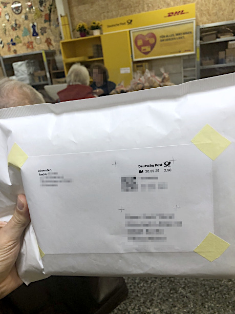

# Internet-Privatverkauf

## Fehler 1: Endpreis falsch berechnen

| Endpreis\_(privat\_ohne\_MwSt)                 | Details
|------------------------------------------------|------------------------------
| Nettozielbetrag                                | Gewinn; Warenpreis vgl. Mitbietende auf dieser und anderen Plattformen
| &divide; (1 &minus; Provision&times;(1+MwSt))  | z.B. Booklooker.de  0,069 (6,9%) zzgl Mwst. 0,19 (19%) im Jahr 2025
| + Porto                                        | DHL/Deutsche Post (zuverlässigste), ... - mind. mit Basis-Sendungsverfolgung
| + Verpackungsmaterial                          | Luftpolsterumschlag Großbriefe, Maxibriefe, kleine/große Paketkartons, Druckpapier (Quittung, evtl. Versandetikett), Klebestift, Paketband, Hohlraum-Füllmaterial
| + Verpackungsaufwand                           | passende Verpackung auftreiben, Brief-/Paketmarke online kaufen, ggf. Versandetikett erstellen/drucken/aufkleben (sonst Packstationsdrucker), ...
| + Übergabeaufwand                              | Weg zur Filiale/Packstation, Zeit in der Warteschlange

## Fehler 2: Tatsächliche Versandkosten auspreisen, obwohl sie unattraktiv sind

Ein Käufer empfindet hohe Versandkosten als Verlust, nicht als Gegenwert:
- Versandkosten wirken wie ein Strafaufschlag an der Kasse, egal ob sie realistisch kalkuliert sind
- glaubwürdig niedrige "Deal"-Versandkosten: Anstelle _"27,99 Euro + 5,59 Euro"_ lieber _"27,99 Euro + 2,49 Euro"_.  
- weniger mentale Reibung beim Kaufabschluss
- Differenzbetrag auf den Warenpreis schlagen, auch wenn mehr Provision fällig wird
- "kostenloser Versand" bei Amazon bevorzugt, also abhängig von der Plattformkultur
- "kostenloser Versand" nachteilig, wenn die Käufer alle Angebote nach Warenpreis (statt Endpreis) sortieren/eyeballen 
	und Versand _komplett_ im Warenpreis eingerechnet ist.

## Fehler 3: Plattformen-Steuertransparenzgesetz (PStTG) vergessen

> Gemeldet werden muss, wenn mehr als 30 Verkäufe im Jahr zustande gekommen sind  
> oder wenn mehr als 2000 Euro Umsatz erwirtschaftet wurden.

Stand 2023 müssen Plattformen erfolgreichere Privatverkäufer dem Finanzamt 
wg. möglicher Besteuerung/Gewerbetätigkeit melden 
und verlangen dann z.B. Geburtsdatum und Steuer-ID.

Booklooker.de: https://www.booklooker.de/faq/steuer-privatverkauf/197

## Fehler 4: Haftungsausschluss im Inserat vergessen

> Privatverkauf: keine Garantie, Gewährleistung, Rücknahme oder Haftung für Unfälle oder Schäden. Ein Widerrufsrecht besteht nicht.  
> Das Produkt ist in gutem Zustand.

- Unangenehmes für Käufer mit etwas Positivem enden lassen.
- "Unfälle" weglassen, wenn man z.B. kein Sportgerät oder Teile dafür verkauft
- Alternativ sicherheitskritische Produkte als defekt
	oder nur dekorativ als Bestandteil von Showroom-Geräten jenseits der Straße oä. verkaufen, 
	mit Hinweis das jedwede andere Nutzung durch den Käufer zu verantworten ist, 
	gleichwohl man sehr sorgsam mit dem Produkt umgegangen ist (Drehmomentschlüssel etc) 
- vermuten lassen, dass es eine übertriebene/juristische Distanzierung ist, das Produkt aber in Ordnung.
- überlicherweise am Ende des Inserats; in der Mitte würde es evtl. schneller ignoriert (Sandwich-Methode)

Das ist keine Rechtsberatung, bin kein Anwalt.

## Fehler 5: Versandkosten und Versandmaterial nicht geprüft

Besser wenn Versandkosten schon vorher im Inserat stünden:
- Kostenübersicht: [https://www.dhl.de/de/privatkunden/pakete-versenden/portoberater.html](https://www.dhl.de/de/privatkunden/pakete-versenden/portoberater.html)
- DHL hat Pauschalpreise für Versand innerhalb von Deutschland, Entfernung spielt keine Rolle, Größe und Gewicht aber (Stand 2025)
- Karton oder Maxibrief-Umschlag in passender Größe vorhanden? wo auftreiben?
- Angebot noch attraktiv, wenn zum Warenpreis noch 7 Euro dazukommen?
- Warenversand ist auch in günstigeren Groß- und Maxibriefen möglich (Stand 2025: max. 5 cm Höhe, unter 1 kg)
- Verpackungsmaterial in der Filiale ist recht teuer; besser paar Kartons aufheben, wenn man eigene Pakete empfängt

## Fehler 6: Käufer nicht prüfen

Zu wissen, dass das Gegenüber gut bewertet ist, beruhigt auch bei Vorkasse.
Der Käufer ist daran interessiert, diese Bewertung beizubehalten und wird weniger nerven.

## Fehler 7: Als Erster seine Daten nennen

Bei offenen Anfragen wie z.B. Kleinanzeigen.de:

Besser Käufer zuerst fragen, wohin das Paket gehen soll _bevor_ man Kontodaten, Versandkosten etc. nennt.

> Hallo XY, können wir so machen, wohin soll das Paket gesendet werden?

- klärt, ob Lieferadresse überhaupt in Deutschland ist
- man offenbart Bots nicht gleich seine persönlichen Daten
- man committed den Käufer: er de-anonymisiert sich, macht den Verkaufsfortschritt verbindlicher und verlängert den Chatverlauf: 
	Rücktritt wird nach so viel "Vorleistung" unangenehmer, falls mal etwas komplizierter wird
- besserer Gesprächsfluss: kein gieriger "Überfall" mit sofortiger Geldforderung, sondern man zeigt erstmal Gebe-Bereitschaft

## Fehler 8: Käuferschutz statt Vorkasse

Besser immer Vorkasse per Banküberweisung, nie Käuferschutz nutzen:
- Käuferschutz verlagert komplettes Risiko auf den Verkäufer: 
	Muss Ware versenden und Käufer kann Zahlung verweigern/zurückbuchen ("nie erhalten")
- Käuferschutz ist oft mit einer Gebühr verbunden = höherer Endpreis
- Kleinanzeigen.de-User sind Paypal oder Banküberweisung gewohnt – nichts Ungewöhnliches oder Verdächtiges, 
	v.a. wenn man als Verkäufer schon gut bewertet wurde
- Käuferschutz läuft bei Kleinanzeigen.de über einen fragw. Zahlungsdienstleister im Ausland (Online Payment Platform OPP)
- "PayPal Freunde" ist zwar gebührenfrei und ohne Käuferschutz, 
	allerdings AGB-widrig für Geschäftstransaktionen und man macht sich angreifbar durch Käufer
	und/oder risikiert seinen Paypal-Account, den man ja auch für andere Sachen nutzt;
	bei nicht-gewerblichen Privatverkäufen vielleicht Grauzone?

Seit paar Monaten muss der Kontohinhaber bei Banküberweisungen exakt benannt sein. Name steht auf der Bankkarte.
Kleinanzeigen wird meckern, dass man keine privaten Daten senden soll (sondern Kleinanzeigen-Bezahldienst nutzen), ignorierbar

> Alles klar, ich habe hier immer Banküberweisung gemacht:
> 
> Empfänger: Andre XXXXXXXX  
> IBAN: DEXX XXXX XXXX XXXX XXXX XX  
> BIC: XXXXXXXXXXX  
> Bank: SPK XXXXXXXXXX  
> Zweck: Kleinanz WAREXYZ  
> Betrag: 55 Euro  
> 
> Ich würde davon die Paketmarke kaufen  
> und mich dann mit der Sendungsnummer (DHL) melden.
>
> Gruß André

_(Kleinanzeigen.de-Chat)_

## Fehler 9: Ware unzureichend verpackt

Ärger mit Käufer und Post wegen Transportschäden vermeiden:

- Ware in wasserabweisende Plastiktüte (Mülltüte, ...) packen 
- Hohlräume füllen, damit die Ware beim Transport im Paket nicht hin- und herrollt
- mehrere lose Gegenstände gegeneinander polstern, sonst reiben sie beim Transport aneinander

Korrekte Empfängerdaten:

- bei Paketen bevorzuge ich den Klebe-Etiketten-Drucker direkt an der Packstation (die scannt meine Online-Paketmarke vom Handy-Bildschirm).
	Hier prüfe ich aber trotzdem immer die Druckqualität: 
	Manchmal wird z.B. die Hausnummer unleserlich/uneindeutig gedruckt (Stift mitnehmen)
- bei Briefsendungen (meist Bücher) drucke ich die Etiketten zuhause – bei meiner aktuellen Menge noch auf einfachem Papier.
	Selbstgedruckte Etiketten gut aufkleben und die Ecken des Etiketts nochmal mit Paketband o.ä. überkleben, 
	falls der Klebestift während des Transports nicht halten sollte. Briefe kann man nicht an Packstationen aufgeben.;
- Briefe klassische Aufteilung: _"Absender:"_ klein links oben, Briefmarke rechts oben, Empfängeradresse groß rechts unten
- die Paket- und Briefmarken kaufe ich online als Bild- bzw. PDF-Datei über:  
	https://www.dhl.de/de/privatkunden/pakete-versenden/portoberater.html  
	Ich bastel die Briefmarke dann direkt auf mein Etikett (Gimp).
	Kann man aber auch separat drucken.
- kann sinnvoll sein, eine Quittung beizulegen nochmal mit vollständigen Absender- und Empfängeradressen.
	Falls das äußere Versandetikett beschädigt und das Paket unzustellbar wird, schaut die Post meines Wissens ins Paket.

## Fehler 10: Undokumentierter Versand

Besser Versand dokumentieren und verfolgbar machen:

- für ungeduldige Käufer: macht Versandbehauptung glaubwürdiger (siehe Fehler 12) – schon erlebt
- für betrügerische Käufer: "nie erhalten", "war nichts im Paket", "kaputt im Paket", ... – bisher nie erlebt
- für DHL/Deutsche Post: Falschbehauptung ungeeigneter Versanddaten oder Verpackung, obwohl dokumentiert Etikett vom Packstationsdrucker – davon gelesen
- für einen selbst: sonst paar Wochen Unklarheit bis sich einer beschwert oder nicht
- nichts beweisfest, könnte aber eigene Sache plausibler machen - man hat mehr in der Hand als der Andere
- Brief: schnelles Smartphone-Foto in der DHL-Filiale mit gut lesbarem Versandetikett
	
- Brief: Briefmarke mit der DHL-App scannen (Icon neben Suchschlitz oben) und Titel bearbeiten:
	"Großbrief KUNDE\_XY WARE\_Z" statt nur "Briefsendung, Briefsendung, Briefsendung".
- Packstation: manchmal Foto/Video vom Einlegen (z.B. vermeintlich Versanddaten oder -material ungeeignet)
- teure Ware oder fragw. Käufer: selten mal Smartphone-Video vom Zustand und Packvorgang, ggf. mit Zeuge (Unterschrift sonst Erinnerungslücke)

## Fehler 11: Voreiliger Versand

Besser erst handeln, wenn das Geld dem Konto wirklich gutgeschrieben wurde:
- sofern es keine Echtzeitüberweisungen sind, kann ein Käufer das Geld innerhalb einer bestimmten Zeit wieder zurückbuchen lassen
- sich nicht im Chat von Zahlungsbestätigungen und Fotos von Online-Überweisungen beeindrucken lassen

## Fehler 12: Käufer unzureichend über Versand informieren

Besser Käufer die DHL-Sendungsnummer und einen Link zur Sendungverfolgung nennen. 
Falls man nur einen Brief hat, dann sendet man ein Foto (siehe Fehler 8) statt der Nummer – das beruhigt den Käufer (anstelle rein verbaler Versandbehauptungen).
Weniger Trara, falls Sendung dauert: Käufer weiß ja, dass es wirklich unterweg ist. 
So ein Foto kann natürlich gefälscht werden, aber so viel kriminielle Energie wird erstmal nicht unterstellt: 
es ist wahrscheinlicher dass das Foto stimmt als dass es nicht stimmt.

> Hallo XY, Paket ist unterwegs:
>
> DHL-Sendungsnummer ist: 123457890
>
> DHL-Link zur Sendungverfolgung: https://www.dhl.de/de/privatkunden/pakete-empfangen/verfolgen.html?piececode=NUMMER
>
> Wichtig: Die Originalverpackung enthält _innerhalb_ der weißen Pappe die Schrauben etc. 
> 
> Wünsche viel Erfolg bei den Projekten / Ich hoffe WARE gefällt und ist von Nutzen / Gute Fahrt
> Gruß André

_(beim Link hinten die Nummer ersetzen)_

## Fehler 13: Pakete nicht selbst verfolgen

Besser selbst ab und zu in der DHL-App/Website kontrollieren.
Je nach Plattform hole ich mir 1-2 Tage nach Zustellung vom Käufer manchmal noch ein "alles in Ordnung" ab, 
damit das mehr oder wenig protokolliert ist. 
Einige Käufer schreiben von sich aus, dass sie das Paket erhalten hätten und alles gut sei.

> prima &#128077;  /  Vielen Dank für die Info &#128077;  /   Danke, werde positiv bewerten &#128077; 

_(Kleinanzeigen.de-Chat)_

## Sonstiges

Du kannst eine ungenutzte Internet-Paketmarke übrigens auch wieder stornieren, dann bekommst das Geld von der DHL wieder zurücküberwiesen.

